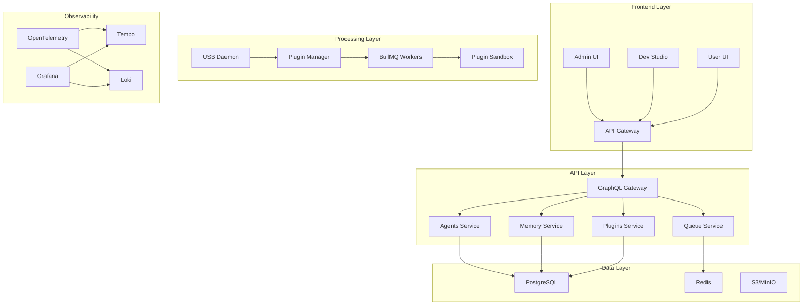

# AutoWeave Developer Handbook

## Table of Contents

- [Welcome to AutoWeave](#welcome-to-autoweave)
- [Development Environment Setup](#development-environment-setup)
- [Architecture Overview](#architecture-overview)
- [Development Workflows](#development-workflows)
- [Code Standards](#code-standards)
- [Testing Guidelines](#testing-guidelines)
- [Debugging and Troubleshooting](#debugging-and-troubleshooting)
- [Contributing Guidelines](#contributing-guidelines)
- [Resources and References](#resources-and-references)

## Welcome to AutoWeave

AutoWeave is a production-ready AI agent orchestration platform built for
enterprise environments. This handbook will guide you through everything you
need to know to contribute effectively to the project.

### What is AutoWeave?

AutoWeave enables organizations to:

- Create and deploy AI agents through a visual interface
- Manage plugins with hot-plug capabilities
- Monitor and observe agent performance in real-time
- Scale agents across different environments
- Integrate with existing enterprise systems

### Technology Stack

- **Backend**: Node.js 20+, TypeScript, Express, GraphQL
- **Frontend**: Next.js 15, React, Tailwind CSS, shadcn/ui
- **Database**: PostgreSQL, Redis
- **Queue System**: BullMQ
- **Monitoring**: OpenTelemetry, Grafana, Tempo, Loki
- **Infrastructure**: Docker, Kubernetes, Helm
- **Build System**: Turborepo, pnpm

## Development Environment Setup

### Prerequisites

Before starting development, ensure you have:

```bash
# Required versions
Node.js >= 20.0.0
pnpm >= 8.6.0
Docker >= 24.0.0
Docker Compose >= 2.0.0
```

### System Dependencies

#### Ubuntu/Debian

```bash
# Update system
sudo apt update && sudo apt upgrade -y

# Install Node.js 20
curl -fsSL https://deb.nodesource.com/setup_20.x | sudo -E bash -
sudo apt-get install -y nodejs

# Install pnpm
npm install -g pnpm@8.6.0

# Install Docker
curl -fsSL https://get.docker.com -o get-docker.sh
sudo sh get-docker.sh
sudo usermod -aG docker $USER

# Install Docker Compose
sudo curl -L "https://github.com/docker/compose/releases/latest/download/docker-compose-$(uname -s)-$(uname -m)" -o /usr/local/bin/docker-compose
sudo chmod +x /usr/local/bin/docker-compose

# USB development dependencies
sudo apt-get install -y libudev-dev libusb-1.0-0-dev

# Additional tools
sudo apt-get install -y git curl jq
```

#### macOS

```bash
# Install Homebrew
/bin/bash -c "$(curl -fsSL https://raw.githubusercontent.com/Homebrew/install/HEAD/install.sh)"

# Install dependencies
brew install node@20 pnpm docker docker-compose libusb git jq

# Start Docker Desktop
open -a Docker
```

#### Windows (WSL2)

```bash
# Install WSL2
wsl --install

# Inside WSL2, follow Ubuntu instructions
# Install Docker Desktop for Windows with WSL2 backend
```

### Initial Setup

#### 1. Clone Repository

```bash
git clone https://github.com/autoweave/autoweave.git
cd autoweave
```

#### 2. Install Dependencies

```bash
# Install all workspace dependencies
pnpm install

# Verify installation
pnpm run type-check
```

#### 3. Environment Configuration

```bash
# Copy environment template
cp .env.example .env.local

# Edit configuration
nano .env.local
```

#### 4. Database Setup

```bash
# Start development services
pnpm run dev:services

# Run migrations
pnpm run db:migrate

# Seed development data
pnpm run db:seed
```

#### 5. Start Development Server

```bash
# Start all services
pnpm run dev

# Or start specific services
pnpm run dev:api      # API Gateway
pnpm run dev:admin    # Admin UI
pnpm run dev:studio   # Dev Studio
pnpm run dev:user     # User UI
```

### Development Services

The development stack includes:

```yaml
# docker-compose.dev.yml
version: '3.8'
services:
  redis:
    image: redis:7-alpine
    ports:
      - '6379:6379'

  postgres:
    image: postgres:15
    environment:
      POSTGRES_DB: autoweave_dev
      POSTGRES_USER: autoweave
      POSTGRES_PASSWORD: development
    ports:
      - '5432:5432'
    volumes:
      - postgres_data:/var/lib/postgresql/data

  minio:
    image: minio/minio:latest
    command: server /data --console-address ":9001"
    ports:
      - '9000:9000'
      - '9001:9001'
    environment:
      MINIO_ROOT_USER: minioadmin
      MINIO_ROOT_PASSWORD: minioadmin
    volumes:
      - minio_data:/data

  grafana:
    image: grafana/grafana:latest
    ports:
      - '3000:3000'
    environment:
      GF_SECURITY_ADMIN_PASSWORD: admin
    volumes:
      - grafana_data:/var/lib/grafana

  tempo:
    image: grafana/tempo:latest
    command: ['-config.file=/etc/tempo.yaml']
    ports:
      - '3200:3200'
      - '4317:4317'
      - '4318:4318'
    volumes:
      - ./config/tempo.yaml:/etc/tempo.yaml
      - tempo_data:/tmp/tempo

  loki:
    image: grafana/loki:latest
    command: -config.file=/etc/loki/local-config.yaml
    ports:
      - '3100:3100'
    volumes:
      - loki_data:/tmp/loki

volumes:
  postgres_data:
  minio_data:
  grafana_data:
  tempo_data:
  loki_data:
```

### IDE Configuration

#### Visual Studio Code

```json
{
  "recommendations": [
    "ms-vscode.vscode-typescript-next",
    "bradlc.vscode-tailwindcss",
    "ms-vscode.vscode-json",
    "esbenp.prettier-vscode",
    "ms-vscode.vscode-eslint",
    "GraphQL.vscode-graphql",
    "ms-vscode.vscode-docker"
  ],
  "settings": {
    "typescript.preferences.importModuleSpecifier": "relative",
    "editor.formatOnSave": true,
    "editor.defaultFormatter": "esbenp.prettier-vscode",
    "tailwindCSS.experimental.classRegex": [
      ["cva\\(([^)]*)\\)", "[\"'`]([^\"'`]*).*?[\"'`]"],
      ["cn\\(([^)]*)\\)", "[\"'`]([^\"'`]*).*?[\"'`]"]
    ]
  }
}
```

#### WebStorm

```javascript
// .idea/jsLibraryMappings.xml
<?xml version="1.0" encoding="UTF-8"?>
<project version="4">
  <component name="JavaScriptLibraryMappings">
    <file url="PROJECT" libraries="{@types/node, @types/react}" />
  </component>
</project>
```

## Architecture Overview

### System Architecture



### Package Structure

```
autoweave/
├── apps/
│   ├── admin/           # Admin UI (Next.js)
│   ├── studio/          # Dev Studio (Next.js)
│   ├── user/            # User UI (Next.js)
│   └── api/             # API Gateway (Express)
├── packages/
│   ├── ui/              # Shared UI components
│   ├── config/          # Shared configuration
│   ├── types/           # TypeScript types
│   ├── utils/           # Utility functions
│   ├── usb-daemon/      # USB hot-plug daemon
│   ├── plugin-manager/  # Plugin management
│   ├── job-queue/       # BullMQ abstraction
│   ├── observability/   # OpenTelemetry setup
│   └── graphql-gateway/ # GraphQL federation
├── services/
│   ├── agents/          # Agents microservice
│   ├── memory/          # Memory microservice
│   ├── plugins/         # Plugins microservice
│   └── queue/           # Queue microservice
├── infrastructure/
│   ├── docker/          # Docker configurations
│   ├── kubernetes/      # K8s manifests
│   └── helm/            # Helm charts
├── docs/               # Documentation
├── tests/              # End-to-end tests
└── tools/              # Development tools
```

### Key Components

#### 1. USB Daemon

- Detects USB device attach/detach events
- Publishes events to Redis Streams
- Handles udev rules and permissions

#### 2. Plugin Manager

- Loads and validates plugins
- Manages plugin lifecycle
- Enforces security sandboxing

#### 3. BullMQ Queue System

- Processes jobs asynchronously
- Handles retries and error recovery
- Provides job monitoring

#### 4. GraphQL Gateway

- Federates multiple subgraphs
- Handles authentication and authorization
- Provides unified API

#### 5. Observability Stack

- Collects traces and metrics
- Provides real-time monitoring
- Enables debugging and optimization

## Development Workflows

### Git Workflow

We use GitFlow with semantic commits:

```bash
# Feature development
git checkout -b feature/plugin-hot-reload
git add .
git commit -m "feat: implement plugin hot-reload functionality"
git push origin feature/plugin-hot-reload

# Create PR
gh pr create --title "feat: Plugin hot-reload" --body "Implements hot-reload functionality for plugins"
```

#### Commit Message Format

```
<type>(<scope>): <description>

[optional body]

[optional footer]
```

Types:

- `feat`: New feature
- `fix`: Bug fix
- `docs`: Documentation changes
- `style`: Code style changes
- `refactor`: Code refactoring
- `test`: Test additions/changes
- `chore`: Maintenance tasks

#### Branch Naming

- `feature/description`
- `bugfix/description`
- `hotfix/description`
- `docs/description`

### Development Process

#### 1. Planning

- Check sprint backlog
- Assign tickets to yourself
- Break down complex tasks
- Estimate effort

#### 2. Implementation

- Create feature branch
- Write tests first (TDD)
- Implement feature
- Update documentation
- Run quality checks

#### 3. Testing

```bash
# Run all tests
pnpm run test

# Run specific test suite
pnpm run test:unit
pnpm run test:integration
pnpm run test:e2e

# Run with coverage
pnpm run test:coverage

# Run specific package tests
pnpm run test --filter=@autoweave/plugin-manager
```

#### 4. Quality Assurance

```bash
# Type checking
pnpm run type-check

# Linting
pnpm run lint
pnpm run lint:fix

# Formatting
pnpm run format

# Security scan
pnpm run security:check

# Performance testing
pnpm run perf:test
```

#### 5. Review Process

- Self-review checklist
- Peer code review
- QA testing
- Documentation review
- Security review

#### 6. Deployment

- Merge to main branch
- Automated CI/CD pipeline
- Staging deployment
- Production deployment

### Local Development

#### Starting Services

```bash
# Start all development services
pnpm run dev

# Start specific service
pnpm run dev:api
pnpm run dev:admin
pnpm run dev:studio

# Start with specific configuration
NODE_ENV=development pnpm run dev
```

#### Database Operations

```bash
# Reset database
pnpm run db:reset

# Run migrations
pnpm run db:migrate

# Seed data
pnpm run db:seed

# Generate migration
pnpm run db:generate

# Database console
pnpm run db:console
```

#### Plugin Development

```bash
# Create new plugin
pnpm run plugin:create my-plugin

# Validate plugin
pnpm run plugin:validate ./plugins/my-plugin

# Test plugin
pnpm run plugin:test ./plugins/my-plugin

# Package plugin
pnpm run plugin:package ./plugins/my-plugin
```

## Code Standards

### TypeScript Configuration

```json
{
  "compilerOptions": {
    "target": "ES2022",
    "module": "ESNext",
    "lib": ["ES2022", "DOM", "DOM.Iterable"],
    "allowJs": true,
    "skipLibCheck": true,
    "strict": true,
    "noEmit": true,
    "incremental": true,
    "esModuleInterop": true,
    "allowSyntheticDefaultImports": true,
    "forceConsistentCasingInFileNames": true,
    "moduleResolution": "node",
    "resolveJsonModule": true,
    "isolatedModules": true,
    "jsx": "preserve",
    "plugins": [
      {
        "name": "next"
      }
    ],
    "baseUrl": ".",
    "paths": {
      "@/*": ["./src/*"],
      "@/components/*": ["./src/components/*"],
      "@/lib/*": ["./src/lib/*"],
      "@/hooks/*": ["./src/hooks/*"],
      "@/types/*": ["./src/types/*"]
    }
  },
  "include": ["next-env.d.ts", "**/*.ts", "**/*.tsx", ".next/types/**/*.ts"],
  "exclude": ["node_modules"]
}
```

### ESLint Configuration

```json
{
  "extends": [
    "next/core-web-vitals",
    "@typescript-eslint/recommended",
    "prettier"
  ],
  "plugins": ["@typescript-eslint"],
  "rules": {
    "@typescript-eslint/no-unused-vars": "error",
    "@typescript-eslint/no-explicit-any": "warn",
    "@typescript-eslint/explicit-function-return-type": "off",
    "@typescript-eslint/explicit-module-boundary-types": "off",
    "prefer-const": "error",
    "no-var": "error",
    "object-shorthand": "error",
    "prefer-template": "error"
  }
}
```

### Prettier Configuration

```json
{
  "semi": true,
  "trailingComma": "es5",
  "singleQuote": true,
  "printWidth": 80,
  "tabWidth": 2,
  "useTabs": false,
  "bracketSpacing": true,
  "arrowParens": "avoid",
  "endOfLine": "lf"
}
```

### Naming Conventions

#### Files and Directories

- `kebab-case` for files and directories
- `PascalCase` for React components
- `camelCase` for utilities and functions

#### Variables and Functions

```typescript
// Variables: camelCase
const userName = 'john_doe';
const apiEndpoint = 'https://api.example.com';

// Functions: camelCase
function getUserById(id: string) {
  return user;
}

// Classes: PascalCase
class PluginManager {
  constructor() {}
}

// Interfaces: PascalCase with 'I' prefix (optional)
interface UserData {
  id: string;
  name: string;
}

// Types: PascalCase
type ApiResponse<T> = {
  data: T;
  error?: string;
};

// Enums: PascalCase
enum UserRole {
  ADMIN = 'admin',
  USER = 'user',
  GUEST = 'guest',
}

// Constants: UPPER_SNAKE_CASE
const API_BASE_URL = 'https://api.autoweave.dev';
const DEFAULT_TIMEOUT = 5000;
```

#### React Components

```typescript
// Component file: user-profile.tsx
// Component name: UserProfile
export function UserProfile({ userId }: { userId: string }) {
  return <div>User Profile</div>;
}

// Props interface
interface UserProfileProps {
  userId: string;
  onUpdate?: (user: User) => void;
}

export function UserProfile({ userId, onUpdate }: UserProfileProps) {
  return <div>User Profile</div>;
}
```

### Code Organization

#### File Structure

```typescript
// Component file structure
import { dependencies } from 'external-libs';
import { internalDependencies } from '@/lib/utils';
import { types } from '@/types';

// Types and interfaces
interface ComponentProps {
  // props definition
}

// Component implementation
export function ComponentName({ props }: ComponentProps) {
  // hooks
  const [state, setState] = useState();

  // functions
  const handleClick = () => {};

  // effects
  useEffect(() => {}, []);

  // render
  return <div>Component</div>;
}

// Default export (if needed)
export default ComponentName;
```

#### Import Order

1. React imports
2. Third-party library imports
3. Internal imports (absolute paths)
4. Relative imports
5. Type-only imports

```typescript
import React, { useState, useEffect } from 'react';
import { Button } from '@radix-ui/react-button';
import { cn } from '@/lib/utils';
import { validateInput } from '../utils/validation';
import type { User } from '@/types/user';
```

### Documentation Standards

#### JSDoc Comments

````typescript
/**
 * Loads and validates a plugin manifest
 * @param manifestPath - Path to the plugin manifest file
 * @param options - Additional loading options
 * @returns Promise resolving to plugin instance
 * @throws {Error} When manifest is invalid or signature verification fails
 * @example
 * ```typescript
 * const plugin = await loadPlugin('./plugins/my-plugin/manifest.json');
 * ```
 */
async function loadPlugin(
  manifestPath: string,
  options: LoadPluginOptions = {},
): Promise<PluginInstance> {
  // implementation
}
````

#### README Structure

````markdown
# Package Name

Brief description of what this package does.

## Installation

```bash
pnpm install @autoweave/package-name
```
````

## Usage

```typescript
import { MyClass } from '@autoweave/package-name';

const instance = new MyClass();
```

## API Reference

### Classes

#### MyClass

Description of the class.

##### Methods

###### method()

Description of the method.

## Examples

Practical examples of usage.

## Contributing

Link to contributing guidelines.

````

## Testing Guidelines

### Testing Strategy

We use a comprehensive testing approach:

1. **Unit Tests**: Test individual functions and components
2. **Integration Tests**: Test interaction between components
3. **End-to-End Tests**: Test complete user workflows
4. **Performance Tests**: Test system performance under load
5. **Security Tests**: Test for vulnerabilities

### Testing Tools

```json
{
  "devDependencies": {
    "jest": "^29.0.0",
    "@testing-library/react": "^13.0.0",
    "@testing-library/jest-dom": "^5.0.0",
    "@testing-library/user-event": "^14.0.0",
    "playwright": "^1.40.0",
    "vitest": "^0.34.0",
    "supertest": "^6.3.0"
  }
}
````

### Unit Testing

#### Component Testing

```typescript
// tests/components/user-profile.test.tsx
import { render, screen } from '@testing-library/react';
import { UserProfile } from '@/components/user-profile';

describe('UserProfile', () => {
  it('renders user name', () => {
    render(<UserProfile userId="123" />);
    expect(screen.getByText('John Doe')).toBeInTheDocument();
  });

  it('handles user update', async () => {
    const onUpdate = jest.fn();
    render(<UserProfile userId="123" onUpdate={onUpdate} />);

    const updateButton = screen.getByRole('button', { name: /update/i });
    await userEvent.click(updateButton);

    expect(onUpdate).toHaveBeenCalledWith(expect.objectContaining({
      id: '123',
    }));
  });
});
```

#### Service Testing

```typescript
// tests/services/plugin-manager.test.ts
import { PluginManager } from '@/services/plugin-manager';
import { createMockManifest } from '@/tests/mocks';

describe('PluginManager', () => {
  let pluginManager: PluginManager;

  beforeEach(() => {
    pluginManager = new PluginManager();
  });

  describe('loadPlugin', () => {
    it('loads valid plugin', async () => {
      const manifest = createMockManifest();
      const plugin = await pluginManager.loadPlugin('./path/to/manifest.json');

      expect(plugin.id).toBe(`${manifest.name}@${manifest.version}`);
      expect(plugin.status).toBe('loaded');
    });

    it('rejects invalid manifest', async () => {
      const invalidManifest = { name: 'invalid' };

      await expect(
        pluginManager.loadPlugin('./invalid/manifest.json'),
      ).rejects.toThrow('Invalid manifest');
    });
  });
});
```

### Integration Testing

```typescript
// tests/integration/plugin-lifecycle.test.ts
import { PluginManager } from '@/services/plugin-manager';
import { JobQueue } from '@/services/job-queue';
import { createTestPlugin } from '@/tests/helpers';

describe('Plugin Lifecycle Integration', () => {
  let pluginManager: PluginManager;
  let jobQueue: JobQueue;

  beforeEach(async () => {
    pluginManager = new PluginManager();
    jobQueue = new JobQueue();
    await jobQueue.start();
  });

  afterEach(async () => {
    await jobQueue.stop();
  });

  it('loads plugin and processes job', async () => {
    const plugin = await createTestPlugin();
    await pluginManager.loadPlugin(plugin.manifestPath);

    const job = await jobQueue.addJob('plugin.test', {
      pluginId: plugin.id,
      data: { message: 'Hello, World!' },
    });

    const result = await job.finished();
    expect(result.success).toBe(true);
    expect(result.data.message).toBe('Hello, World!');
  });
});
```

### End-to-End Testing

```typescript
// tests/e2e/plugin-management.spec.ts
import { test, expect } from '@playwright/test';

test.describe('Plugin Management', () => {
  test('user can install and configure plugin', async ({ page }) => {
    await page.goto('/admin/plugins');

    // Install plugin
    await page.click('[data-testid="install-plugin-button"]');
    await page.fill(
      '[data-testid="plugin-url-input"]',
      'https://example.com/plugin.zip',
    );
    await page.click('[data-testid="install-confirm-button"]');

    // Verify installation
    await expect(page.locator('[data-testid="plugin-list"]')).toContainText(
      'My Plugin',
    );

    // Configure plugin
    await page.click('[data-testid="configure-plugin-button"]');
    await page.fill('[data-testid="config-field-name"]', 'Test Configuration');
    await page.click('[data-testid="save-config-button"]');

    // Verify configuration saved
    await expect(page.locator('[data-testid="success-message"]')).toBeVisible();
  });
});
```

### Performance Testing

```typescript
// tests/performance/plugin-loading.test.ts
import { performance } from 'perf_hooks';
import { PluginManager } from '@/services/plugin-manager';

describe('Plugin Loading Performance', () => {
  let pluginManager: PluginManager;

  beforeEach(() => {
    pluginManager = new PluginManager();
  });

  it('loads plugin within 250ms', async () => {
    const start = performance.now();

    await pluginManager.loadPlugin('./test-plugin/manifest.json');

    const duration = performance.now() - start;
    expect(duration).toBeLessThan(250);
  });

  it('handles 1000 plugin load cycles without memory leak', async () => {
    const initialMemory = process.memoryUsage().heapUsed;

    for (let i = 0; i < 1000; i++) {
      const plugin = await pluginManager.loadPlugin(
        './test-plugin/manifest.json',
      );
      await pluginManager.unloadPlugin(plugin.id);
    }

    global.gc?.();

    const finalMemory = process.memoryUsage().heapUsed;
    const memoryIncrease = finalMemory - initialMemory;

    expect(memoryIncrease).toBeLessThan(1024 * 1024); // Less than 1MB
  });
});
```

### Test Utilities

```typescript
// tests/utils/test-helpers.ts
import { PluginManifest } from '@/types/plugin';

export function createMockManifest(
  overrides: Partial<PluginManifest> = {},
): PluginManifest {
  return {
    name: 'test-plugin',
    version: '1.0.0',
    description: 'Test plugin for unit tests',
    entry: 'dist/index.js',
    permissions: {
      filesystem: [],
      network: { outbound: [] },
      queue: ['test-queue'],
    },
    hooks: {
      onLoad: 'initialize',
      onUnload: 'cleanup',
    },
    ...overrides,
  };
}

export function createTestPlugin(manifest?: Partial<PluginManifest>) {
  const pluginManifest = createMockManifest(manifest);
  // Create temporary plugin directory with manifest
  return {
    id: `${pluginManifest.name}@${pluginManifest.version}`,
    manifestPath: './test-plugin/manifest.json',
    manifest: pluginManifest,
  };
}
```

## Debugging and Troubleshooting

### Development Tools

#### 1. Logging

```typescript
// Use structured logging
import { createLogger } from '@autoweave/logger';

const logger = createLogger('plugin-manager');

logger.info('Plugin loaded', {
  pluginId: plugin.id,
  version: plugin.manifest.version,
  loadTime: duration,
});

logger.error('Plugin failed to load', {
  error: error.message,
  stack: error.stack,
  pluginPath: manifestPath,
});
```

#### 2. Tracing

```typescript
// Use OpenTelemetry for tracing
import { trace } from '@opentelemetry/api';

const tracer = trace.getTracer('plugin-manager');

export async function loadPlugin(manifestPath: string) {
  const span = tracer.startSpan('plugin.load');

  try {
    // Plugin loading logic
    span.setAttributes({
      'plugin.path': manifestPath,
      'plugin.name': manifest.name,
    });

    const result = await actualLoadPlugin(manifestPath);
    span.setStatus({ code: 1 }); // OK
    return result;
  } catch (error) {
    span.recordException(error);
    span.setStatus({ code: 2 }); // ERROR
    throw error;
  } finally {
    span.end();
  }
}
```

#### 3. Debugging with VS Code

```json
{
  "version": "0.2.0",
  "configurations": [
    {
      "name": "Debug API Server",
      "type": "node",
      "request": "launch",
      "program": "${workspaceFolder}/apps/api/src/index.ts",
      "outFiles": ["${workspaceFolder}/apps/api/dist/**/*.js"],
      "env": {
        "NODE_ENV": "development"
      },
      "runtimeArgs": ["--loader", "ts-node/esm"],
      "console": "integratedTerminal",
      "internalConsoleOptions": "neverOpen"
    },
    {
      "name": "Debug Tests",
      "type": "node",
      "request": "launch",
      "program": "${workspaceFolder}/node_modules/.bin/jest",
      "args": ["--runInBand", "--no-cache", "--detectOpenHandles"],
      "console": "integratedTerminal",
      "internalConsoleOptions": "neverOpen"
    }
  ]
}
```

### Common Issues and Solutions

#### 1. Plugin Loading Failures

**Symptoms**: Plugin fails to load with validation errors

**Debugging**:

```bash
# Check plugin manifest
pnpm run plugin:validate ./plugins/my-plugin/manifest.json

# Check plugin logs
docker logs -f autoweave-plugin-manager

# Check OpenTelemetry traces
curl http://localhost:3200/api/traces?service=plugin-manager
```

**Solutions**:

- Verify manifest schema compliance
- Check file permissions
- Validate plugin signature
- Review plugin dependencies

#### 2. Memory Leaks

**Symptoms**: Increasing memory usage over time

**Debugging**:

```bash
# Monitor memory usage
pnpm run monitor:memory

# Generate heap dump
kill -USR2 $(pgrep -f "node.*api")

# Analyze heap dump
node --inspect-brk=0.0.0.0:9229 apps/api/dist/index.js
```

**Solutions**:

- Review plugin cleanup logic
- Check for circular references
- Implement proper resource disposal
- Use WeakMap for caching

#### 3. Performance Issues

**Symptoms**: Slow response times, high CPU usage

**Debugging**:

```bash
# Profile application
pnpm run profile:cpu

# Check database queries
pnpm run db:log

# Monitor queue performance
pnpm run queue:stats
```

**Solutions**:

- Optimize database queries
- Implement caching
- Review algorithm complexity
- Scale horizontally

#### 4. USB Device Detection Issues

**Symptoms**: USB devices not detected

**Debugging**:

```bash
# Check udev rules
sudo udevadm monitor

# Check device permissions
ls -la /dev/bus/usb/

# Check libusb
lsusb -v

# Check daemon logs
journalctl -u autoweave-usb-daemon
```

**Solutions**:

- Fix udev rules
- Adjust permissions
- Restart udev service
- Check USB daemon configuration

### Monitoring and Alerting

#### 1. Application Metrics

```typescript
// Custom metrics
import { metrics } from '@opentelemetry/api';

const meter = metrics.getMeter('autoweave');

const requestCounter = meter.createCounter('http_requests_total');
const requestDuration = meter.createHistogram('http_request_duration_seconds');
const activePlugins = meter.createUpDownCounter('active_plugins');

// Record metrics
requestCounter.add(1, { method: 'GET', route: '/api/plugins' });
requestDuration.record(0.123, { method: 'GET', route: '/api/plugins' });
activePlugins.add(1, { plugin_type: 'llm' });
```

#### 2. Health Checks

```typescript
// Health check endpoint
export async function healthCheck(): Promise<HealthStatus> {
  const checks = await Promise.allSettled([
    checkDatabase(),
    checkRedis(),
    checkPluginManager(),
    checkUSBDaemon(),
  ]);

  return {
    status: checks.every((c) => c.status === 'fulfilled')
      ? 'healthy'
      : 'unhealthy',
    checks: checks.map((check, index) => ({
      name: ['database', 'redis', 'plugin-manager', 'usb-daemon'][index],
      status: check.status === 'fulfilled' ? 'up' : 'down',
      message: check.status === 'rejected' ? check.reason : 'OK',
    })),
  };
}
```

## Contributing Guidelines

### Code of Conduct

We are committed to providing a welcoming and inclusive environment for all
contributors. Please read our [Code of Conduct](CODE_OF_CONDUCT.md) before
contributing.

### Contributing Process

1. **Fork the repository**
2. **Create a feature branch**
3. **Make your changes**
4. **Write tests**
5. **Update documentation**
6. **Submit a pull request**

### Pull Request Guidelines

#### Before Submitting

- [ ] Tests pass locally
- [ ] Code follows style guidelines
- [ ] Documentation is updated
- [ ] Commit messages are descriptive
- [ ] No merge conflicts

#### PR Description Template

```markdown
## Summary

Brief description of changes

## Changes Made

- List of changes
- Impact on existing functionality
- New features added

## Testing

- [ ] Unit tests added/updated
- [ ] Integration tests pass
- [ ] Manual testing completed

## Documentation

- [ ] README updated
- [ ] API documentation updated
- [ ] Examples provided

## Breaking Changes

List any breaking changes and migration guide

## Screenshots

If applicable, add screenshots
```

#### Review Process

1. **Automated checks**: CI/CD pipeline runs
2. **Code review**: At least one approval required
3. **Testing**: QA team validates changes
4. **Documentation**: Technical writer reviews docs
5. **Approval**: Maintainer approves and merges

### Issue Reporting

#### Bug Reports

```markdown
**Bug Description** Clear description of the bug

**Steps to Reproduce**

1. Step 1
2. Step 2
3. Step 3

**Expected Behavior** What should happen

**Actual Behavior** What actually happens

**Environment**

- OS: [e.g., Ubuntu 22.04]
- Node.js version: [e.g., 20.5.0]
- AutoWeave version: [e.g., 1.2.3]

**Additional Context** Any additional information
```

#### Feature Requests

```markdown
**Feature Description** Clear description of the proposed feature

**Use Case** Why is this feature needed?

**Proposed Solution** How should this feature work?

**Alternatives Considered** Other approaches considered

**Additional Context** Any additional information
```

## Resources and References

### Documentation

- [AutoWeave Documentation](https://docs.autoweave.dev)
- [API Reference](https://api.autoweave.dev)
- [Plugin Development Guide](https://docs.autoweave.dev/plugins)

### External Resources

- [Node.js Documentation](https://nodejs.org/docs)
- [TypeScript Handbook](https://www.typescriptlang.org/docs)
- [Next.js Documentation](https://nextjs.org/docs)
- [React Documentation](https://react.dev)
- [GraphQL Documentation](https://graphql.org/learn)
- [OpenTelemetry Documentation](https://opentelemetry.io/docs)

### Community

- [GitHub Discussions](https://github.com/autoweave/autoweave/discussions)
- [Discord Server](https://discord.gg/autoweave)
- [Stack Overflow](https://stackoverflow.com/questions/tagged/autoweave)

### Getting Help

- Check existing issues and discussions
- Search documentation
- Ask in Discord
- Create a new issue

### Learning Resources

- [AutoWeave Tutorials](https://docs.autoweave.dev/tutorials)
- [Example Projects](https://github.com/autoweave/examples)
- [Video Tutorials](https://youtube.com/autoweave)
- [Blog Posts](https://blog.autoweave.dev)

---

Welcome to the AutoWeave development team! This handbook should provide you with
everything you need to get started. If you have questions or suggestions for
improving this documentation, please don't hesitate to reach out.
