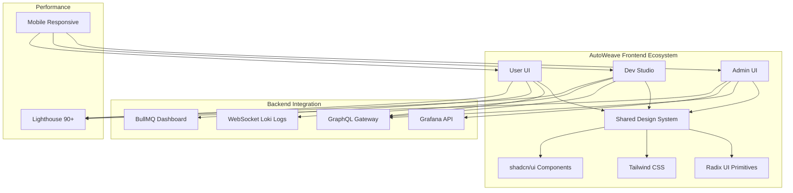

# Frontend Architecture - AutoWeave 1.0

**Version:** 1.0.0  
**Sprint:** 5 (Front-ends)  
**Stack:** Next.js 15 App Router + React Server Components  
**Date:** 2025-07-14

## 1. Vue d'Ensemble

AutoWeave propose **3 interfaces utilisateur spécialisées** construites sur une
architecture Next.js 15 moderne avec App Router et React Server Components.
Chaque UI a un public et des fonctionnalités dédiées, partageant un design
system cohérent.



## 2. Architecture Technique

### 2.1 Stack Technologique

```json
{
  "dependencies": {
    "next": "^15.0.0",
    "react": "^18.2.0",
    "react-dom": "^18.2.0",
    "@radix-ui/react-slot": "^1.0.2",
    "@radix-ui/react-dialog": "^1.0.5",
    "@radix-ui/react-dropdown-menu": "^2.0.6",
    "@radix-ui/react-toast": "^1.1.5",
    "@radix-ui/react-tooltip": "^1.0.7",
    "class-variance-authority": "^0.7.0",
    "clsx": "^2.0.0",
    "tailwind-merge": "^2.0.0",
    "tailwindcss": "^3.3.0",
    "reactflow": "^11.8.0",
    "@apollo/client": "^3.8.0",
    "@tanstack/react-query": "^5.0.0",
    "framer-motion": "^10.16.0",
    "lucide-react": "^0.292.0"
  },
  "devDependencies": {
    "@types/react": "^18.2.0",
    "@types/node": "^20.0.0",
    "typescript": "^5.0.0",
    "autoprefixer": "^10.4.0",
    "eslint": "^8.0.0",
    "eslint-config-next": "^15.0.0"
  }
}
```

### 2.2 Structure Monorepo

```
apps/
├── admin-ui/                 # Admin Dashboard
│   ├── app/
│   │   ├── globals.css
│   │   ├── layout.tsx
│   │   ├── page.tsx
│   │   ├── health/
│   │   │   └── page.tsx
│   │   ├── plugins/
│   │   │   ├── page.tsx
│   │   │   └── [id]/
│   │   │       └── page.tsx
│   │   ├── logs/
│   │   │   └── page.tsx
│   │   └── costs/
│   │       └── page.tsx
│   ├── components/
│   ├── lib/
│   └── public/
├── dev-studio/              # Developer Studio
│   ├── app/
│   │   ├── layout.tsx
│   │   ├── page.tsx
│   │   ├── builder/
│   │   │   └── page.tsx
│   │   ├── flows/
│   │   │   ├── page.tsx
│   │   │   └── [id]/
│   │   │       ├── page.tsx
│   │   │       └── edit/
│   │   │           └── page.tsx
│   │   └── logs/
│   │       └── page.tsx
│   ├── components/
│   │   ├── flow-builder/
│   │   ├── log-stream/
│   │   └── code-editor/
│   └── lib/
└── user-ui/                # End User Interface
    ├── app/
    │   ├── layout.tsx
    │   ├── page.tsx
    │   ├── agents/
    │   │   ├── page.tsx
    │   │   └── [id]/
    │   │       └── page.tsx
    │   └── chat/
    │       ├── page.tsx
    │       └── [threadId]/
    │           └── page.tsx
    ├── components/
    │   ├── agent-list/
    │   ├── chat-interface/
    │   └── voice-controls/
    └── lib/

packages/
├── ui/                      # Shared Design System
│   ├── src/
│   │   ├── components/
│   │   │   ├── ui/          # Radix + shadcn/ui
│   │   │   ├── form/
│   │   │   ├── layout/
│   │   │   └── feedback/
│   │   ├── hooks/
│   │   ├── utils/
│   │   └── styles/
│   │       ├── globals.css
│   │       └── components.css
│   └── package.json
├── graphql/                 # GraphQL Client
├── auth/                    # Authentication
└── utils/                   # Shared Utilities
```

## 3. Admin UI - Dashboard de Supervision

### 3.1 Pages Principales

#### 3.1.1 Health Dashboard (`/health`)

```tsx
// apps/admin-ui/app/health/page.tsx
import { Suspense } from 'react';
import {
  Card,
  CardContent,
  CardDescription,
  CardHeader,
  CardTitle,
} from '@autoweave/ui';
import { SystemMetrics } from '@/components/system-metrics';
import { ServiceStatus } from '@/components/service-status';
import { AlertsPanel } from '@/components/alerts-panel';

export default function HealthPage() {
  return (
    <div className="flex-1 space-y-4 p-8 pt-6">
      <div className="flex items-center justify-between space-y-2">
        <h2 className="text-3xl font-bold tracking-tight">System Health</h2>
      </div>

      <div className="grid gap-4 md:grid-cols-2 lg:grid-cols-4">
        <Card>
          <CardHeader className="flex flex-row items-center justify-between space-y-0 pb-2">
            <CardTitle className="text-sm font-medium">USB Devices</CardTitle>
            <UsbIcon className="h-4 w-4 text-muted-foreground" />
          </CardHeader>
          <CardContent>
            <div className="text-2xl font-bold">12</div>
            <p className="text-xs text-muted-foreground">+2 from last hour</p>
          </CardContent>
        </Card>

        <Card>
          <CardHeader className="flex flex-row items-center justify-between space-y-0 pb-2">
            <CardTitle className="text-sm font-medium">
              Active Plugins
            </CardTitle>
            <PlugIcon className="h-4 w-4 text-muted-foreground" />
          </CardHeader>
          <CardContent>
            <div className="text-2xl font-bold">8</div>
            <p className="text-xs text-muted-foreground">All running</p>
          </CardContent>
        </Card>

        <Card>
          <CardHeader className="flex flex-row items-center justify-between space-y-0 pb-2">
            <CardTitle className="text-sm font-medium">Queue Jobs</CardTitle>
            <ActivityIcon className="h-4 w-4 text-muted-foreground" />
          </CardHeader>
          <CardContent>
            <div className="text-2xl font-bold">45</div>
            <p className="text-xs text-muted-foreground">Processing</p>
          </CardContent>
        </Card>

        <Card>
          <CardHeader className="flex flex-row items-center justify-between space-y-0 pb-2">
            <CardTitle className="text-sm font-medium">Memory Usage</CardTitle>
            <MemoryStickIcon className="h-4 w-4 text-muted-foreground" />
          </CardHeader>
          <CardContent>
            <div className="text-2xl font-bold">2.4GB</div>
            <p className="text-xs text-muted-foreground">68% of available</p>
          </CardContent>
        </Card>
      </div>

      <div className="grid gap-4 md:grid-cols-2 lg:grid-cols-7">
        <Card className="col-span-4">
          <CardHeader>
            <CardTitle>System Metrics</CardTitle>
          </CardHeader>
          <CardContent className="pl-2">
            <Suspense fallback={<MetricsSkeleton />}>
              <SystemMetrics />
            </Suspense>
          </CardContent>
        </Card>

        <Card className="col-span-3">
          <CardHeader>
            <CardTitle>Service Status</CardTitle>
            <CardDescription>Real-time service health</CardDescription>
          </CardHeader>
          <CardContent>
            <Suspense fallback={<ServicesSkeleton />}>
              <ServiceStatus />
            </Suspense>
          </CardContent>
        </Card>
      </div>

      <div className="grid gap-4 md:grid-cols-1">
        <Card>
          <CardHeader>
            <CardTitle>Active Alerts</CardTitle>
            <CardDescription>Critical system notifications</CardDescription>
          </CardHeader>
          <CardContent>
            <AlertsPanel />
          </CardContent>
        </Card>
      </div>
    </div>
  );
}
```

#### 3.1.2 Plugin Management (`/plugins`)

```tsx
// apps/admin-ui/app/plugins/page.tsx
import { DataTable } from '@/components/data-table';
import { PluginActions } from '@/components/plugin-actions';
import { InstallPluginDialog } from '@/components/install-plugin-dialog';

const columns = [
  {
    accessorKey: 'name',
    header: 'Plugin Name',
  },
  {
    accessorKey: 'version',
    header: 'Version',
  },
  {
    accessorKey: 'status',
    header: 'Status',
    cell: ({ row }) => (
      <Badge
        variant={row.getValue('status') === 'running' ? 'default' : 'secondary'}
      >
        {row.getValue('status')}
      </Badge>
    ),
  },
  {
    accessorKey: 'memoryUsage',
    header: 'Memory',
    cell: ({ row }) => (
      <div className="text-right">{row.getValue('memoryUsage')} MB</div>
    ),
  },
  {
    id: 'actions',
    cell: ({ row }) => <PluginActions plugin={row.original} />,
  },
];

export default function PluginsPage() {
  return (
    <div className="hidden h-full flex-1 flex-col space-y-8 p-8 md:flex">
      <div className="flex items-center justify-between space-y-2">
        <div>
          <h2 className="text-2xl font-bold tracking-tight">Plugins</h2>
          <p className="text-muted-foreground">Manage your AutoWeave plugins</p>
        </div>
        <div className="flex items-center space-x-2">
          <InstallPluginDialog />
        </div>
      </div>

      <DataTable data={plugins} columns={columns} />
    </div>
  );
}
```

#### 3.1.3 Logs Viewer (`/logs`)

```tsx
// apps/admin-ui/app/logs/page.tsx
import { LogStream } from '@/components/log-stream';
import { LogFilters } from '@/components/log-filters';

export default function LogsPage() {
  return (
    <div className="flex h-full flex-col space-y-4 p-8">
      <div className="flex items-center justify-between">
        <h2 className="text-2xl font-bold tracking-tight">System Logs</h2>
        <LogFilters />
      </div>

      <div className="flex-1 rounded-md border">
        <LogStream />
      </div>
    </div>
  );
}
```

#### 3.1.4 Cost Monitoring (`/costs`)

```tsx
// apps/admin-ui/app/costs/page.tsx
import { CostChart } from '@/components/cost-chart';
import { CostBreakdown } from '@/components/cost-breakdown';
import { CostAlerts } from '@/components/cost-alerts';

export default function CostsPage() {
  return (
    <div className="flex-1 space-y-4 p-8 pt-6">
      <div className="flex items-center justify-between space-y-2">
        <h2 className="text-3xl font-bold tracking-tight">Cost Management</h2>
      </div>

      <div className="grid gap-4 md:grid-cols-2 lg:grid-cols-4">
        <Card>
          <CardHeader className="flex flex-row items-center justify-between space-y-0 pb-2">
            <CardTitle className="text-sm font-medium">This Month</CardTitle>
            <DollarSign className="h-4 w-4 text-muted-foreground" />
          </CardHeader>
          <CardContent>
            <div className="text-2xl font-bold">$124.50</div>
            <p className="text-xs text-muted-foreground">
              +12% from last month
            </p>
          </CardContent>
        </Card>

        <Card>
          <CardHeader className="flex flex-row items-center justify-between space-y-0 pb-2">
            <CardTitle className="text-sm font-medium">LLM Costs</CardTitle>
            <BrainCircuit className="h-4 w-4 text-muted-foreground" />
          </CardHeader>
          <CardContent>
            <div className="text-2xl font-bold">$89.20</div>
            <p className="text-xs text-muted-foreground">72% of total</p>
          </CardContent>
        </Card>
      </div>

      <div className="grid gap-4 md:grid-cols-2 lg:grid-cols-7">
        <Card className="col-span-4">
          <CardHeader>
            <CardTitle>Cost Trends</CardTitle>
          </CardHeader>
          <CardContent className="pl-2">
            <CostChart />
          </CardContent>
        </Card>

        <Card className="col-span-3">
          <CardHeader>
            <CardTitle>Breakdown</CardTitle>
          </CardHeader>
          <CardContent>
            <CostBreakdown />
          </CardContent>
        </Card>
      </div>
    </div>
  );
}
```

## 4. Dev Studio - Builder d'Agents

### 4.1 Flow Builder (`/builder`)

```tsx
// apps/dev-studio/app/builder/page.tsx
'use client';

import ReactFlow, {
  Background,
  Controls,
  MiniMap,
  useNodesState,
  useEdgesState,
  addEdge,
  Connection,
  Edge,
} from 'reactflow';
import 'reactflow/dist/style.css';

import { LLMNode } from '@/components/nodes/llm-node';
import { USBNode } from '@/components/nodes/usb-node';
import { OutputNode } from '@/components/nodes/output-node';
import { NodeToolbox } from '@/components/node-toolbox';
import { FlowControls } from '@/components/flow-controls';

const nodeTypes = {
  llm: LLMNode,
  usb: USBNode,
  output: OutputNode,
};

const initialNodes = [
  {
    id: '1',
    type: 'usb',
    position: { x: 100, y: 100 },
    data: { label: 'USB Scanner' },
  },
  {
    id: '2',
    type: 'llm',
    position: { x: 300, y: 100 },
    data: { label: 'Document Analysis' },
  },
  {
    id: '3',
    type: 'output',
    position: { x: 500, y: 100 },
    data: { label: 'Results' },
  },
];

const initialEdges = [
  { id: 'e1-2', source: '1', target: '2' },
  { id: 'e2-3', source: '2', target: '3' },
];

export default function BuilderPage() {
  const [nodes, setNodes, onNodesChange] = useNodesState(initialNodes);
  const [edges, setEdges, onEdgesChange] = useEdgesState(initialEdges);

  const onConnect = useCallback(
    (params: Connection) => setEdges((eds) => addEdge(params, eds)),
    [setEdges],
  );

  return (
    <div className="flex h-full">
      <NodeToolbox />

      <div className="flex-1 relative">
        <ReactFlow
          nodes={nodes}
          edges={edges}
          onNodesChange={onNodesChange}
          onEdgesChange={onEdgesChange}
          onConnect={onConnect}
          nodeTypes={nodeTypes}
          className="bg-background"
          fitView
        >
          <Background />
          <Controls />
          <MiniMap />
        </ReactFlow>

        <FlowControls />
      </div>
    </div>
  );
}
```

### 4.2 WebSocket Log Stream

```tsx
// apps/dev-studio/components/log-stream.tsx
'use client';

import { useEffect, useState } from 'react';
import { ScrollArea } from '@autoweave/ui';

interface LogEntry {
  timestamp: string;
  level: 'debug' | 'info' | 'warn' | 'error';
  message: string;
  source: string;
  metadata?: Record<string, any>;
}

export function LogStream() {
  const [logs, setLogs] = useState<LogEntry[]>([]);
  const [wsStatus, setWsStatus] = useState<
    'connecting' | 'connected' | 'disconnected'
  >('connecting');

  useEffect(() => {
    const ws = new WebSocket(`${process.env.NEXT_PUBLIC_WS_URL}/logs`);

    ws.onopen = () => {
      setWsStatus('connected');
      console.log('Connected to log stream');
    };

    ws.onmessage = (event) => {
      const logEntry: LogEntry = JSON.parse(event.data);
      setLogs((prev) => [...prev.slice(-999), logEntry]); // Keep last 1000 logs
    };

    ws.onclose = () => {
      setWsStatus('disconnected');
      console.log('Disconnected from log stream');
    };

    ws.onerror = (error) => {
      console.error('WebSocket error:', error);
      setWsStatus('disconnected');
    };

    return () => {
      ws.close();
    };
  }, []);

  const getLevelColor = (level: LogEntry['level']) => {
    switch (level) {
      case 'error':
        return 'text-red-500';
      case 'warn':
        return 'text-yellow-500';
      case 'info':
        return 'text-blue-500';
      case 'debug':
        return 'text-gray-500';
      default:
        return 'text-foreground';
    }
  };

  return (
    <div className="flex flex-col h-full">
      <div className="flex items-center justify-between p-4 border-b">
        <h3 className="text-lg font-semibold">Live Logs</h3>
        <div className="flex items-center space-x-2">
          <div
            className={`w-2 h-2 rounded-full ${
              wsStatus === 'connected'
                ? 'bg-green-500'
                : wsStatus === 'connecting'
                  ? 'bg-yellow-500'
                  : 'bg-red-500'
            }`}
          />
          <span className="text-sm text-muted-foreground capitalize">
            {wsStatus}
          </span>
        </div>
      </div>

      <ScrollArea className="flex-1">
        <div className="p-4 space-y-1 font-mono text-sm">
          {logs.map((log, index) => (
            <div key={index} className="flex space-x-3">
              <span className="text-muted-foreground w-20 shrink-0">
                {new Date(log.timestamp).toLocaleTimeString()}
              </span>
              <span
                className={`w-12 shrink-0 uppercase ${getLevelColor(log.level)}`}
              >
                {log.level}
              </span>
              <span className="text-muted-foreground w-20 shrink-0">
                {log.source}
              </span>
              <span className="flex-1">{log.message}</span>
            </div>
          ))}
        </div>
      </ScrollArea>
    </div>
  );
}
```

## 5. User UI - Interface Utilisateur Final

### 5.1 Agent List & Chat Interface

```tsx
// apps/user-ui/app/page.tsx
import { AgentSidebar } from '@/components/agent-sidebar';
import { ChatInterface } from '@/components/chat-interface';

export default function HomePage() {
  return (
    <div className="flex h-screen bg-background">
      <AgentSidebar />
      <main className="flex-1 flex flex-col">
        <ChatInterface />
      </main>
    </div>
  );
}
```

```tsx
// apps/user-ui/components/agent-sidebar.tsx
import { Card, CardContent, CardHeader, CardTitle } from '@autoweave/ui';
import { Badge } from '@autoweave/ui';
import { Button } from '@autoweave/ui';

interface Agent {
  id: string;
  name: string;
  status: 'online' | 'offline' | 'busy';
  description: string;
  capabilities: string[];
}

export function AgentSidebar() {
  const agents: Agent[] = [
    {
      id: '1',
      name: 'Document Scanner',
      status: 'online',
      description: 'Scans and processes documents via USB scanner',
      capabilities: ['USB', 'OCR', 'PDF'],
    },
    {
      id: '2',
      name: 'Code Assistant',
      status: 'online',
      description: 'Helps with programming tasks and code review',
      capabilities: ['Coding', 'Debug', 'Review'],
    },
    {
      id: '3',
      name: 'Data Analyst',
      status: 'busy',
      description: 'Analyzes data and generates insights',
      capabilities: ['Analytics', 'Charts', 'SQL'],
    },
  ];

  return (
    <div className="w-80 border-r bg-muted/40 p-4">
      <div className="flex items-center justify-between mb-4">
        <h2 className="text-lg font-semibold">Available Agents</h2>
        <Button size="sm">+ New</Button>
      </div>

      <div className="space-y-3">
        {agents.map((agent) => (
          <Card
            key={agent.id}
            className="cursor-pointer hover:bg-accent/50 transition-colors"
          >
            <CardHeader className="pb-2">
              <div className="flex items-center justify-between">
                <CardTitle className="text-sm">{agent.name}</CardTitle>
                <Badge
                  variant={
                    agent.status === 'online'
                      ? 'default'
                      : agent.status === 'busy'
                        ? 'secondary'
                        : 'outline'
                  }
                  className="text-xs"
                >
                  {agent.status}
                </Badge>
              </div>
            </CardHeader>
            <CardContent className="pt-0">
              <p className="text-xs text-muted-foreground mb-2">
                {agent.description}
              </p>
              <div className="flex flex-wrap gap-1">
                {agent.capabilities.map((cap) => (
                  <Badge key={cap} variant="outline" className="text-xs">
                    {cap}
                  </Badge>
                ))}
              </div>
            </CardContent>
          </Card>
        ))}
      </div>
    </div>
  );
}
```

### 5.2 Chat Interface

```tsx
// apps/user-ui/components/chat-interface.tsx
'use client';

import { useState, useRef, useEffect } from 'react';
import { Button } from '@autoweave/ui';
import { Input } from '@autoweave/ui';
import { ScrollArea } from '@autoweave/ui';
import { Avatar, AvatarFallback, AvatarImage } from '@autoweave/ui';
import { Send, Mic, MicOff } from 'lucide-react';

interface Message {
  id: string;
  content: string;
  sender: 'user' | 'agent';
  timestamp: Date;
  agentName?: string;
}

export function ChatInterface() {
  const [messages, setMessages] = useState<Message[]>([]);
  const [inputValue, setInputValue] = useState('');
  const [isRecording, setIsRecording] = useState(false);
  const scrollAreaRef = useRef<HTMLDivElement>(null);

  const handleSendMessage = () => {
    if (!inputValue.trim()) return;

    const newMessage: Message = {
      id: Date.now().toString(),
      content: inputValue,
      sender: 'user',
      timestamp: new Date(),
    };

    setMessages((prev) => [...prev, newMessage]);
    setInputValue('');

    // Simulate agent response
    setTimeout(() => {
      const agentResponse: Message = {
        id: (Date.now() + 1).toString(),
        content: `I received your message: "${inputValue}". How can I help you with that?`,
        sender: 'agent',
        timestamp: new Date(),
        agentName: 'Document Scanner',
      };
      setMessages((prev) => [...prev, agentResponse]);
    }, 1000);
  };

  const toggleRecording = () => {
    setIsRecording(!isRecording);
    // Implement voice recording logic
  };

  useEffect(() => {
    // Auto-scroll to bottom when new messages arrive
    if (scrollAreaRef.current) {
      scrollAreaRef.current.scrollTop = scrollAreaRef.current.scrollHeight;
    }
  }, [messages]);

  return (
    <div className="flex flex-col h-full">
      <div className="border-b p-4">
        <h1 className="text-xl font-semibold">Chat with Agents</h1>
        <p className="text-sm text-muted-foreground">
          Start a conversation with your AutoWeave agents
        </p>
      </div>

      <ScrollArea ref={scrollAreaRef} className="flex-1 p-4">
        <div className="space-y-4">
          {messages.map((message) => (
            <div
              key={message.id}
              className={`flex ${message.sender === 'user' ? 'justify-end' : 'justify-start'}`}
            >
              <div
                className={`flex items-start space-x-2 max-w-xs lg:max-w-md ${
                  message.sender === 'user'
                    ? 'flex-row-reverse space-x-reverse'
                    : 'flex-row'
                }`}
              >
                <Avatar className="w-8 h-8">
                  <AvatarImage
                    src={
                      message.sender === 'user'
                        ? '/user-avatar.png'
                        : '/agent-avatar.png'
                    }
                  />
                  <AvatarFallback>
                    {message.sender === 'user' ? 'U' : 'A'}
                  </AvatarFallback>
                </Avatar>
                <div
                  className={`rounded-lg p-3 ${
                    message.sender === 'user'
                      ? 'bg-primary text-primary-foreground'
                      : 'bg-muted'
                  }`}
                >
                  {message.sender === 'agent' && message.agentName && (
                    <p className="text-xs font-medium text-muted-foreground mb-1">
                      {message.agentName}
                    </p>
                  )}
                  <p className="text-sm">{message.content}</p>
                  <p
                    className={`text-xs mt-1 ${
                      message.sender === 'user'
                        ? 'text-primary-foreground/70'
                        : 'text-muted-foreground'
                    }`}
                  >
                    {message.timestamp.toLocaleTimeString([], {
                      hour: '2-digit',
                      minute: '2-digit',
                    })}
                  </p>
                </div>
              </div>
            </div>
          ))}
        </div>
      </ScrollArea>

      <div className="border-t p-4">
        <div className="flex items-center space-x-2">
          <Input
            value={inputValue}
            onChange={(e) => setInputValue(e.target.value)}
            placeholder="Type your message..."
            className="flex-1"
            onKeyDown={(e) => {
              if (e.key === 'Enter' && !e.shiftKey) {
                e.preventDefault();
                handleSendMessage();
              }
            }}
          />
          <Button
            size="icon"
            variant={isRecording ? 'destructive' : 'outline'}
            onClick={toggleRecording}
          >
            {isRecording ? (
              <MicOff className="h-4 w-4" />
            ) : (
              <Mic className="h-4 w-4" />
            )}
          </Button>
          <Button onClick={handleSendMessage} disabled={!inputValue.trim()}>
            <Send className="h-4 w-4" />
          </Button>
        </div>
      </div>
    </div>
  );
}
```

## 6. Design System Partagé

### 6.1 Package UI Structure

```tsx
// packages/ui/src/components/ui/button.tsx
import * as React from 'react';
import { Slot } from '@radix-ui/react-slot';
import { cva, type VariantProps } from 'class-variance-authority';
import { cn } from '@/lib/utils';

const buttonVariants = cva(
  'inline-flex items-center justify-center whitespace-nowrap rounded-md text-sm font-medium ring-offset-background transition-colors focus-visible:outline-none focus-visible:ring-2 focus-visible:ring-ring focus-visible:ring-offset-2 disabled:pointer-events-none disabled:opacity-50',
  {
    variants: {
      variant: {
        default: 'bg-primary text-primary-foreground hover:bg-primary/90',
        destructive:
          'bg-destructive text-destructive-foreground hover:bg-destructive/90',
        outline:
          'border border-input bg-background hover:bg-accent hover:text-accent-foreground',
        secondary:
          'bg-secondary text-secondary-foreground hover:bg-secondary/80',
        ghost: 'hover:bg-accent hover:text-accent-foreground',
        link: 'text-primary underline-offset-4 hover:underline',
      },
      size: {
        default: 'h-10 px-4 py-2',
        sm: 'h-9 rounded-md px-3',
        lg: 'h-11 rounded-md px-8',
        icon: 'h-10 w-10',
      },
    },
    defaultVariants: {
      variant: 'default',
      size: 'default',
    },
  },
);

export interface ButtonProps
  extends React.ButtonHTMLAttributes<HTMLButtonElement>,
    VariantProps<typeof buttonVariants> {
  asChild?: boolean;
}

const Button = React.forwardRef<HTMLButtonElement, ButtonProps>(
  ({ className, variant, size, asChild = false, ...props }, ref) => {
    const Comp = asChild ? Slot : 'button';
    return (
      <Comp
        className={cn(buttonVariants({ variant, size, className }))}
        ref={ref}
        {...props}
      />
    );
  },
);
Button.displayName = 'Button';

export { Button, buttonVariants };
```

### 6.2 Tailwind Configuration

```js
// packages/ui/tailwind.config.js
/** @type {import('tailwindcss').Config} */
module.exports = {
  darkMode: ['class'],
  content: [
    './pages/**/*.{ts,tsx}',
    './components/**/*.{ts,tsx}',
    './app/**/*.{ts,tsx}',
    './src/**/*.{ts,tsx}',
  ],
  theme: {
    container: {
      center: true,
      padding: '2rem',
      screens: {
        '2xl': '1400px',
      },
    },
    extend: {
      colors: {
        border: 'hsl(var(--border))',
        input: 'hsl(var(--input))',
        ring: 'hsl(var(--ring))',
        background: 'hsl(var(--background))',
        foreground: 'hsl(var(--foreground))',
        primary: {
          DEFAULT: 'hsl(var(--primary))',
          foreground: 'hsl(var(--primary-foreground))',
        },
        secondary: {
          DEFAULT: 'hsl(var(--secondary))',
          foreground: 'hsl(var(--secondary-foreground))',
        },
        destructive: {
          DEFAULT: 'hsl(var(--destructive))',
          foreground: 'hsl(var(--destructive-foreground))',
        },
        muted: {
          DEFAULT: 'hsl(var(--muted))',
          foreground: 'hsl(var(--muted-foreground))',
        },
        accent: {
          DEFAULT: 'hsl(var(--accent))',
          foreground: 'hsl(var(--accent-foreground))',
        },
        popover: {
          DEFAULT: 'hsl(var(--popover))',
          foreground: 'hsl(var(--popover-foreground))',
        },
        card: {
          DEFAULT: 'hsl(var(--card))',
          foreground: 'hsl(var(--card-foreground))',
        },
      },
      borderRadius: {
        lg: 'var(--radius)',
        md: 'calc(var(--radius) - 2px)',
        sm: 'calc(var(--radius) - 4px)',
      },
      keyframes: {
        'accordion-down': {
          from: { height: 0 },
          to: { height: 'var(--radix-accordion-content-height)' },
        },
        'accordion-up': {
          from: { height: 'var(--radix-accordion-content-height)' },
          to: { height: 0 },
        },
      },
      animation: {
        'accordion-down': 'accordion-down 0.2s ease-out',
        'accordion-up': 'accordion-up 0.2s ease-out',
      },
    },
  },
  plugins: [require('tailwindcss-animate')],
};
```

### 6.3 CSS Variables (Theme)

```css
/* packages/ui/src/styles/globals.css */
@tailwind base;
@tailwind components;
@tailwind utilities;

@layer base {
  :root {
    --background: 0 0% 100%;
    --foreground: 222.2 84% 4.9%;
    --card: 0 0% 100%;
    --card-foreground: 222.2 84% 4.9%;
    --popover: 0 0% 100%;
    --popover-foreground: 222.2 84% 4.9%;
    --primary: 221.2 83.2% 53.3%;
    --primary-foreground: 210 40% 98%;
    --secondary: 210 40% 96%;
    --secondary-foreground: 222.2 84% 4.9%;
    --muted: 210 40% 96%;
    --muted-foreground: 215.4 16.3% 46.9%;
    --accent: 210 40% 96%;
    --accent-foreground: 222.2 84% 4.9%;
    --destructive: 0 84.2% 60.2%;
    --destructive-foreground: 210 40% 98%;
    --border: 214.3 31.8% 91.4%;
    --input: 214.3 31.8% 91.4%;
    --ring: 221.2 83.2% 53.3%;
    --radius: 0.5rem;
  }

  .dark {
    --background: 222.2 84% 4.9%;
    --foreground: 210 40% 98%;
    --card: 222.2 84% 4.9%;
    --card-foreground: 210 40% 98%;
    --popover: 222.2 84% 4.9%;
    --popover-foreground: 210 40% 98%;
    --primary: 217.2 91.2% 59.8%;
    --primary-foreground: 222.2 84% 4.9%;
    --secondary: 217.2 32.6% 17.5%;
    --secondary-foreground: 210 40% 98%;
    --muted: 217.2 32.6% 17.5%;
    --muted-foreground: 215 20.2% 65.1%;
    --accent: 217.2 32.6% 17.5%;
    --accent-foreground: 210 40% 98%;
    --destructive: 0 62.8% 30.6%;
    --destructive-foreground: 210 40% 98%;
    --border: 217.2 32.6% 17.5%;
    --input: 217.2 32.6% 17.5%;
    --ring: 224.3 76.3% 94.1%;
  }
}

@layer base {
  * {
    @apply border-border;
  }
  body {
    @apply bg-background text-foreground;
  }
}
```

## 7. Performance & Lighthouse Optimization

### 7.1 Next.js 15 Configuration

```js
// next.config.js (shared config)
/** @type {import('next').NextConfig} */
const nextConfig = {
  experimental: {
    appDir: true,
    serverComponentsExternalPackages: ['@autoweave/ui'],
  },
  images: {
    domains: ['localhost'],
    formats: ['image/webp', 'image/avif'],
  },
  compress: true,
  poweredByHeader: false,
  reactStrictMode: true,
  swcMinify: true,
  compiler: {
    removeConsole: process.env.NODE_ENV === 'production',
  },
  webpack: (config, { dev, isServer }) => {
    // Optimize bundle size
    if (!dev && !isServer) {
      config.optimization.splitChunks = {
        chunks: 'all',
        cacheGroups: {
          vendor: {
            test: /[\\/]node_modules[\\/]/,
            name: 'vendors',
            chunks: 'all',
          },
          common: {
            name: 'common',
            minChunks: 2,
            chunks: 'all',
          },
        },
      };
    }
    return config;
  },
  headers: async () => [
    {
      source: '/(.*)',
      headers: [
        {
          key: 'X-Content-Type-Options',
          value: 'nosniff',
        },
        {
          key: 'X-Frame-Options',
          value: 'DENY',
        },
        {
          key: 'X-XSS-Protection',
          value: '1; mode=block',
        },
      ],
    },
  ],
};

module.exports = nextConfig;
```

### 7.2 Performance Budgets

```js
// lighthouse.config.js
module.exports = {
  ci: {
    collect: {
      url: [
        'http://localhost:3000', // Admin UI
        'http://localhost:3001', // Dev Studio
        'http://localhost:3002', // User UI
      ],
      numberOfRuns: 3,
    },
    assert: {
      assertions: {
        'categories:performance': ['error', { minScore: 0.9 }],
        'categories:accessibility': ['error', { minScore: 0.9 }],
        'categories:best-practices': ['error', { minScore: 0.9 }],
        'categories:seo': ['error', { minScore: 0.9 }],
        'first-contentful-paint': ['error', { maxNumericValue: 2000 }],
        'largest-contentful-paint': ['error', { maxNumericValue: 2500 }],
        'cumulative-layout-shift': ['error', { maxNumericValue: 0.1 }],
        'total-blocking-time': ['error', { maxNumericValue: 300 }],
      },
    },
    upload: {
      target: 'temporary-public-storage',
    },
  },
};
```

### 7.3 Mobile Performance

```tsx
// components/mobile-optimization.tsx
import { Suspense } from 'react';
import dynamic from 'next/dynamic';

// Lazy load heavy components
const ReactFlow = dynamic(() => import('reactflow'), {
  loading: () => (
    <div className="flex items-center justify-center h-64">
      Loading Flow Builder...
    </div>
  ),
  ssr: false,
});

const LogStream = dynamic(() => import('./log-stream'), {
  loading: () => <div className="animate-pulse bg-muted h-32 rounded"></div>,
});

// Mobile-first responsive design
export function ResponsiveLayout({ children }: { children: React.ReactNode }) {
  return (
    <div className="min-h-screen bg-background">
      {/* Mobile navigation */}
      <div className="lg:hidden">
        <MobileNav />
      </div>

      {/* Desktop sidebar */}
      <div className="hidden lg:block lg:fixed lg:inset-y-0 lg:w-64">
        <DesktopSidebar />
      </div>

      {/* Main content */}
      <div className="lg:pl-64">
        <main className="flex-1">{children}</main>
      </div>
    </div>
  );
}
```

## 8. CI/CD & Deployment

### 8.1 GitHub Actions

```yaml
# .github/workflows/frontend.yml
name: Frontend CI/CD

on:
  push:
    branches: [main, develop]
    paths: ['apps/**', 'packages/ui/**']
  pull_request:
    branches: [main]
    paths: ['apps/**', 'packages/ui/**']

jobs:
  test:
    runs-on: ubuntu-latest
    steps:
      - uses: actions/checkout@v4
      - uses: actions/setup-node@v4
        with:
          node-version: '20'
          cache: 'pnpm'

      - name: Install dependencies
        run: pnpm install --frozen-lockfile

      - name: Lint
        run: pnpm lint

      - name: Type check
        run: pnpm type-check

      - name: Test
        run: pnpm test

      - name: Build
        run: pnpm build

  lighthouse:
    runs-on: ubuntu-latest
    needs: test
    if: github.event_name == 'pull_request'
    steps:
      - uses: actions/checkout@v4
      - uses: actions/setup-node@v4
        with:
          node-version: '20'
          cache: 'pnpm'

      - name: Install dependencies
        run: pnpm install --frozen-lockfile

      - name: Build apps
        run: pnpm build

      - name: Start apps
        run: |
          pnpm start:admin &
          pnpm start:studio &
          pnpm start:user &
          sleep 10

      - name: Run Lighthouse CI
        run: pnpm lighthouse:ci
        env:
          LHCI_GITHUB_APP_TOKEN: ${{ secrets.LHCI_GITHUB_APP_TOKEN }}

  deploy:
    runs-on: ubuntu-latest
    needs: [test, lighthouse]
    if: github.ref == 'refs/heads/main'
    steps:
      - uses: actions/checkout@v4

      - name: Deploy to Vercel
        uses: amondnet/vercel-action@v25
        with:
          vercel-token: ${{ secrets.VERCEL_TOKEN }}
          vercel-org-id: ${{ secrets.VERCEL_ORG_ID }}
          vercel-project-id: ${{ secrets.VERCEL_PROJECT_ID }}
          working-directory: apps/admin-ui
```

### 8.2 Docker Multi-Stage

```dockerfile
# Dockerfile.frontend
FROM node:20-alpine AS base
RUN corepack enable pnpm

FROM base AS deps
WORKDIR /app
COPY package.json pnpm-lock.yaml pnpm-workspace.yaml ./
COPY packages/ui/package.json ./packages/ui/
COPY apps/*/package.json ./apps/
RUN pnpm install --frozen-lockfile

FROM base AS builder
WORKDIR /app
COPY --from=deps /app/node_modules ./node_modules
COPY . .
RUN pnpm build

FROM base AS admin-ui
WORKDIR /app
COPY --from=builder /app/apps/admin-ui/.next/standalone ./
COPY --from=builder /app/apps/admin-ui/.next/static ./apps/admin-ui/.next/static
COPY --from=builder /app/apps/admin-ui/public ./apps/admin-ui/public
EXPOSE 3000
CMD ["node", "apps/admin-ui/server.js"]

FROM base AS dev-studio
WORKDIR /app
COPY --from=builder /app/apps/dev-studio/.next/standalone ./
COPY --from=builder /app/apps/dev-studio/.next/static ./apps/dev-studio/.next/static
COPY --from=builder /app/apps/dev-studio/public ./apps/dev-studio/public
EXPOSE 3001
CMD ["node", "apps/dev-studio/server.js"]

FROM base AS user-ui
WORKDIR /app
COPY --from=builder /app/apps/user-ui/.next/standalone ./
COPY --from=builder /app/apps/user-ui/.next/static ./apps/user-ui/.next/static
COPY --from=builder /app/apps/user-ui/public ./apps/user-ui/public
EXPOSE 3002
CMD ["node", "apps/user-ui/server.js"]
```

## 9. Tests d'Acceptation

### 9.1 Critères de Performance

- [ ] **Lighthouse Score ≥ 90** pour les 4 métriques core
- [ ] **Mobile Performance ≥ 90** sur devices low-end
- [ ] **First Contentful Paint < 2s**
- [ ] **Largest Contentful Paint < 2.5s**
- [ ] **Cumulative Layout Shift < 0.1**
- [ ] **Time to Interactive < 3s**

### 9.2 Critères Fonctionnels

- [ ] **Admin UI** : Health, Plugins, Logs, Costs pages complètes
- [ ] **Dev Studio** : React Flow builder + WebSocket logs
- [ ] **User UI** : Agent list + chat interface fonctionnels
- [ ] **Design System** : Cohérence visuelle 100%
- [ ] **Responsive** : Mobile + tablet + desktop
- [ ] **Accessibility** : WCAG 2.1 AA compliance

### 9.3 Tests E2E

```typescript
// tests/e2e/admin-ui.spec.ts
import { test, expect } from '@playwright/test';

test('Admin UI - Health Dashboard', async ({ page }) => {
  await page.goto('/health');

  // Check main metrics cards
  await expect(page.locator('[data-testid="usb-devices-card"]')).toBeVisible();
  await expect(
    page.locator('[data-testid="active-plugins-card"]'),
  ).toBeVisible();
  await expect(page.locator('[data-testid="queue-jobs-card"]')).toBeVisible();
  await expect(page.locator('[data-testid="memory-usage-card"]')).toBeVisible();

  // Check system metrics chart
  await expect(
    page.locator('[data-testid="system-metrics-chart"]'),
  ).toBeVisible();

  // Check service status
  await expect(page.locator('[data-testid="service-status"]')).toBeVisible();
});

test('Dev Studio - Flow Builder', async ({ page }) => {
  await page.goto('/builder');

  // Check React Flow canvas
  await expect(page.locator('.react-flow')).toBeVisible();

  // Check node toolbox
  await expect(page.locator('[data-testid="node-toolbox"]')).toBeVisible();

  // Add a node
  await page.click('[data-testid="llm-node-button"]');
  await page.click('.react-flow__pane', { position: { x: 300, y: 200 } });

  // Verify node was added
  await expect(page.locator('.react-flow__node')).toHaveCount(4); // 3 initial + 1 new
});

test('User UI - Chat Interface', async ({ page }) => {
  await page.goto('/');

  // Check agent sidebar
  await expect(page.locator('[data-testid="agent-sidebar"]')).toBeVisible();

  // Check chat interface
  await expect(page.locator('[data-testid="chat-interface"]')).toBeVisible();

  // Send a message
  const input = page.locator('[data-testid="chat-input"]');
  await input.fill('Hello, can you help me?');
  await page.click('[data-testid="send-button"]');

  // Check message appears
  await expect(page.locator('[data-testid="message"]')).toContainText(
    'Hello, can you help me?',
  );

  // Wait for agent response
  await expect(page.locator('[data-testid="agent-message"]')).toBeVisible({
    timeout: 5000,
  });
});
```

## 10. Roadmap & Évolutions

### 10.1 Version 1.0 (Sprint 5)

- [x] Architecture documentée
- [ ] 3 UIs Next.js 15 implémentées
- [ ] Design system Radix + shadcn/ui
- [ ] Performance Lighthouse 90+
- [ ] Tests E2E complets

### 10.2 Version 1.1 (Post-Sprint 5)

- [ ] Dark/Light theme switcher
- [ ] Advanced data visualization
- [ ] Real-time collaboration
- [ ] Mobile app PWA
- [ ] Offline support

### 10.3 Version 2.0 (Avatar Integration)

- [ ] Voice interface integration
- [ ] Video avatar components
- [ ] 3D visualization
- [ ] WebRTC support
- [ ] Multi-modal interactions

---

**Status:** 📋 READY FOR IMPLEMENTATION  
**Next Milestone:** Sprint 5 Start  
**Team:** Frontend Team Lead + 3 developers
