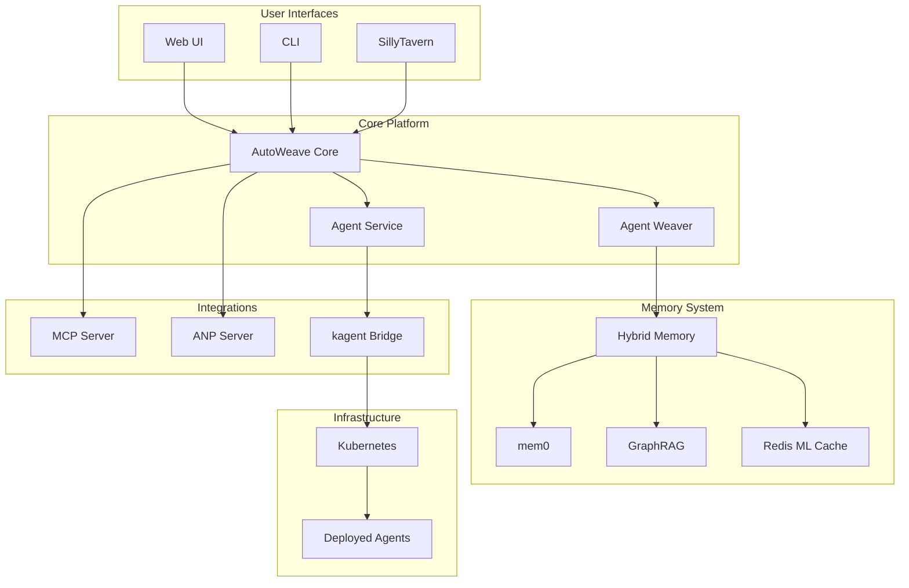

# 🌟 AutoWeave - The Self-Weaving Agent Orchestrator

<div align="center">
  
  
  
  
  
</div>

## 🚀 Overview

AutoWeave is an advanced AI agent orchestration platform that democratizes the creation and deployment of intelligent agents. By combining natural language processing with Kubernetes-native deployment, AutoWeave enables anyone to create sophisticated AI agents without deep technical knowledge.

### 🎯 Key Features

- **Natural Language Agent Creation**: Describe what you want, AutoWeave builds it
- **Hybrid Memory System**: Combines contextual (mem0) and structural (GraphRAG) memory
- **Agent Network Protocol (ANP)**: Standardized agent-to-agent communication
- **Dynamic UI Generation (AG-UI)**: Real-time WebSocket-based interfaces
- **Model Context Protocol (MCP)**: Seamless integration with AI models
- **Production-Ready Deployment**: Kubernetes-native with full observability
- **6 Specialized AI Agents**: Pre-built agents for common tasks

## 📦 Ecosystem Modules

AutoWeave is organized as a modular ecosystem with specialized components:

### Core Modules

| Module | Description | Repository |
|--------|-------------|------------|
| **autoweave-core** | Core engine and orchestration | [GitHub](https://github.com/GontrandL/autoweave-core) |
| **autoweave-memory** | Hybrid memory system (mem0 + GraphRAG) | [GitHub](https://github.com/GontrandL/autoweave-memory) |
| **autoweave-integrations** | MCP, ANP, and kagent integrations | [GitHub](https://github.com/GontrandL/autoweave-integrations) |
| **autoweave-agents** | Collection of intelligent agents | [GitHub](https://github.com/GontrandL/autoweave-agents) |

### Interface Modules

| Module | Description | Repository |
|--------|-------------|------------|
| **autoweave-ui** | User interfaces and API routes | [GitHub](https://github.com/GontrandL/autoweave-ui) |
| **autoweave-cli** | Command-line interface | [GitHub](https://github.com/GontrandL/autoweave-cli) |

### Infrastructure

| Module | Description | Repository |
|--------|-------------|------------|
| **autoweave-deployment** | Kubernetes manifests and scripts | [GitHub](https://github.com/GontrandL/autoweave-deployment) |

## 🏗️ Architecture



## 🚀 Quick Start

### Prerequisites

- Node.js 18.0.0+
- Python 3.8+
- Docker and Docker Compose
- Kubernetes cluster (or Kind for local development)
- OpenAI API key

### Installation

1. **Clone the deployment module**
```bash
git clone https://github.com/GontrandL/autoweave-deployment.git
cd autoweave-deployment
```

2. **Run the installer**
```bash
./install.sh
```

3. **Configure environment**
```bash
cp .env.example .env
# Edit .env with your OpenAI API key and configurations
```

4. **Start AutoWeave**
```bash
./start-autoweave.sh
```

### Creating Your First Agent

```bash
# Using CLI
autoweave create "Create a file processing agent that converts CSV to JSON"

# Using API
curl -X POST http://localhost:3000/api/agents \
  -H "Content-Type: application/json" \
  -d '{"description": "Create a file processing agent that converts CSV to JSON"}'

# Using Web UI
# Navigate to http://localhost:3000
```

## 🧩 Core Components

### Agent Weaver
Transforms natural language descriptions into executable agent workflows using advanced LLM processing.

### Hybrid Memory System
- **Contextual Memory (mem0)**: Stores conversations, user preferences, and session data
- **Structural Memory (GraphRAG)**: Maintains relationships, knowledge graphs, and ontologies
- **Redis ML Cache**: Intelligent caching with pattern recognition

### Protocol Support
- **ANP (Agent Network Protocol)**: RESTful API for agent communication
- **MCP (Model Context Protocol)**: Integration with AI models
- **AG-UI (Agent GUI)**: Dynamic UI generation via WebSocket

### Pre-built Agents
1. **Debugging Agent**: OpenTelemetry-based system diagnostics
2. **Self-Awareness Agent**: System monitoring and optimization
3. **Integration Agent**: API and service integration
4. **Configuration Intelligence**: Smart configuration generation
5. **Security Agent**: Security scanning and compliance
6. **Performance Agent**: Performance monitoring and optimization

## 🔧 Development

### Setting up for development

```bash
# Clone all modules
for module in core memory integrations agents ui cli deployment; do
  git clone https://github.com/GontrandL/autoweave-$module.git
done

# Install dependencies
cd autoweave-core && npm install
cd ../autoweave-memory && npm install
# ... repeat for each module

# Link modules locally
npm link ../autoweave-memory  # from autoweave-core
# ... link dependencies as needed
```

### Running tests

```bash
# Unit tests
npm test

# Integration tests
npm run test:integration

# E2E tests
npm run test:e2e
```

### Contributing

Please read our [Contributing Guide](CONTRIBUTING.md) for details on our code of conduct and the process for submitting pull requests.

## 📚 Documentation

- [Architecture Overview](docs/ARCHITECTURE.md)
- [API Reference](docs/API.md)
- [Deployment Guide](docs/DEPLOYMENT.md)
- [Agent Development](docs/AGENT_DEVELOPMENT.md)
- [Memory System](docs/MEMORY_SYSTEM.md)
- [Protocol Specifications](docs/PROTOCOLS.md)

## 🛣️ Roadmap

### Phase 1: Foundation (✅ Complete)
- Core agent creation engine
- Hybrid memory system
- Basic protocol support
- CLI and Web UI

### Phase 2: Enhancement (🚧 In Progress)
- Advanced agent templates
- Enhanced UI/UX
- Performance optimizations
- Extended protocol support

### Phase 3: Ecosystem (📅 Planned)
- Plugin architecture
- Marketplace for agents
- Enterprise features
- Cloud deployment options

## 🤝 Community

- **Discord**: [Join our community](https://discord.gg/autoweave)
- **Twitter**: [@autoweave](https://twitter.com/autoweave)
- **Blog**: [blog.autoweave.dev](https://blog.autoweave.dev)

## 📄 License

AutoWeave is open source software licensed under the [MIT License](LICENSE).

## 🙏 Acknowledgments

- OpenAI for GPT models
- Kubernetes community
- mem0 and Qdrant teams
- All our contributors

---

<div align="center">
  <p>Built with ❤️ by the AutoWeave Team</p>
  <p>⭐ Star us on GitHub!</p>
</div>