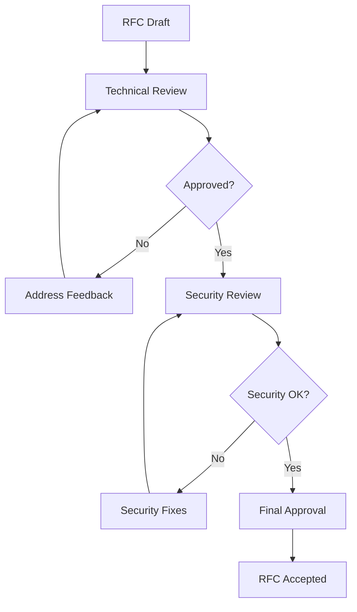

# Sprint 0 - Requirements Freeze & Validation

**Duration:** ≤ 1 semaine  
**Objective:** Gel des exigences détaillé et validation complète avant démarrage
Sprint 1  
**Date:** 2025-07-14

## 1. Vue d'Ensemble

Le Sprint 0 constitue la phase critique de validation et figement des exigences
pour la plateforme AutoWeave 1.0. Aucun développement ne peut débuter avant la
completion de ce sprint.

## 2. Livrables Obligatoires

### 2.1 RFC Techniques (Status: ✅ TERMINÉ)

- [x] **RFC-001-PLUGIN-MANIFEST.md** : Spécification complète du manifeste
      plugin
  - Schéma JSON validé avec AJV
  - Architecture Worker Thread isolation
  - Système de permissions granulaires
  - Validation cryptographique SHA-256

### 2.2 Architecture Documents (Status: 🚧 EN COURS)

- [ ] **USB_DAEMON_SPEC.md** : Spécification daemon USB hot-plug
- [ ] **FRONTEND_ARCHITECTURE.md** : Architecture 3 UIs Next.js 15
- [ ] **BACKEND_ARCHITECTURE.md** : GraphQL Gateway + BullMQ + OTEL

### 2.3 Process Documentation (Status: ⏳ PENDING)

- [ ] **CONTRIBUTION_GUIDE.md** : Standards développement + code review
- [ ] **TESTING_STRATEGY.md** : Stratégie testing + couverture minimale
- [ ] **SECURITY_GUIDELINES.md** : Guidelines sécurité + audit

## 3. Validation Compatibilité OSS

### 3.1 Audit Licences Dépendances

| Dépendance              | Version | Licence      | Compatibilité OSS | Status    |
| ----------------------- | ------- | ------------ | ----------------- | --------- |
| **Core Runtime**        |         |              |                   |
| Node.js                 | ≥18.0.0 | MIT          | ✅ Compatible     | Validé    |
| TypeScript              | ^5.0.0  | Apache-2.0   | ✅ Compatible     | Validé    |
| **USB & Hardware**      |         |              |                   |
| node-usb                | ^2.11.0 | MIT          | ✅ Compatible     | Validé    |
| libusb                  | 1.0.x   | LGPL-2.1+    | ✅ Compatible     | Validé    |
| chokidar                | ^3.5.0  | MIT          | ✅ Compatible     | Validé    |
| **Queue & Jobs**        |         |              |                   |
| BullMQ                  | ^4.0.0  | MIT          | ✅ Compatible     | Validé    |
| Redis                   | ^7.0.0  | BSD-3-Clause | ✅ Compatible     | Validé    |
| **GraphQL Gateway**     |         |              |                   |
| @apollo/gateway         | ^2.0.0  | Elastic-2.0  | ⚠️ Attention      | À valider |
| @apollo/subgraph        | ^2.0.0  | Elastic-2.0  | ⚠️ Attention      | À valider |
| graphql                 | ^16.6.0 | MIT          | ✅ Compatible     | Validé    |
| **Observability**       |         |              |                   |
| @opentelemetry/api      | ^1.6.0  | Apache-2.0   | ✅ Compatible     | Validé    |
| @opentelemetry/sdk-node | ^0.45.0 | Apache-2.0   | ✅ Compatible     | Validé    |
| **Frontend Stack**      |         |              |                   |
| Next.js                 | ^15.0.0 | MIT          | ✅ Compatible     | Validé    |
| React                   | ^18.2.0 | MIT          | ✅ Compatible     | Validé    |
| React Flow              | ^11.8.0 | MIT          | ✅ Compatible     | Validé    |
| Radix UI                | ^1.0.0  | MIT          | ✅ Compatible     | Validé    |
| Tailwind CSS            | ^3.3.0  | MIT          | ✅ Compatible     | Validé    |
| **Build & Deploy**      |         |              |                   |
| Turborepo               | ^1.10.0 | MIT          | ✅ Compatible     | Validé    |
| Docker                  | CE      | Apache-2.0   | ✅ Compatible     | Validé    |
| Helm                    | ^3.12.0 | Apache-2.0   | ✅ Compatible     | Validé    |

### 3.2 Actions Licence Apollo GraphQL

⚠️ **ATTENTION CRITIQUE:** Apollo GraphQL Federation utilise la licence
Elastic-2.0 qui pose des restrictions commerciales.

**Options alternatives évaluées:**

1. **GraphQL Mesh** (MIT) - Recommandé
2. **Mercurius** (MIT) - Option lightweight
3. **Hasura** (Apache-2.0) - Option managed
4. **Custom Federation** - Development overhead

**Décision requise:** Choisir alternative MIT/Apache-2.0 avant Sprint 1.

## 4. Critères d'Acceptation Sprint 1

### 4.1 Critères Techniques Bloquants

- [ ] **Tous les RFC validés** par l'équipe tech + security review
- [ ] **Licences OSS confirmées** - Aucune licence propriétaire/restrictive
- [ ] **Architecture decisions records** (ADR) créés pour choix critiques
- [ ] **Security threat model** initial documenté
- [ ] **Performance baselines** définis (targets + métriques)

### 4.2 Critères Process

- [ ] **Git workflow** défini (GitFlow + Conventional Commits)
- [ ] **CI/CD pipeline** skeleton configuré
- [ ] **Quality gates** SonarCloud configurés
- [ ] **Dependency scanning** + vulnerability monitoring activé
- [ ] **Branch protection rules** appliquées sur main/develop

### 4.3 Critères Documentation

- [ ] **README.md** projet mis à jour avec architecture overview
- [ ] **CONTRIBUTING.md** avec guidelines développement
- [ ] **Code of Conduct** défini
- [ ] **Issue templates** GitHub configurés
- [ ] **PR templates** avec checklists qualité

## 5. Process de Validation RFC

### 5.1 Workflow Review

### 5.2 Review Checklist

**Technical Review:**

- [ ] Architecture coherence with overall system
- [ ] Performance implications assessed
- [ ] Scalability considerations documented
- [ ] Error handling strategies defined
- [ ] Testing approach outlined

**Security Review:**

- [ ] Threat model updated
- [ ] Security controls identified
- [ ] Input validation specified
- [ ] Authentication/authorization defined
- [ ] Data protection measures outlined

## 6. Définition of Done - Sprint 0

### 6.1 Must Have (Bloquant)

- [x] RFC-001 Plugin Manifest validé et approuvé
- [ ] Tous les documents d'architecture créés
- [ ] Audit licences OSS complété - 100% compatible
- [ ] Décision Apollo GraphQL prise + alternative choisie
- [ ] Security threat model v1.0 documenté
- [ ] Performance targets définis

### 6.2 Should Have (Important)

- [ ] ADR (Architecture Decision Records) initialisés
- [ ] Prototype minimal daemon USB fonctionnel
- [ ] Setup environnement développement documenté
- [ ] Templates CI/CD créés
- [ ] Monitoring/observability stack défini

### 6.3 Nice to Have (Optionnel)

- [ ] Logo/branding AutoWeave défini
- [ ] Roadmap publique GitHub Projects
- [ ] Discord/Slack community setup
- [ ] Blog/communication strategy outlined

## 7. Risques & Mitigation

### 7.1 Risques Identifiés

| Risque                               | Probabilité | Impact   | Mitigation                     |
| ------------------------------------ | ----------- | -------- | ------------------------------ |
| Licence Apollo GraphQL bloquante     | Haute       | Critique | Alternative GraphQL Mesh ready |
| Complexité architecture sous-estimée | Moyenne     | Haute    | Prototype validation Sprint 0  |
| Performance USB daemon insuffisante  | Faible      | Moyenne  | Benchmarks + fallback udev     |
| Délai validation sécurité            | Moyenne     | Moyenne  | Security review parallèle      |

### 7.2 Go/No-Go Criteria

**GO Sprint 1 si:**

- ✅ Tous les RFC approuvés
- ✅ Licences 100% OSS compatibles
- ✅ Architecture validée par CTO
- ✅ Security review passed

**NO-GO si:**

- ❌ RFC critiques non approuvés
- ❌ Dépendances propriétaires bloquantes
- ❌ Architecture fundamentalement flawed
- ❌ Vulnérabilités critiques non résolues

## 8. Planning Sprint 0

### 8.1 Timeline (5 jours)

**Jour 1-2:** RFC Creation + Technical Review

- RFC-001 ✅ DONE
- USB_DAEMON_SPEC.md
- FRONTEND_ARCHITECTURE.md

**Jour 3:** Licence Audit + Apollo Decision

- Audit complet dépendances
- Décision GraphQL alternative
- Security review initiale

**Jour 4:** Process Documentation

- CONTRIBUTING.md
- TESTING_STRATEGY.md
- CI/CD templates

**Jour 5:** Final Review + Go/No-Go

- Review finale tous deliverables
- Décision Sprint 1
- Communication équipe

### 8.2 Assignements

- **Tech Lead:** RFC reviews + architecture validation
- **Security Lead:** Threat model + security guidelines
- **DevOps Lead:** CI/CD + infrastructure specs
- **Frontend Lead:** UI architecture + design system
- **Backend Lead:** GraphQL + daemon specifications

## 9. Success Metrics

- **Documentation Coverage:** 100% requirements documented
- **Review Velocity:** Tous RFC reviewés sous 48h
- **Licence Compliance:** 0 dépendances propriétaires
- **Security Score:** 0 vulnérabilités critiques/hautes
- **Architecture Confidence:** Team vote ≥ 90% confidence

## 10. Next Steps

**Sprint 1 Ready Criteria:**

- Sprint 0 DoD 100% complétée
- Go/No-Go décision positive
- Sprint 1 backlog refiné
- Development environment setup
- Team kick-off meeting scheduled

---

**Status:** 🚧 IN PROGRESS  
**Last Updated:** 2025-07-14  
**Next Review:** End of Day 5
