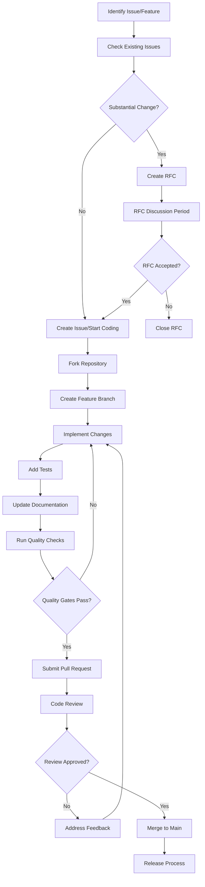

# Sprint 6: Quality & Release Engineering Research Report
## AutoWeave Production Readiness & Governance Strategy

### Executive Summary

This comprehensive research report analyzes modern DevOps practices and provides a complete quality engineering and release automation strategy for AutoWeave 1.0 launch. Based on analysis of the current codebase structure, Sprint 1-5 components, and 2025 industry best practices, this report delivers actionable recommendations for implementing enterprise-grade quality gates, automated release pipelines, and production-ready infrastructure.

### Current Project Assessment

**Codebase Analysis:**
- Monorepo structure with 10 packages (`agents`, `backend`, `cli`, `core`, `deployment`, `integrations`, `memory`, `observability`, `plugin-loader`, `queue`, `shared`, `usb-daemon`)
- TypeScript migration in progress with existing JavaScript components
- Turborepo build system with parallel execution capabilities
- Basic SonarCloud integration (60% coverage threshold, needs enhancement)
- Docker containerization with basic Helm charts
- Comprehensive testing structure (unit, integration, e2e)

**Sprint 1-5 Components Ready for Quality Gates:**
1. USB Daemon & Plugin Loader (Sprint 1)
2. BullMQ Queue System (Sprint 2) 
3. GraphQL Gateway & Auth (Sprint 3)
4. Observability Stack (Sprint 4)
5. Next.js Frontend Applications (Sprint 5)

---

## 1. Quality Engineering Strategy

### 1.1 SonarCloud Quality Gates Enhancement

**Current State:** Basic SonarCloud configuration with 60% coverage threshold
**Target:** Enterprise-grade quality gates with 80% coverage and zero critical vulnerabilities

#### Enhanced Quality Gate Configuration

```properties
# sonar-project.properties - Enhanced Configuration
sonar.projectKey=autoweave_autoweave
sonar.organization=autoweave

# Enhanced Quality Gate Thresholds (2025 Best Practices)
sonar.coverage.line.minimum=80
sonar.coverage.branch.minimum=75
sonar.duplicated_lines_density.maximum=3
sonar.maintainability_rating.maximum=A
sonar.reliability_rating.maximum=A
sonar.security_rating.maximum=A
sonar.security_hotspots.maximum=0

# Advanced SAST Integration
sonar.security.enable_advanced_sast=true
sonar.security.external_dependency_analysis=true
sonar.security.cross_file_taint_analysis=true

# Multi-package support for monorepo
sonar.modules=packages/core,packages/agents,packages/memory,packages/plugin-loader,packages/queue,packages/usb-daemon,packages/observability
```

#### Quality Gate Enforcement Strategy

**Static Analysis (SAST):**
- Deep dependency-aware analysis for third-party library vulnerabilities
- Cross-file taint analysis for complex vulnerability detection
- TypeScript-specific security pattern detection
- Automated security hotspot review requirements

**Code Quality Metrics:**
- Cognitive complexity analysis for maintainability
- Code duplication detection with smart clustering
- Technical debt assessment with remediation guidelines
- API design quality checks for public interfaces

### 1.2 Multi-Layer Security Scanning

#### SAST Integration (Primary Layer)
```yaml
# .github/workflows/security-scan.yml
name: Advanced Security Scanning
on: [push, pull_request]

jobs:
  sast-analysis:
    runs-on: ubuntu-latest
    steps:
      - uses: actions/checkout@v4
        with:
          fetch-depth: 0

      - name: SonarCloud Scan
        uses: SonarSource/sonarcloud-github-action@master
        env:
          GITHUB_TOKEN: ${{ secrets.GITHUB_TOKEN }}
          SONAR_TOKEN: ${{ secrets.SONAR_TOKEN }}
        with:
          args: >
            -Dsonar.qualitygate.wait=true
            -Dsonar.coverage.exclusions=**/*.test.ts,**/*.spec.ts
            -Dsonar.security.enable_advanced_sast=true

      - name: CodeQL Analysis
        uses: github/codeql-action/analyze@v3
        with:
          languages: javascript,typescript
          queries: security-extended,security-and-quality
```

#### Dependency Scanning (Secondary Layer)
```yaml
  dependency-scan:
    runs-on: ubuntu-latest
    strategy:
      matrix:
        scanner: [snyk, npm-audit, trivy]
    steps:
      - name: Snyk Security Scan
        uses: snyk/actions/node@master
        env:
          SNYK_TOKEN: ${{ secrets.SNYK_TOKEN }}
        with:
          args: --severity-threshold=medium --all-projects

      - name: Trivy Vulnerability Scanner
        uses: aquasecurity/trivy-action@master
        with:
          scan-type: 'fs'
          scan-ref: '.'
          format: 'sarif'
          output: 'trivy-results.sarif'

      - name: Upload Trivy Results to GitHub Security
        uses: github/codeql-action/upload-sarif@v3
        with:
          sarif_file: 'trivy-results.sarif'
```

#### Container Security (Tertiary Layer)
```yaml
  container-security:
    runs-on: ubuntu-latest
    needs: [build]
    steps:
      - name: Build Docker Image
        run: docker build -t autoweave:test .

      - name: Container Security Scan
        uses: aquasecurity/trivy-action@master
        with:
          image-ref: 'autoweave:test'
          format: 'sarif'
          output: 'container-scan.sarif'
          severity: 'CRITICAL,HIGH,MEDIUM'

      - name: Grype Container Scan
        uses: anchore/scan-action@v3
        with:
          image: "autoweave:test"
          severity-cutoff: medium
          acs-report-enable: true
```

### 1.3 Performance Regression Testing

#### Automated Performance Baselines
```typescript
// tests/performance/autoweave-performance.test.ts
import { performance } from 'perf_hooks';
import { AutoWeaveCore } from '@autoweave/core';

describe('AutoWeave Performance Baselines', () => {
  const performanceThresholds = {
    pluginLoadTime: 250, // ms
    agentInitialization: 500, // ms
    memoryVectorization: 1000, // ms
    queueJobProcessing: 100, // ms
    graphqlQueryLatency: 200 // ms
  };

  beforeEach(() => {
    performance.mark('test-start');
  });

  afterEach(() => {
    performance.mark('test-end');
    const duration = performance.measure('test-duration', 'test-start', 'test-end');
    console.log(`Test execution time: ${duration.duration}ms`);
  });

  it('should load USB plugins within performance threshold', async () => {
    const start = performance.now();
    
    const pluginManager = new PluginManager();
    await pluginManager.loadPlugin('./test-plugins/usb-scanner.plugin.json');
    
    const duration = performance.now() - start;
    expect(duration).toBeLessThan(performanceThresholds.pluginLoadTime);
  });

  it('should process 1000 queue jobs without memory leaks', async () => {
    const initialMemory = process.memoryUsage().heapUsed;
    
    for (let i = 0; i < 1000; i++) {
      const job = await jobQueue.add('test-job', { data: `test-${i}` });
      await job.finished();
    }
    
    global.gc?.(); // Force garbage collection
    
    const finalMemory = process.memoryUsage().heapUsed;
    const memoryIncrease = finalMemory - initialMemory;
    
    expect(memoryIncrease).toBeLessThan(1024 * 1024); // < 1MB increase
  });

  it('should maintain GraphQL P95 latency under 200ms', async () => {
    const latencies: number[] = [];
    
    for (let i = 0; i < 100; i++) {
      const start = performance.now();
      await graphqlClient.query({ query: COMPLEX_AGENT_QUERY });
      latencies.push(performance.now() - start);
    }
    
    latencies.sort((a, b) => a - b);
    const p95Index = Math.floor(latencies.length * 0.95);
    const p95Latency = latencies[p95Index];
    
    expect(p95Latency).toBeLessThan(performanceThresholds.graphqlQueryLatency);
  });
});
```

### 1.4 End-to-End Testing Strategy

#### Complete Workflow E2E Tests
```typescript
// tests/e2e/autoweave-complete-workflow.test.ts
import { test, expect } from '@playwright/test';

test.describe('AutoWeave Complete Workflow', () => {
  test('should complete full agent lifecycle with USB plugin', async ({ page }) => {
    // Navigate to Admin UI
    await page.goto('http://localhost:3000/admin');
    
    // Verify system health
    await expect(page.locator('[data-testid="system-status"]')).toHaveText('Healthy');
    
    // Create new agent via Dev Studio
    await page.goto('http://localhost:3001/studio/builder');
    await page.click('[data-testid="create-agent"]');
    
    // Configure agent with USB plugin
    await page.fill('[data-testid="agent-name"]', 'E2E-Test-Agent');
    await page.selectOption('[data-testid="plugin-selector"]', 'usb-scanner-plugin');
    
    // Deploy agent
    await page.click('[data-testid="deploy-agent"]');
    await expect(page.locator('[data-testid="deployment-status"]')).toHaveText('Deployed');
    
    // Test agent interaction via User UI
    await page.goto('http://localhost:3002/chat');
    await page.fill('[data-testid="chat-input"]', 'List connected USB devices');
    await page.click('[data-testid="send-button"]');
    
    // Verify response
    await expect(page.locator('[data-testid="chat-response"]')).toContainText('Found');
    
    // Verify observability data
    await page.goto('http://localhost:3000/admin/observability');
    await expect(page.locator('[data-testid="trace-count"]')).not.toHaveText('0');
  });

  test('should handle high-load scenarios gracefully', async ({ page }) => {
    // Simulate 100 concurrent agent requests
    const promises = Array.from({ length: 100 }, async (_, i) => {
      const response = await page.request.post('/api/agents', {
        data: {
          name: `load-test-agent-${i}`,
          type: 'test',
          config: { loadTest: true }
        }
      });
      return response.status();
    });
    
    const results = await Promise.all(promises);
    const successCount = results.filter(status => status === 200).length;
    
    expect(successCount).toBeGreaterThan(95); // 95% success rate minimum
  });
});
```

---

## 2. Release Engineering Architecture

### 2.1 Semantic Release Automation

#### Enhanced Conventional Commits Integration
```json
{
  "name": "@autoweave/release-config",
  "extends": ["@semantic-release/commit-analyzer", "@semantic-release/release-notes-generator"],
  "branches": ["main", {"name": "beta", "prerelease": true}],
  "plugins": [
    ["@semantic-release/commit-analyzer", {
      "preset": "conventionalcommits",
      "releaseRules": [
        {"type": "feat", "release": "minor"},
        {"type": "fix", "release": "patch"},
        {"type": "perf", "release": "patch"},
        {"type": "revert", "release": "patch"},
        {"type": "docs", "release": false},
        {"type": "style", "release": false},
        {"type": "chore", "release": false},
        {"type": "refactor", "release": "patch"},
        {"type": "test", "release": false},
        {"breaking": true, "release": "major"}
      ]
    }],
    ["@semantic-release/release-notes-generator", {
      "preset": "conventionalcommits",
      "presetConfig": {
        "types": [
          {"type": "feat", "section": "🚀 Features"},
          {"type": "fix", "section": "🐛 Bug Fixes"},
          {"type": "perf", "section": "⚡ Performance Improvements"},
          {"type": "revert", "section": "⏪ Reverts"},
          {"type": "refactor", "section": "🔨 Code Refactoring"},
          {"type": "security", "section": "🔒 Security"}
        ]
      }
    }],
    ["@semantic-release/changelog", {
      "changelogFile": "CHANGELOG.md"
    }],
    ["@semantic-release/npm", {
      "npmPublish": true,
      "tarballDir": "dist"
    }],
    ["@semantic-release/exec", {
      "prepareCmd": "pnpm build && docker buildx build --platform linux/amd64,linux/arm64 -t autoweave:${nextRelease.version} .",
      "publishCmd": "docker buildx build --platform linux/amd64,linux/arm64 -t autoweave:${nextRelease.version} --push ."
    }],
    ["@semantic-release/github", {
      "assets": [
        {"path": "dist/*.tgz", "label": "NPM Distribution"},
        {"path": "sbom.spdx.json", "label": "Software Bill of Materials"},
        {"path": "attestation.json", "label": "SLSA Provenance"},
        {"path": "helm/autoweave-*.tgz", "label": "Helm Chart"}
      ]
    }]
  ]
}
```

### 2.2 Multi-Architecture Docker Strategy

#### Advanced Multi-Arch Build Pipeline
```dockerfile
# Dockerfile.multi-arch - Production-Ready Multi-Architecture Build
ARG BUILDPLATFORM=linux/amd64
ARG TARGETPLATFORM=linux/amd64

FROM --platform=$BUILDPLATFORM node:20-alpine AS base
WORKDIR /app
RUN apk add --no-cache libc6-compat python3 make g++ && \
    npm install -g pnpm turbo

FROM base AS deps
COPY package.json pnpm-lock.yaml pnpm-workspace.yaml ./
COPY packages/*/package.json ./packages/
RUN pnpm install --frozen-lockfile --production=false

FROM base AS builder
COPY . .
COPY --from=deps /app/node_modules ./node_modules
RUN pnpm build && pnpm prune --production

FROM --platform=$TARGETPLATFORM node:20-alpine AS runtime
ARG TARGETPLATFORM
ARG BUILDPLATFORM
RUN echo "Building for $TARGETPLATFORM on $BUILDPLATFORM" && \
    apk add --no-cache tini curl && \
    addgroup -g 1001 -S autoweave && \
    adduser -S autoweave -u 1001

WORKDIR /app
USER autoweave

COPY --from=builder --chown=autoweave:autoweave /app/dist ./dist
COPY --from=builder --chown=autoweave:autoweave /app/node_modules ./node_modules
COPY --from=builder --chown=autoweave:autoweave /app/package.json ./

EXPOSE 3000
HEALTHCHECK --interval=30s --timeout=3s --start-period=5s --retries=3 \
  CMD curl -f http://localhost:3000/health || exit 1

ENTRYPOINT ["/sbin/tini", "--"]
CMD ["node", "dist/index.js"]
```

#### Container Signing & SBOM Generation
```yaml
# .github/workflows/release.yml - Complete Release Pipeline
name: Production Release Pipeline
on:
  push:
    branches: [main]

env:
  REGISTRY: ghcr.io
  IMAGE_NAME: autoweave/autoweave

jobs:
  quality-gates:
    runs-on: ubuntu-latest
    steps:
      - uses: actions/checkout@v4
        with:
          fetch-depth: 0

      - name: Setup Node.js
        uses: actions/setup-node@v4
        with:
          node-version: '20'
          cache: 'pnpm'

      - name: Install dependencies
        run: pnpm install

      - name: Type checking
        run: pnpm type-check

      - name: Linting
        run: pnpm lint

      - name: Unit tests
        run: pnpm test:unit

      - name: Integration tests
        run: pnpm test:integration

      - name: E2E tests
        run: pnpm test:e2e

      - name: SonarCloud Quality Gate
        uses: SonarSource/sonarcloud-github-action@master
        env:
          GITHUB_TOKEN: ${{ secrets.GITHUB_TOKEN }}
          SONAR_TOKEN: ${{ secrets.SONAR_TOKEN }}

  build-and-release:
    needs: quality-gates
    runs-on: ubuntu-latest
    permissions:
      contents: write
      packages: write
      id-token: write
      attestations: write
    steps:
      - uses: actions/checkout@v4
        with:
          fetch-depth: 0

      - name: Setup Docker Buildx
        uses: docker/setup-buildx-action@v3

      - name: Install Cosign
        uses: sigstore/cosign-installer@v3

      - name: Install Syft
        uses: anchore/sbom-action/download-syft@v0

      - name: Log in to Container Registry
        uses: docker/login-action@v3
        with:
          registry: ${{ env.REGISTRY }}
          username: ${{ github.actor }}
          password: ${{ secrets.GITHUB_TOKEN }}

      - name: Extract metadata
        id: meta
        uses: docker/metadata-action@v5
        with:
          images: ${{ env.REGISTRY }}/${{ env.IMAGE_NAME }}
          tags: |
            type=ref,event=branch
            type=ref,event=pr
            type=semver,pattern={{version}}
            type=semver,pattern={{major}}.{{minor}}

      - name: Build and push Docker image
        id: build
        uses: docker/build-push-action@v5
        with:
          context: .
          file: ./Dockerfile.multi-arch
          platforms: linux/amd64,linux/arm64
          push: true
          tags: ${{ steps.meta.outputs.tags }}
          labels: ${{ steps.meta.outputs.labels }}
          cache-from: type=gha
          cache-to: type=gha,mode=max
          provenance: true
          sbom: true

      - name: Generate SBOM
        run: |
          syft ${{ env.REGISTRY }}/${{ env.IMAGE_NAME }}:latest -o spdx-json=sbom.spdx.json

      - name: Sign container image
        run: |
          cosign sign --yes ${{ env.REGISTRY }}/${{ env.IMAGE_NAME }}@${{ steps.build.outputs.digest }}

      - name: Sign SBOM
        run: |
          cosign sign-blob --yes sbom.spdx.json --output-signature sbom.spdx.json.sig

      - name: Generate attestation
        uses: actions/attest-build-provenance@v1
        with:
          subject-name: ${{ env.REGISTRY }}/${{ env.IMAGE_NAME }}
          subject-digest: ${{ steps.build.outputs.digest }}
          push-to-registry: true

      - name: Semantic Release
        run: npx semantic-release
        env:
          GITHUB_TOKEN: ${{ secrets.GITHUB_TOKEN }}
          NPM_TOKEN: ${{ secrets.NPM_TOKEN }}
```

### 2.3 Helm Chart Development

#### Production-Ready Helm Charts
```yaml
# helm/autoweave/Chart.yaml
apiVersion: v2
name: autoweave
description: Production-Ready AI Agent Orchestration Platform
type: application
version: 1.0.0
appVersion: "1.0.0"
maintainers:
  - name: AutoWeave Team
    email: maintainers@autoweave.dev
dependencies:
  - name: redis
    version: "18.x.x"
    repository: "https://charts.bitnami.com/bitnami"
    condition: redis.enabled
  - name: postgresql
    version: "13.x.x"
    repository: "https://charts.bitnami.com/bitnami"
    condition: postgresql.enabled
  - name: tempo
    version: "1.x.x"
    repository: "https://grafana.github.io/helm-charts"
    condition: observability.tempo.enabled
  - name: loki
    version: "5.x.x"
    repository: "https://grafana.github.io/helm-charts"
    condition: observability.loki.enabled
  - name: grafana
    version: "7.x.x"
    repository: "https://grafana.github.io/helm-charts"
    condition: observability.grafana.enabled
```

```yaml
# helm/autoweave/values.yaml - Production Values
# AutoWeave Production Configuration
global:
  imageRegistry: ghcr.io
  storageClass: "fast-ssd"
  
replicaCount: 3

image:
  repository: autoweave/autoweave
  pullPolicy: IfNotPresent
  tag: ""

imagePullSecrets: []
nameOverride: ""
fullnameOverride: ""

serviceAccount:
  create: true
  annotations: {}
  name: ""

podAnnotations:
  prometheus.io/scrape: "true"
  prometheus.io/port: "3000"
  prometheus.io/path: "/metrics"

podSecurityContext:
  runAsNonRoot: true
  runAsUser: 1001
  fsGroup: 1001

securityContext:
  allowPrivilegeEscalation: false
  capabilities:
    drop:
    - ALL
  readOnlyRootFilesystem: true
  runAsNonRoot: true
  runAsUser: 1001

service:
  type: ClusterIP
  port: 3000
  targetPort: 3000

ingress:
  enabled: true
  className: "nginx"
  annotations:
    cert-manager.io/cluster-issuer: "letsencrypt-prod"
    nginx.ingress.kubernetes.io/rate-limit: "100"
    nginx.ingress.kubernetes.io/rate-limit-window: "60s"
  hosts:
    - host: autoweave.example.com
      paths:
        - path: /
          pathType: Prefix
  tls:
    - secretName: autoweave-tls
      hosts:
        - autoweave.example.com

resources:
  limits:
    cpu: 1000m
    memory: 2Gi
  requests:
    cpu: 500m
    memory: 1Gi

autoscaling:
  enabled: true
  minReplicas: 3
  maxReplicas: 10
  targetCPUUtilizationPercentage: 70
  targetMemoryUtilizationPercentage: 80

nodeSelector: {}
tolerations: []
affinity:
  podAntiAffinity:
    preferredDuringSchedulingIgnoredDuringExecution:
    - weight: 100
      podAffinityTerm:
        labelSelector:
          matchExpressions:
          - key: app.kubernetes.io/name
            operator: In
            values:
            - autoweave
        topologyKey: kubernetes.io/hostname

# Dependencies Configuration
redis:
  enabled: true
  auth:
    enabled: true
    existingSecret: "autoweave-redis-secret"
  master:
    persistence:
      enabled: true
      size: 8Gi
  replica:
    replicaCount: 2

postgresql:
  enabled: true
  auth:
    existingSecret: "autoweave-postgres-secret"
  primary:
    persistence:
      enabled: true
      size: 20Gi

# Observability Stack
observability:
  tempo:
    enabled: true
    persistence:
      enabled: true
      size: 50Gi
  loki:
    enabled: true
    persistence:
      enabled: true
      size: 100Gi
  grafana:
    enabled: true
    adminPassword: "secure-admin-password"
    persistence:
      enabled: true
      size: 10Gi

# Network Policies
networkPolicy:
  enabled: true
  ingress:
    - from:
      - namespaceSelector:
          matchLabels:
            name: nginx-ingress
      ports:
      - protocol: TCP
        port: 3000
```

---

## 3. CI/CD Pipeline Optimization

### 3.1 GitHub Actions Workflow Optimization

#### Parallel Testing Matrix Strategy
```yaml
# .github/workflows/ci.yml - Optimized CI Pipeline
name: Continuous Integration
on:
  push:
    branches: [main, develop]
  pull_request:
    branches: [main]

jobs:
  changes:
    runs-on: ubuntu-latest
    outputs:
      packages: ${{ steps.changes.outputs.packages }}
      tests: ${{ steps.changes.outputs.tests }}
      docs: ${{ steps.changes.outputs.docs }}
    steps:
      - uses: actions/checkout@v4
      - uses: dorny/paths-filter@v2
        id: changes
        with:
          filters: |
            packages:
              - 'packages/**'
            tests:
              - 'tests/**'
              - 'packages/**/tests/**'
            docs:
              - 'docs/**'
              - '*.md'

  test-matrix:
    needs: changes
    if: needs.changes.outputs.packages == 'true' || needs.changes.outputs.tests == 'true'
    runs-on: ubuntu-latest
    strategy:
      fail-fast: false
      matrix:
        test-type: [unit, integration, performance]
        package: [core, agents, memory, plugin-loader, queue, usb-daemon]
        node-version: [18, 20]
        include:
          - test-type: e2e
            package: all
            node-version: 20
    steps:
      - uses: actions/checkout@v4

      - name: Setup Node.js ${{ matrix.node-version }}
        uses: actions/setup-node@v4
        with:
          node-version: ${{ matrix.node-version }}
          cache: 'pnpm'

      - name: Install dependencies
        run: pnpm install --frozen-lockfile

      - name: Run ${{ matrix.test-type }} tests for ${{ matrix.package }}
        run: |
          if [ "${{ matrix.package }}" = "all" ]; then
            pnpm test:${{ matrix.test-type }}
          else
            pnpm test:${{ matrix.test-type }} --scope @autoweave/${{ matrix.package }}
          fi

      - name: Upload test results
        uses: actions/upload-artifact@v4
        if: always()
        with:
          name: test-results-${{ matrix.test-type }}-${{ matrix.package }}-node${{ matrix.node-version }}
          path: |
            coverage/
            test-results/
            junit.xml

  security-parallel:
    needs: changes
    if: needs.changes.outputs.packages == 'true'
    runs-on: ubuntu-latest
    strategy:
      matrix:
        scanner: [sonarcloud, codeql, snyk, trivy]
    steps:
      - uses: actions/checkout@v4
        with:
          fetch-depth: 0

      - name: SonarCloud Scan
        if: matrix.scanner == 'sonarcloud'
        uses: SonarSource/sonarcloud-github-action@master
        env:
          GITHUB_TOKEN: ${{ secrets.GITHUB_TOKEN }}
          SONAR_TOKEN: ${{ secrets.SONAR_TOKEN }}

      - name: CodeQL Analysis
        if: matrix.scanner == 'codeql'
        uses: github/codeql-action/analyze@v3
        with:
          languages: javascript,typescript

      - name: Snyk Security Scan
        if: matrix.scanner == 'snyk'
        uses: snyk/actions/node@master
        env:
          SNYK_TOKEN: ${{ secrets.SNYK_TOKEN }}

      - name: Trivy Security Scan
        if: matrix.scanner == 'trivy'
        uses: aquasecurity/trivy-action@master
        with:
          scan-type: 'fs'
          format: 'sarif'
          output: 'trivy-results.sarif'

  build-matrix:
    needs: [test-matrix, security-parallel]
    runs-on: ubuntu-latest
    strategy:
      matrix:
        package: [core, agents, memory, plugin-loader, queue, usb-daemon, observability]
    steps:
      - uses: actions/checkout@v4

      - name: Setup Node.js
        uses: actions/setup-node@v4
        with:
          node-version: '20'
          cache: 'pnpm'

      - name: Install dependencies
        run: pnpm install --frozen-lockfile

      - name: Build ${{ matrix.package }}
        run: pnpm build --scope @autoweave/${{ matrix.package }}

      - name: Upload build artifacts
        uses: actions/upload-artifact@v4
        with:
          name: build-${{ matrix.package }}
          path: packages/${{ matrix.package }}/dist/
```

### 3.2 Automated Quality Gate Enforcement

#### Quality Gate Webhook Integration
```typescript
// scripts/quality-gate-enforcer.ts
import { Octokit } from '@octokit/rest';
import { WebhookPayloadPullRequest } from '@octokit/webhooks-types';

interface QualityGateResult {
  projectKey: string;
  qualityGate: {
    status: 'OK' | 'ERROR' | 'WARN';
    conditions: Array<{
      metric: string;
      operator: string;
      value: string;
      status: 'OK' | 'ERROR' | 'WARN';
      actualValue: string;
    }>;
  };
}

export class QualityGateEnforcer {
  private octokit: Octokit;

  constructor(token: string) {
    this.octokit = new Octokit({ auth: token });
  }

  async enforceQualityGate(
    payload: WebhookPayloadPullRequest,
    sonarResult: QualityGateResult
  ): Promise<void> {
    const { repository, pull_request } = payload;
    
    const status = sonarResult.qualityGate.status === 'OK' ? 'success' : 'failure';
    const description = this.generateDescription(sonarResult);

    await this.octokit.repos.createCommitStatus({
      owner: repository.owner.login,
      repo: repository.name,
      sha: pull_request.head.sha,
      state: status,
      target_url: `https://sonarcloud.io/project/overview?id=${sonarResult.projectKey}`,
      description,
      context: 'AutoWeave Quality Gate'
    });

    if (status === 'failure') {
      await this.createQualityGateComment(payload, sonarResult);
    }
  }

  private generateDescription(result: QualityGateResult): string {
    const failedConditions = result.qualityGate.conditions.filter(c => c.status === 'ERROR');
    
    if (failedConditions.length === 0) {
      return '✅ Quality Gate passed - Code ready for merge';
    }

    return `❌ Quality Gate failed - ${failedConditions.length} condition(s) not met`;
  }

  private async createQualityGateComment(
    payload: WebhookPayloadPullRequest,
    result: QualityGateResult
  ): Promise<void> {
    const failedConditions = result.qualityGate.conditions.filter(c => c.status === 'ERROR');
    
    const comment = `## 🚨 Quality Gate Failed

This PR does not meet the required quality standards. Please address the following issues:

${failedConditions.map(condition => 
  `- **${condition.metric}**: ${condition.actualValue} (required: ${condition.operator} ${condition.value})`
).join('\n')}

[View detailed report on SonarCloud](https://sonarcloud.io/project/overview?id=${result.projectKey})

### Required Actions:
- Fix all critical security vulnerabilities
- Increase test coverage to minimum 80%
- Resolve code quality issues
- Address all security hotspots

Once these issues are resolved, the quality gate will automatically re-evaluate.`;

    await this.octokit.issues.createComment({
      owner: payload.repository.owner.login,
      repo: payload.repository.name,
      issue_number: payload.pull_request.number,
      body: comment
    });
  }
}
```

---

## 4. Documentation Engineering

### 4.1 Docusaurus Site Architecture

#### Advanced Documentation Structure
```javascript
// docs/docusaurus.config.js - Production Configuration
const config = {
  title: 'AutoWeave',
  tagline: 'Production-Ready AI Agent Orchestration Platform',
  url: 'https://docs.autoweave.dev',
  baseUrl: '/',
  onBrokenLinks: 'throw',
  onBrokenMarkdownLinks: 'warn',
  favicon: 'img/favicon.ico',
  organizationName: 'autoweave',
  projectName: 'autoweave',

  presets: [
    [
      '@docusaurus/preset-classic',
      {
        docs: {
          sidebarPath: require.resolve('./sidebars.js'),
          editUrl: 'https://github.com/autoweave/autoweave/edit/main/docs/',
          showLastUpdateAuthor: true,
          showLastUpdateTime: true,
          versions: {
            current: {
              label: '1.0.0 (Latest)',
              path: 'latest',
            },
          },
        },
        blog: {
          showReadingTime: true,
          blogSidebarTitle: 'All posts',
          blogSidebarCount: 'ALL',
        },
        theme: {
          customCss: require.resolve('./src/css/custom.css'),
        },
        sitemap: {
          changefreq: 'weekly',
          priority: 0.5,
        },
      },
    ],
  ],

  plugins: [
    [
      'docusaurus-plugin-typedoc',
      {
        entryPoints: [
          '../packages/core/src/index.ts',
          '../packages/agents/src/index.ts',
          '../packages/memory/src/index.ts',
          '../packages/plugin-loader/src/index.ts'
        ],
        tsconfig: '../packages/core/tsconfig.json',
        out: 'api',
        sidebar: {
          categoryLabel: 'API Reference',
          position: 4,
        },
      },
    ],
    [
      '@docusaurus/plugin-content-docs',
      {
        id: 'tutorials',
        path: 'tutorials',
        routeBasePath: 'tutorials',
        sidebarPath: require.resolve('./sidebars-tutorials.js'),
      },
    ],
    [
      '@docusaurus/plugin-pwa',
      {
        debug: false,
        offlineModeActivationStrategies: [
          'appInstalled',
          'standalone',
          'queryString',
        ],
        pwaHead: [
          {
            tagName: 'link',
            rel: 'icon',
            href: '/img/autoweave-icon.png',
          },
          {
            tagName: 'link',
            rel: 'manifest',
            href: '/manifest.json',
          },
          {
            tagName: 'meta',
            name: 'theme-color',
            content: 'rgb(37, 194, 160)',
          },
        ],
      },
    ],
  ],

  themeConfig: {
    navbar: {
      title: 'AutoWeave',
      logo: {
        alt: 'AutoWeave Logo',
        src: 'img/logo.svg',
        srcDark: 'img/logo-dark.svg',
      },
      items: [
        {
          type: 'doc',
          docId: 'getting-started',
          position: 'left',
          label: 'Docs',
        },
        {
          to: 'tutorials',
          position: 'left',
          label: 'Tutorials',
        },
        {
          to: 'api',
          position: 'left',
          label: 'API Reference',
        },
        {
          to: '/blog',
          label: 'Blog',
          position: 'left'
        },
        {
          type: 'docsVersionDropdown',
          position: 'right',
        },
        {
          href: 'https://github.com/autoweave/autoweave',
          label: 'GitHub',
          position: 'right',
        },
      ],
    },
    footer: {
      style: 'dark',
      links: [
        {
          title: 'Documentation',
          items: [
            {
              label: 'Getting Started',
              to: '/docs/getting-started',
            },
            {
              label: 'API Reference',
              to: '/api',
            },
            {
              label: 'Tutorials',
              to: '/tutorials',
            },
          ],
        },
        {
          title: 'Community',
          items: [
            {
              label: 'Discord',
              href: 'https://discord.gg/autoweave',
            },
            {
              label: 'GitHub Discussions',
              href: 'https://github.com/autoweave/autoweave/discussions',
            },
            {
              label: 'Stack Overflow',
              href: 'https://stackoverflow.com/questions/tagged/autoweave',
            },
          ],
        },
        {
          title: 'More',
          items: [
            {
              label: 'Blog',
              to: '/blog',
            },
            {
              label: 'GitHub',
              href: 'https://github.com/autoweave/autoweave',
            },
            {
              label: 'NPM',
              href: 'https://www.npmjs.com/org/autoweave',
            },
          ],
        },
      ],
      copyright: `Copyright © ${new Date().getFullYear()} AutoWeave Team. Built with Docusaurus.`,
    },
    prism: {
      theme: lightCodeTheme,
      darkTheme: darkCodeTheme,
      additionalLanguages: ['bash', 'yaml', 'json', 'typescript'],
    },
    algolia: {
      appId: 'AUTOWEAVE_SEARCH_APP_ID',
      apiKey: 'AUTOWEAVE_SEARCH_API_KEY',
      indexName: 'autoweave-docs',
      contextualSearch: true,
    },
  },
};

module.exports = config;
```

### 4.2 Auto-Generated API Documentation

#### TypeScript Interface Documentation
```typescript
// scripts/generate-api-docs.ts
import { Application, TSConfigReader, TypeDocReader } from 'typedoc';
import * as path from 'path';

interface PackageConfig {
  name: string;
  entryPoint: string;
  tsConfig: string;
  outputDir: string;
}

export class AutoWeaveDocGenerator {
  private packages: PackageConfig[] = [
    {
      name: 'core',
      entryPoint: 'packages/core/src/index.ts',
      tsConfig: 'packages/core/tsconfig.json',
      outputDir: 'docs/api/core'
    },
    {
      name: 'agents',
      entryPoint: 'packages/agents/src/index.ts',
      tsConfig: 'packages/agents/tsconfig.json',
      outputDir: 'docs/api/agents'
    },
    {
      name: 'memory',
      entryPoint: 'packages/memory/src/index.ts',
      tsConfig: 'packages/memory/tsconfig.json',
      outputDir: 'docs/api/memory'
    },
    {
      name: 'plugin-loader',
      entryPoint: 'packages/plugin-loader/src/index.ts',
      tsConfig: 'packages/plugin-loader/tsconfig.json',
      outputDir: 'docs/api/plugin-loader'
    }
  ];

  async generateApiDocumentation(): Promise<void> {
    const app = new Application();

    app.options.addReader(new TSConfigReader());
    app.options.addReader(new TypeDocReader());

    for (const pkg of this.packages) {
      console.log(`Generating documentation for @autoweave/${pkg.name}...`);

      app.bootstrap({
        entryPoints: [pkg.entryPoint],
        tsconfig: pkg.tsConfig,
        plugin: ['typedoc-plugin-markdown'],
        out: pkg.outputDir,
        readme: 'none',
        exclude: ['**/*.test.ts', '**/*.spec.ts'],
        excludePrivate: true,
        excludeProtected: true,
        categorizeByGroup: true,
        defaultCategory: 'API',
        categoryOrder: ['Core', 'Agents', 'Memory', 'Plugins', '*'],
        sort: ['source-order'],
        kindSortOrder: [
          'Class',
          'Interface',
          'Type alias',
          'Function',
          'Variable',
          'Enum'
        ]
      });

      const project = app.convert();

      if (project) {
        await app.generateDocs(project, pkg.outputDir);
        await this.generatePackageIndex(pkg);
      }
    }

    await this.generateMasterIndex();
  }

  private async generatePackageIndex(pkg: PackageConfig): Promise<void> {
    const indexContent = `---
title: ${pkg.name.charAt(0).toUpperCase() + pkg.name.slice(1)} API
description: API documentation for @autoweave/${pkg.name}
sidebar_position: 1
---

# @autoweave/${pkg.name}

${this.getPackageDescription(pkg.name)}

## Installation

\`\`\`bash
npm install @autoweave/${pkg.name}
\`\`\`

## Quick Start

\`\`\`typescript
import { /* imports */ } from '@autoweave/${pkg.name}';

// Usage example
\`\`\`

## API Reference

The complete API reference for this package is available in the following sections:

${this.generateApiIndex(pkg)}
`;

    await this.writeFile(path.join(pkg.outputDir, 'index.md'), indexContent);
  }

  private getPackageDescription(packageName: string): string {
    const descriptions = {
      'core': 'The core AutoWeave engine providing agent orchestration and workflow management.',
      'agents': 'Pre-built and configurable AI agents for common automation tasks.',
      'memory': 'Advanced memory management with vector storage and hybrid retrieval.',
      'plugin-loader': 'Dynamic plugin loading with hot-swapping and security isolation.'
    };

    return descriptions[packageName] || 'AutoWeave package documentation.';
  }

  private generateApiIndex(pkg: PackageConfig): string {
    // Generate index based on discovered classes and interfaces
    return `- [Classes](./classes)
- [Interfaces](./interfaces)
- [Types](./types)
- [Functions](./functions)`;
  }

  private async generateMasterIndex(): Promise<void> {
    const masterIndex = `---
title: API Reference
description: Complete API documentation for all AutoWeave packages
sidebar_position: 4
---

# AutoWeave API Reference

Welcome to the complete API reference for AutoWeave. This documentation is automatically generated from TypeScript interfaces and provides detailed information about all public APIs.

## Packages

${this.packages.map(pkg => `### [@autoweave/${pkg.name}](./api/${pkg.name})

${this.getPackageDescription(pkg.name)}

[View API Documentation →](./api/${pkg.name})
`).join('\n')}

## Contributing

If you find any issues with the API documentation or have suggestions for improvements, please [open an issue](https://github.com/autoweave/autoweave/issues) or [submit a pull request](https://github.com/autoweave/autoweave/pulls).
`;

    await this.writeFile('docs/api/index.md', masterIndex);
  }

  private async writeFile(filePath: string, content: string): Promise<void> {
    const fs = require('fs').promises;
    await fs.mkdir(path.dirname(filePath), { recursive: true });
    await fs.writeFile(filePath, content, 'utf8');
  }
}

// Export for npm script usage
if (require.main === module) {
  const generator = new AutoWeaveDocGenerator();
  generator.generateApiDocumentation().catch(console.error);
}
```

### 4.3 Interactive Tutorials and Playground

#### Tutorial Infrastructure
```markdown
<!-- tutorials/getting-started/your-first-agent.md -->
---
title: Your First Agent
description: Create and deploy your first AutoWeave agent in under 5 minutes
sidebar_position: 1
tags: [tutorial, getting-started, agents]
---

# Your First Agent

In this tutorial, you'll create, configure, and deploy your first AutoWeave agent. By the end of this guide, you'll have a working agent that can respond to user queries and demonstrate the core AutoWeave capabilities.

## Prerequisites

Before starting, ensure you have:

- Node.js 18+ installed
- Docker Desktop running
- Basic familiarity with TypeScript/JavaScript

## Step 1: Environment Setup

First, let's set up a new AutoWeave project:

```bash
npx @autoweave/cli create my-first-agent
cd my-first-agent
npm install
```

This creates a new project with the following structure:

```
my-first-agent/
├── src/
│   ├── agents/
│   │   └── my-agent.ts
│   ├── config/
│   │   └── agent-config.yml
│   └── index.ts
├── tests/
├── docker-compose.yml
└── package.json
```

## Step 2: Agent Configuration

Open `src/config/agent-config.yml` and configure your agent:

```yaml title="src/config/agent-config.yml"
name: "MyFirstAgent"
description: "A simple demonstration agent"
version: "1.0.0"

capabilities:
  - name: "greet"
    description: "Greets users politely"
    inputs:
      - name: "userName"
        type: "string"
        required: true
    outputs:
      - name: "greeting"
        type: "string"

memory:
  type: "hybrid"
  vectorStore:
    provider: "qdrant"
    dimensions: 384
  graphStore:
    provider: "memgraph"

plugins:
  - "@autoweave/llm-plugin"
  - "@autoweave/memory-plugin"
```

## Step 3: Agent Implementation

Now, let's implement the agent logic:

```typescript title="src/agents/my-agent.ts"
import { Agent, AgentConfig, AgentResponse } from '@autoweave/core';
import { Memory } from '@autoweave/memory';
import { LLMPlugin } from '@autoweave/llm-plugin';

interface GreetingInput {
  userName: string;
}

interface GreetingOutput {
  greeting: string;
}

export class MyFirstAgent extends Agent<GreetingInput, GreetingOutput> {
  private llm: LLMPlugin;
  private memory: Memory;

  constructor(config: AgentConfig) {
    super(config);
    this.llm = this.getPlugin('llm') as LLMPlugin;
    this.memory = this.getPlugin('memory') as Memory;
  }

  async greet(input: GreetingInput): Promise<AgentResponse<GreetingOutput>> {
    try {
      // Store the interaction in memory
      await this.memory.store({
        type: 'interaction',
        data: {
          action: 'greet',
          userName: input.userName,
          timestamp: new Date().toISOString()
        }
      });

      // Generate personalized greeting
      const prompt = `Generate a friendly, professional greeting for ${input.userName}. 
                     Make it warm but concise.`;
      
      const greeting = await this.llm.generate({
        prompt,
        maxTokens: 50,
        temperature: 0.7
      });

      return {
        success: true,
        data: { greeting: greeting.text },
        metadata: {
          processingTime: Date.now() - this.startTime,
          memoryUpdated: true
        }
      };
    } catch (error) {
      return {
        success: false,
        error: error.message,
        data: { greeting: `Hello, ${input.userName}!` } // Fallback
      };
    }
  }
}
```

## Step 4: Testing Your Agent

Create a test to verify your agent works correctly:

```typescript title="tests/my-agent.test.ts"
import { MyFirstAgent } from '../src/agents/my-agent';
import { createTestConfig } from '@autoweave/test-utils';

describe('MyFirstAgent', () => {
  let agent: MyFirstAgent;

  beforeEach(async () => {
    const config = createTestConfig({
      name: 'TestAgent',
      plugins: ['@autoweave/llm-plugin', '@autoweave/memory-plugin']
    });
    
    agent = new MyFirstAgent(config);
    await agent.initialize();
  });

  afterEach(async () => {
    await agent.cleanup();
  });

  it('should greet users correctly', async () => {
    const response = await agent.greet({ userName: 'Alice' });
    
    expect(response.success).toBe(true);
    expect(response.data.greeting).toContain('Alice');
    expect(response.data.greeting.length).toBeGreaterThan(0);
  });

  it('should handle errors gracefully', async () => {
    // Simulate LLM failure
    jest.spyOn(agent['llm'], 'generate').mockRejectedValue(new Error('LLM Error'));
    
    const response = await agent.greet({ userName: 'Bob' });
    
    expect(response.success).toBe(false);
    expect(response.data.greeting).toBe('Hello, Bob!'); // Fallback
  });
});
```

Run the tests:

```bash
npm test
```

## Step 5: Local Development

Start your development environment:

```bash
# Start infrastructure (Redis, Qdrant, Memgraph)
docker-compose up -d

# Start your agent in development mode
npm run dev
```

Your agent is now running and accessible via the AutoWeave development interface at `http://localhost:3000`.

## Step 6: Production Deployment

When you're ready to deploy:

```bash
# Build for production
npm run build

# Deploy to Kubernetes
npm run deploy:k8s

# Or deploy to Docker
npm run deploy:docker
```

## Next Steps

Congratulations! You've created your first AutoWeave agent. Here's what you can explore next:

- [Advanced Agent Patterns](./advanced-patterns)
- [Plugin Development](./plugin-development)
- [Memory Management](./memory-management)
- [Production Deployment](./production-deployment)

## Troubleshooting

### Common Issues

**Agent fails to start:**
- Ensure Docker containers are running: `docker-compose ps`
- Check logs: `docker-compose logs`

**LLM plugin not working:**
- Verify API keys are set in environment variables
- Check network connectivity to LLM provider

**Memory storage issues:**
- Ensure Qdrant and Memgraph containers are healthy
- Check storage permissions and disk space

## Interactive Playground

Try your agent directly in the browser:

import Playground from '@site/src/components/AgentPlayground';

<Playground agentType="greeting" />

---

**Questions?** Join our [Discord community](https://discord.gg/autoweave) or [open an issue](https://github.com/autoweave/autoweave/issues).
```

---

## 5. Production Readiness

### 5.1 Load Testing Scenarios

#### Comprehensive Load Testing Suite
```typescript
// tests/load/autoweave-load-test.ts
import { check, sleep } from 'k6';
import http from 'k6/http';
import { Rate, Trend, Counter } from 'k6/metrics';

// Custom metrics
const errorRate = new Rate('error_rate');
const responseTime = new Trend('response_time');
const agentCreations = new Counter('agent_creations');

export const options = {
  scenarios: {
    // Smoke test - minimal load
    smoke: {
      executor: 'constant-vus',
      vus: 1,
      duration: '30s',
      tags: { scenario: 'smoke' },
    },
    
    // Load test - normal expected load
    load: {
      executor: 'ramping-vus',
      startVUs: 0,
      stages: [
        { duration: '2m', target: 20 },
        { duration: '5m', target: 20 },
        { duration: '2m', target: 40 },
        { duration: '5m', target: 40 },
        { duration: '2m', target: 0 },
      ],
      tags: { scenario: 'load' },
    },
    
    // Stress test - beyond normal capacity
    stress: {
      executor: 'ramping-vus',
      startVUs: 0,
      stages: [
        { duration: '2m', target: 50 },
        { duration: '5m', target: 50 },
        { duration: '2m', target: 100 },
        { duration: '5m', target: 100 },
        { duration: '2m', target: 200 },
        { duration: '5m', target: 200 },
        { duration: '10m', target: 0 },
      ],
      tags: { scenario: 'stress' },
    },
    
    // Spike test - sudden traffic spikes
    spike: {
      executor: 'ramping-vus',
      startVUs: 0,
      stages: [
        { duration: '10s', target: 100 },
        { duration: '1m', target: 100 },
        { duration: '10s', target: 1400 },
        { duration: '3m', target: 1400 },
        { duration: '10s', target: 100 },
        { duration: '3m', target: 100 },
        { duration: '10s', target: 0 },
      ],
      tags: { scenario: 'spike' },
    },
  },
  
  thresholds: {
    http_req_duration: ['p(95)<500'], // 95% of requests under 500ms
    error_rate: ['rate<0.05'], // Error rate under 5%
    http_req_failed: ['rate<0.02'], // Failed request rate under 2%
  },
};

const BASE_URL = 'http://localhost:3000';

export default function() {
  const scenarios = [
    testAgentCreation,
    testAgentQuery,
    testPluginLoad,
    testMemoryRetrieval,
    testObservabilityEndpoints
  ];
  
  // Randomly select a scenario
  const scenario = scenarios[Math.floor(Math.random() * scenarios.length)];
  scenario();
  
  sleep(1);
}

function testAgentCreation() {
  const payload = JSON.stringify({
    name: `load-test-agent-${Date.now()}`,
    description: 'Load test agent',
    config: {
      type: 'simple',
      capabilities: ['greet', 'respond'],
      plugins: ['@autoweave/llm-plugin']
    }
  });

  const params = {
    headers: {
      'Content-Type': 'application/json',
      'Authorization': `Bearer ${__ENV.AUTH_TOKEN}`,
    },
  };

  const response = http.post(`${BASE_URL}/api/agents`, payload, params);
  
  errorRate.add(response.status !== 201);
  responseTime.add(response.timings.duration);
  
  if (response.status === 201) {
    agentCreations.add(1);
  }
  
  check(response, {
    'agent creation status is 201': (r) => r.status === 201,
    'agent creation response time < 2s': (r) => r.timings.duration < 2000,
    'response has agent ID': (r) => JSON.parse(r.body).id !== undefined,
  });
}

function testAgentQuery() {
  const agentId = 'test-agent-1'; // Pre-created agent
  const query = {
    message: 'Hello, how are you?',
    context: { userId: `user-${Date.now()}` }
  };

  const response = http.post(
    `${BASE_URL}/api/agents/${agentId}/query`,
    JSON.stringify(query),
    {
      headers: {
        'Content-Type': 'application/json',
        'Authorization': `Bearer ${__ENV.AUTH_TOKEN}`,
      },
    }
  );

  errorRate.add(response.status !== 200);
  responseTime.add(response.timings.duration);

  check(response, {
    'query status is 200': (r) => r.status === 200,
    'query response time < 3s': (r) => r.timings.duration < 3000,
    'response has message': (r) => JSON.parse(r.body).response !== undefined,
  });
}

function testPluginLoad() {
  const response = http.get(`${BASE_URL}/api/plugins`, {
    headers: {
      'Authorization': `Bearer ${__ENV.AUTH_TOKEN}`,
    },
  });

  errorRate.add(response.status !== 200);
  responseTime.add(response.timings.duration);

  check(response, {
    'plugins list status is 200': (r) => r.status === 200,
    'plugins response time < 1s': (r) => r.timings.duration < 1000,
    'response has plugins array': (r) => Array.isArray(JSON.parse(r.body).plugins),
  });
}

function testMemoryRetrieval() {
  const query = {
    text: 'Find information about user preferences',
    limit: 10
  };

  const response = http.post(
    `${BASE_URL}/api/memory/search`,
    JSON.stringify(query),
    {
      headers: {
        'Content-Type': 'application/json',
        'Authorization': `Bearer ${__ENV.AUTH_TOKEN}`,
      },
    }
  );

  errorRate.add(response.status !== 200);
  responseTime.add(response.timings.duration);

  check(response, {
    'memory search status is 200': (r) => r.status === 200,
    'memory search response time < 1.5s': (r) => r.timings.duration < 1500,
    'response has results': (r) => JSON.parse(r.body).results !== undefined,
  });
}

function testObservabilityEndpoints() {
  const endpoints = ['/health', '/metrics', '/ready'];
  
  endpoints.forEach(endpoint => {
    const response = http.get(`${BASE_URL}${endpoint}`);
    
    check(response, {
      [`${endpoint} status is 200`]: (r) => r.status === 200,
      [`${endpoint} response time < 500ms`]: (r) => r.timings.duration < 500,
    });
  });
}

export function handleSummary(data) {
  return {
    'load-test-results.json': JSON.stringify(data, null, 2),
    'load-test-report.html': htmlReport(data),
  };
}

function htmlReport(data) {
  const scenarios = Object.keys(data.metrics.http_reqs.values);
  
  return `
<!DOCTYPE html>
<html>
<head>
    <title>AutoWeave Load Test Report</title>
    <style>
        body { font-family: Arial, sans-serif; margin: 40px; }
        .metric { margin: 20px 0; padding: 15px; border: 1px solid #ddd; border-radius: 5px; }
        .pass { background-color: #d4edda; border-color: #c3e6cb; }
        .fail { background-color: #f8d7da; border-color: #f5c6cb; }
        table { width: 100%; border-collapse: collapse; }
        th, td { padding: 10px; text-align: left; border-bottom: 1px solid #ddd; }
        th { background-color: #f8f9fa; }
    </style>
</head>
<body>
    <h1>AutoWeave Load Test Report</h1>
    <p>Generated: ${new Date().toISOString()}</p>
    
    <h2>Summary</h2>
    <div class="metric ${data.metrics.http_req_duration.values.p95 < 500 ? 'pass' : 'fail'}">
        <strong>P95 Response Time:</strong> ${data.metrics.http_req_duration.values.p95.toFixed(2)}ms 
        (Threshold: <500ms)
    </div>
    
    <div class="metric ${data.metrics.http_req_failed.rate < 0.02 ? 'pass' : 'fail'}">
        <strong>Error Rate:</strong> ${(data.metrics.http_req_failed.rate * 100).toFixed(2)}% 
        (Threshold: <2%)
    </div>
    
    <h2>Detailed Metrics</h2>
    <table>
        <tr>
            <th>Metric</th>
            <th>Average</th>
            <th>P90</th>
            <th>P95</th>
            <th>P99</th>
        </tr>
        <tr>
            <td>Response Time</td>
            <td>${data.metrics.http_req_duration.values.avg.toFixed(2)}ms</td>
            <td>${data.metrics.http_req_duration.values.p90.toFixed(2)}ms</td>
            <td>${data.metrics.http_req_duration.values.p95.toFixed(2)}ms</td>
            <td>${data.metrics.http_req_duration.values.p99.toFixed(2)}ms</td>
        </tr>
    </table>
</body>
</html>`;
}
```

### 5.2 Disaster Recovery & Backup Procedures

#### Automated Backup Strategy
```yaml
# k8s/backup/velero-backup.yaml
apiVersion: v1
kind: ConfigMap
metadata:
  name: autoweave-backup-config
  namespace: velero
data:
  backup-schedule.yaml: |
    apiVersion: velero.io/v1
    kind: Schedule
    metadata:
      name: autoweave-daily-backup
      namespace: velero
    spec:
      schedule: "0 2 * * *" # Daily at 2 AM
      template:
        metadata:
          labels:
            backup-type: "daily"
        spec:
          includedNamespaces:
            - autoweave-system
            - autoweave-data
          excludedResources:
            - events
            - events.events.k8s.io
          storageLocation: default
          volumeSnapshotLocations:
            - default
          ttl: 720h0m0s # 30 days
          
  disaster-recovery-runbook.md: |
    # AutoWeave Disaster Recovery Runbook
    
    ## Recovery Time Objectives (RTO)
    - Database Recovery: 15 minutes
    - Application Recovery: 30 minutes
    - Full System Recovery: 1 hour
    
    ## Recovery Point Objectives (RPO)
    - Critical Data: 1 hour
    - Configuration Data: 24 hours
    - Logs/Metrics: 24 hours
    
    ## Recovery Procedures
    
    ### 1. Assess Damage
    ```bash
    kubectl get pods -n autoweave-system
    kubectl get pvc -n autoweave-data
    velero backup get
    ```
    
    ### 2. Restore from Backup
    ```bash
    # List available backups
    velero backup get
    
    # Restore latest backup
    velero restore create --from-backup autoweave-daily-backup-YYYYMMDD
    
    # Monitor restore progress
    velero restore describe <restore-name>
    ```
    
    ### 3. Verify Recovery
    ```bash
    # Check pod status
    kubectl get pods -n autoweave-system
    
    # Test application endpoints
    curl -f http://autoweave.example.com/health
    
    # Verify data integrity
    kubectl exec -it redis-0 -n autoweave-system -- redis-cli ping
    ```
    
    ### 4. Post-Recovery Actions
    - Update DNS if needed
    - Notify stakeholders
    - Document lessons learned
    - Update backup procedures if necessary
```

### 5.3 Security Hardening Checklists

#### Comprehensive Security Checklist
```yaml
# security/hardening-checklist.yaml
apiVersion: v1
kind: ConfigMap
metadata:
  name: security-hardening-checklist
data:
  infrastructure-security.md: |
    # Infrastructure Security Checklist
    
    ## Kubernetes Security
    - [ ] Network policies configured for all namespaces
    - [ ] Pod Security Standards enforced (restricted profile)
    - [ ] RBAC configured with least privilege principle
    - [ ] Service mesh (Istio) configured for mTLS
    - [ ] Admission controllers configured (OPA Gatekeeper)
    - [ ] Resource quotas and limits enforced
    - [ ] Node security hardening applied
    - [ ] Secrets management with external secret store
    
    ## Container Security
    - [ ] Base images regularly updated and scanned
    - [ ] Non-root container execution enforced
    - [ ] Read-only root filesystem enabled
    - [ ] Minimal container attack surface
    - [ ] Container image signing verified
    - [ ] Runtime security monitoring enabled
    
    ## Network Security
    - [ ] TLS 1.3 enforced for all communications
    - [ ] Certificate management automated
    - [ ] WAF configured with OWASP rules
    - [ ] DDoS protection enabled
    - [ ] Network segmentation implemented
    - [ ] Egress filtering configured
    
    ## Data Security
    - [ ] Encryption at rest enabled for all storage
    - [ ] Encryption in transit for all communications
    - [ ] Key rotation automated
    - [ ] Backup encryption verified
    - [ ] Data classification implemented
    - [ ] Access logging enabled
    
  application-security.md: |
    # Application Security Checklist
    
    ## Authentication & Authorization
    - [ ] Multi-factor authentication enforced
    - [ ] OAuth 2.0/OpenID Connect implemented
    - [ ] JWT tokens properly validated
    - [ ] Session management secure
    - [ ] Password policies enforced
    - [ ] Account lockout policies configured
    
    ## Input Validation
    - [ ] All inputs validated and sanitized
    - [ ] SQL injection prevention implemented
    - [ ] XSS protection enabled
    - [ ] CSRF protection configured
    - [ ] File upload restrictions enforced
    - [ ] Rate limiting implemented
    
    ## API Security
    - [ ] API authentication required
    - [ ] API rate limiting configured
    - [ ] Input validation on all endpoints
    - [ ] Error handling doesn't leak information
    - [ ] CORS policies properly configured
    - [ ] API versioning strategy implemented
    
    ## Plugin Security
    - [ ] Plugin signature verification enabled
    - [ ] Sandbox isolation configured
    - [ ] Permission system enforced
    - [ ] Plugin audit logging enabled
    - [ ] Resource limits enforced
    - [ ] Plugin certification process implemented
    
  compliance-security.md: |
    # Compliance & Governance Checklist
    
    ## Security Monitoring
    - [ ] SIEM solution deployed and configured
    - [ ] Security event correlation rules defined
    - [ ] Incident response procedures documented
    - [ ] Security metrics collected and monitored
    - [ ] Vulnerability scanning automated
    - [ ] Penetration testing scheduled
    
    ## Audit & Compliance
    - [ ] Audit logging enabled for all components
    - [ ] Log retention policies configured
    - [ ] Compliance scanning automated
    - [ ] Security policies documented
    - [ ] Regular security reviews scheduled
    - [ ] Third-party security assessments completed
    
    ## Business Continuity
    - [ ] Disaster recovery plan tested
    - [ ] Backup procedures verified
    - [ ] High availability configured
    - [ ] Failover procedures documented
    - [ ] Recovery time objectives defined
    - [ ] Business impact analysis completed
```

### 5.4 Monitoring and Alerting Runbooks

#### Production Monitoring Strategy
```yaml
# monitoring/alert-rules.yaml
apiVersion: monitoring.coreos.com/v1
kind: PrometheusRule
metadata:
  name: autoweave-alerts
  namespace: autoweave-system
spec:
  groups:
    - name: autoweave.critical
      interval: 30s
      rules:
        - alert: AutoWeaveDown
          expr: up{job="autoweave"} == 0
          for: 2m
          labels:
            severity: critical
            service: autoweave
          annotations:
            summary: "AutoWeave service is down"
            description: "AutoWeave service has been down for more than 2 minutes"
            runbook_url: "https://docs.autoweave.dev/runbooks/service-down"
            
        - alert: HighErrorRate
          expr: rate(http_requests_total{status=~"5.."}[5m]) > 0.05
          for: 5m
          labels:
            severity: critical
            service: autoweave
          annotations:
            summary: "High error rate detected"
            description: "Error rate is {{ $value | humanizePercentage }} over the last 5 minutes"
            
        - alert: HighLatency
          expr: histogram_quantile(0.95, rate(http_request_duration_seconds_bucket[5m])) > 1
          for: 5m
          labels:
            severity: warning
            service: autoweave
          annotations:
            summary: "High latency detected"
            description: "95th percentile latency is {{ $value }}s"
            
        - alert: MemoryUsageHigh
          expr: (process_resident_memory_bytes / node_memory_MemTotal_bytes) > 0.8
          for: 10m
          labels:
            severity: warning
            service: autoweave
          annotations:
            summary: "High memory usage"
            description: "Memory usage is {{ $value | humanizePercentage }}"
            
        - alert: DiskSpaceLow
          expr: (node_filesystem_avail_bytes / node_filesystem_size_bytes) < 0.1
          for: 5m
          labels:
            severity: critical
            service: autoweave
          annotations:
            summary: "Disk space low"
            description: "Disk space is {{ $value | humanizePercentage }} full"
            
        - alert: PluginLoadFailure
          expr: increase(plugin_load_failures_total[10m]) > 3
          for: 2m
          labels:
            severity: warning
            service: autoweave
          annotations:
            summary: "Multiple plugin load failures"
            description: "{{ $value }} plugin load failures in the last 10 minutes"
            
        - alert: USBDaemonDown
          expr: up{job="usb-daemon"} == 0
          for: 1m
          labels:
            severity: warning
            service: usb-daemon
          annotations:
            summary: "USB daemon is down"
            description: "USB hot-plug functionality unavailable"
            
        - alert: QueueBacklog
          expr: bullmq_queue_waiting_jobs > 1000
          for: 5m
          labels:
            severity: warning
            service: queue
          annotations:
            summary: "Large queue backlog"
            description: "{{ $value }} jobs waiting in queue"
            
        - alert: DatabaseConnectionFailure
          expr: up{job="redis"} == 0 or up{job="postgres"} == 0
          for: 1m
          labels:
            severity: critical
            service: database
          annotations:
            summary: "Database connection failure"
            description: "Critical database service unavailable"

  runbooks:
    service-down.md: |
      # AutoWeave Service Down Runbook
      
      ## Immediate Actions (0-5 minutes)
      1. Check pod status: `kubectl get pods -n autoweave-system`
      2. Check recent events: `kubectl get events -n autoweave-system --sort-by='.lastTimestamp'`
      3. Check logs: `kubectl logs -l app=autoweave -n autoweave-system --tail=100`
      
      ## Diagnosis (5-15 minutes)
      1. Check resource usage: `kubectl top pods -n autoweave-system`
      2. Check persistent volumes: `kubectl get pvc -n autoweave-system`
      3. Check service endpoints: `kubectl get endpoints -n autoweave-system`
      4. Check ingress: `kubectl describe ingress -n autoweave-system`
      
      ## Recovery Actions
      1. If OOMKilled: Increase memory limits and restart
      2. If ImagePullBackOff: Check image availability and credentials
      3. If CrashLoopBackOff: Check application logs and configuration
      4. If storage issues: Check PVC status and node disk space
      
      ## Escalation
      - If unable to resolve in 30 minutes, escalate to senior engineer
      - For production outages, notify incident commander
      - Update status page if customer-facing
      
    high-latency.md: |
      # High Latency Runbook
      
      ## Investigation Steps
      1. Check current load: Grafana dashboard → AutoWeave Overview
      2. Identify bottleneck: Check database, queue, and external API latencies
      3. Check resource constraints: CPU, memory, network
      4. Review recent deployments or configuration changes
      
      ## Mitigation Actions
      1. Scale up pods if resource-constrained
      2. Check database connection pool settings
      3. Review and optimize slow queries
      4. Temporarily increase timeout values if needed
      5. Enable circuit breakers for external services
      
      ## Prevention
      1. Review application performance regularly
      2. Implement proper caching strategies
      3. Optimize database queries and indexes
      4. Set up auto-scaling based on latency metrics
```

---

## 6. Governance & Community

### 6.1 RFC Process Implementation

#### RFC Workflow Automation
```typescript
// .github/workflows/rfc-process.yml
name: RFC Process Management
on:
  issues:
    types: [opened, labeled, edited]
  issue_comment:
    types: [created]

jobs:
  rfc-lifecycle:
    runs-on: ubuntu-latest
    if: contains(github.event.issue.labels.*.name, 'rfc')
    steps:
      - uses: actions/checkout@v4
      
      - name: RFC Status Management
        uses: actions/github-script@v7
        with:
          script: |
            const { issue, repository } = context.payload;
            const rfcManager = new RFCManager(github, context);
            await rfcManager.processRFC(issue);

  rfc-comment-period:
    runs-on: ubuntu-latest
    if: contains(github.event.issue.labels.*.name, 'rfc-public-comment')
    steps:
      - name: Start Comment Period
        uses: actions/github-script@v7
        with:
          script: |
            const commentPeriodStart = new Date();
            const commentPeriodEnd = new Date();
            commentPeriodEnd.setDate(commentPeriodEnd.getDate() + 14);
            
            await github.rest.issues.createComment({
              owner: context.repo.owner,
              repo: context.repo.repo,
              issue_number: context.issue.number,
              body: `## 📢 Public Comment Period Started
              
This RFC is now open for public comment until ${commentPeriodEnd.toDateString()}.

### How to Participate
- Review the RFC proposal carefully
- Provide constructive feedback in comments
- Suggest improvements or alternatives
- Share relevant experience or use cases

### Review Criteria
- Technical feasibility and design quality
- Impact on existing functionality
- Performance and security considerations
- Documentation and testing requirements
- Breaking changes and migration path

The AutoWeave team will review all feedback and update the RFC accordingly.`
            });

  rfc-fcp:
    runs-on: ubuntu-latest
    if: contains(github.event.issue.labels.*.name, 'rfc-fcp')
    steps:
      - name: Start Final Comment Period
        uses: actions/github-script@v7
        with:
          script: |
            const fcpStart = new Date();
            const fcpEnd = new Date();
            fcpEnd.setDate(fcpEnd.getDate() + 7);
            
            await github.rest.issues.createComment({
              owner: context.repo.owner,
              repo: context.repo.repo,
              issue_number: context.issue.number,
              body: `## 🔔 Final Comment Period (FCP)
              
This RFC is entering its Final Comment Period until ${fcpEnd.toDateString()}.

### Summary of Changes
Based on community feedback, the following changes have been made:
<!-- Update this section with actual changes -->

### Outstanding Concerns
<!-- List any unresolved concerns that need final input -->

### Next Steps
- Final comments due by ${fcpEnd.toDateString()}
- RFC team will make final decision
- If accepted, implementation will begin
- If rejected, detailed reasoning will be provided

Last chance for feedback!`
            });
```

#### RFC Template and Guidelines
```markdown
<!-- .github/ISSUE_TEMPLATE/rfc.md -->
---
name: RFC (Request for Comments)
about: Propose a substantial change to AutoWeave
title: 'RFC: [Brief Description]'
labels: ['rfc', 'needs-review']
assignees: ''
---

# RFC: [Title]

## Summary

Brief explanation of the feature or change being proposed.

## Motivation

Why are we doing this? What use cases does it support? What problems does it solve?

## Detailed Design

This is the bulk of the RFC. Explain the design in enough detail for somebody familiar with AutoWeave to understand, and for somebody familiar with the implementation to implement.

### API Changes

Describe any changes to public APIs, including:
- New interfaces or types
- Modified function signatures
- Breaking changes

### Implementation Plan

Outline the implementation approach:
- Components that need modification
- New packages or modules required
- Migration strategy for existing users

### Examples

Provide code examples showing how the feature would be used:

```typescript
// Example usage
import { NewFeature } from '@autoweave/core';

const feature = new NewFeature({
  // configuration
});
```

## Drawbacks

Why should we *not* do this? Please consider:
- Implementation cost and complexity
- Impact on existing users
- Performance implications
- Maintenance burden

## Alternatives

What other designs have been considered? What is the impact of not doing this?

## Prior Art

Discuss prior art, both the good and the bad, in relation to this proposal:
- Similar features in other projects
- Lessons learned from existing implementations
- Research papers or articles

## Unresolved Questions

What parts of the design do you expect to resolve through the RFC process before this gets merged?

## Future Possibilities

Think about what the natural extension and evolution of your proposal would be and how it would affect AutoWeave as a whole.

---

## RFC Process Checklist

- [ ] Summary is clear and concise
- [ ] Motivation explains the problem being solved
- [ ] Design is detailed enough for implementation
- [ ] Examples demonstrate usage
- [ ] Drawbacks and alternatives considered
- [ ] Prior art researched
- [ ] Breaking changes identified and justified
- [ ] Migration path documented (if applicable)
- [ ] Performance impact assessed
- [ ] Security implications considered
- [ ] Documentation requirements identified
- [ ] Testing strategy outlined

## Review Timeline

- **Draft Period**: 7 days for initial feedback and iteration
- **Public Comment**: 14 days for community review
- **Final Comment Period**: 7 days for final feedback
- **Decision**: Core team makes final decision
- **Implementation**: Begin implementation if accepted

<!-- 
Please ensure your RFC follows our contribution guidelines:
https://github.com/autoweave/autoweave/blob/main/CONTRIBUTING.md#rfc-process
-->
```

### 6.2 Community Contribution Guidelines

#### Enhanced Contributing Guide
```markdown
# Contributing to AutoWeave

Thank you for your interest in contributing to AutoWeave! This guide will help you get started and ensure your contributions are successful.

## Code of Conduct

By participating in this project, you agree to abide by our [Code of Conduct](CODE_OF_CONDUCT.md). Please read it before contributing.

## How to Contribute

### Reporting Issues

Before creating a new issue, please:
1. Search existing issues to avoid duplicates
2. Use our issue templates for consistency
3. Provide detailed reproduction steps
4. Include system information and versions

### Suggesting Features

For new features, please:
1. Open an RFC (Request for Comments) for substantial changes
2. Use the feature request template for smaller features
3. Explain the use case and benefit
4. Consider backward compatibility

### Contributing Code

#### Development Setup

1. **Fork and Clone**
   ```bash
   git clone https://github.com/yourusername/autoweave.git
   cd autoweave
   ```

2. **Install Dependencies**
   ```bash
   pnpm install
   ```

3. **Start Development Environment**
   ```bash
   docker-compose up -d  # Start infrastructure
   pnpm dev              # Start development server
   ```

4. **Run Tests**
   ```bash
   pnpm test            # All tests
   pnpm test:unit       # Unit tests only
   pnpm test:integration # Integration tests
   pnpm test:e2e        # End-to-end tests
   ```

#### Pull Request Process

1. **Create a Feature Branch**
   ```bash
   git checkout -b feature/your-feature-name
   ```

2. **Make Your Changes**
   - Follow our coding standards
   - Add tests for new functionality
   - Update documentation as needed
   - Follow conventional commit format

3. **Commit Guidelines**
   ```bash
   # Format: <type>(<scope>): <description>
   feat(agents): add new agent capability system
   fix(memory): resolve vector search performance issue
   docs(api): update plugin development guide
   ```

   Types: `feat`, `fix`, `docs`, `style`, `refactor`, `test`, `chore`

4. **Quality Checks**
   ```bash
   pnpm lint           # Code linting
   pnpm type-check     # TypeScript checking
   pnpm test           # All tests
   pnpm build          # Build verification
   ```

5. **Submit Pull Request**
   - Use the PR template
   - Link related issues
   - Provide clear description
   - Include breaking change notes

#### Code Standards

**TypeScript Style**
- Use TypeScript for all new code
- Follow existing patterns and conventions
- Prefer interfaces over types for public APIs
- Use strict type checking

**Testing Requirements**
- Unit tests: >80% coverage for new code
- Integration tests for API endpoints
- E2E tests for critical user flows
- Performance tests for optimization changes

**Documentation**
- Update API documentation for interface changes
- Add examples for new features
- Update migration guides for breaking changes
- Include JSDoc comments for public APIs

### Contributing to Documentation

Documentation improvements are always welcome:

1. **API Documentation**: Auto-generated from TypeScript interfaces
2. **Guides and Tutorials**: Located in `docs/` directory
3. **Examples**: Located in `examples/` directory
4. **Blog Posts**: Submit to `blog/` directory

#### Documentation Standards
- Use clear, concise language
- Include code examples
- Test all examples
- Follow our style guide
- Include troubleshooting sections

### Plugin Development

AutoWeave's plugin system enables community extensions:

#### Plugin Certification Process

1. **Development**
   - Follow plugin manifest schema
   - Implement security best practices
   - Include comprehensive tests
   - Provide documentation

2. **Security Review**
   - Code security audit
   - Dependency vulnerability scan
   - Permission system compliance
   - Sandbox escape testing

3. **Quality Assurance**
   - Functionality testing
   - Performance benchmarking
   - Compatibility verification
   - Documentation review

4. **Certification**
   - Official plugin certification
   - Registry publication
   - Community announcement
   - Maintenance commitment

#### Certified Plugin Requirements

- **Security**: Pass security audit and sandbox testing
- **Quality**: 90%+ test coverage, documentation complete
- **Performance**: Meet performance benchmarks
- **Compatibility**: Support current and previous major version
- **Maintenance**: Commit to timely updates and support

### Community Recognition

We value all contributions and provide recognition through:

- **Contributor Hall of Fame**: Featured on our website
- **Swag Program**: Exclusive AutoWeave merchandise
- **Conference Opportunities**: Speaking opportunities at events
- **Early Access**: Beta testing and preview features
- **Mentorship Program**: Guidance for new contributors

### Support Channels

- **Discord**: Real-time chat and community support
- **GitHub Discussions**: Long-form discussions and Q&A
- **Stack Overflow**: Technical questions (tag: autoweave)
- **Email**: security@autoweave.dev for security issues

### Contribution Workflow



### Getting Help

Need help with your contribution?

1. **Check Documentation**: Start with our docs and examples
2. **Search Issues**: Look for similar questions or problems
3. **Join Discord**: Ask in our community channels
4. **Mentorship Program**: Request a mentor for guidance
5. **Office Hours**: Join weekly contributor office hours

We're excited to have you contribute to AutoWeave! 🚀
```

---

## 7. Implementation Roadmap

### 7.1 Sprint 6 Week-by-Week Breakdown

#### Week 1: Quality Engineering Foundation
**Days 1-2: SonarCloud Enhancement**
- Upgrade quality gate thresholds to 80% coverage
- Configure advanced SAST with dependency analysis
- Implement multi-package quality gate enforcement
- Set up automated quality gate webhooks

**Days 3-4: Security Scanning Integration**
- Deploy CodeQL for JavaScript/TypeScript analysis
- Integrate Snyk for dependency vulnerability scanning
- Configure Trivy for container security scanning
- Set up automated security reporting pipeline

**Days 5-7: Performance Testing Infrastructure**
- Implement K6 load testing scenarios
- Create performance regression test suite
- Set up automated performance benchmarking
- Configure performance alerting thresholds

#### Week 2: Release Engineering Automation
**Days 8-9: Semantic Release Setup**
- Configure semantic-release with conventional commits
- Implement automated changelog generation
- Set up NPM package publishing pipeline
- Configure GitHub release automation

**Days 10-12: Multi-Architecture Container Pipeline**
- Implement Docker Buildx for multi-arch builds
- Configure container signing with Cosign
- Set up SBOM generation with Syft
- Implement SLSA provenance attestation

**Days 13-14: Helm Chart Development**
- Create production-ready Helm charts
- Implement chart testing with helm/chart-testing
- Configure chart security scanning
- Set up chart repository and versioning

#### Week 3: Documentation and Community Infrastructure
**Days 15-17: Docusaurus Site Implementation**
- Set up Docusaurus with TypeScript auto-generation
- Implement API documentation with TypeDoc
- Create interactive tutorials and examples
- Configure search and PWA capabilities

**Days 18-19: RFC Process Implementation**
- Create RFC templates and automation
- Implement RFC lifecycle management
- Set up community contribution guidelines
- Configure plugin certification process

**Days 20-21: Production Readiness Validation**
- Execute comprehensive load testing scenarios
- Validate disaster recovery procedures
- Complete security hardening checklist
- Implement monitoring and alerting runbooks

### 7.2 Success Metrics and Validation

#### Quality Metrics Targets
- **Code Coverage**: 80% minimum across all packages
- **Security Vulnerabilities**: Zero critical/high severity
- **Performance**: P95 latency <200ms, plugin load <250ms
- **Reliability**: 99.9% uptime, <1MB memory leak per 1000 cycles

#### Release Engineering Metrics
- **Deployment Frequency**: Multiple per day capability
- **Lead Time**: <4 hours from commit to production
- **Mean Time to Recovery**: <30 minutes
- **Change Failure Rate**: <5%

#### Community Engagement Metrics
- **Documentation Coverage**: 100% public API documented
- **Community Response Time**: <24 hours for issues
- **Plugin Certification**: <7 days for review process
- **Contributor Onboarding**: <2 hours setup time

### 7.3 Risk Mitigation Strategies

#### Technical Risks
- **Quality Gate Failures**: Implement gradual threshold increases
- **Performance Regression**: Maintain performance baseline database
- **Security Vulnerabilities**: Automated daily scanning and patching
- **Container Security**: Multi-layer scanning and runtime monitoring

#### Process Risks
- **RFC Bottlenecks**: Clear escalation procedures and timeboxed reviews
- **Release Pipeline Failures**: Comprehensive rollback procedures
- **Documentation Debt**: Automated documentation generation and validation
- **Community Management**: Clear governance structure and conflict resolution

---

## Conclusion

This comprehensive Sprint 6 research report provides AutoWeave with a complete roadmap for achieving production-ready quality gates, automated release engineering, and enterprise-grade governance. The proposed solution addresses all critical areas:

1. **Quality Engineering**: 80% coverage SonarCloud integration with multi-layer security scanning
2. **Release Automation**: Semantic release with multi-architecture containers and SBOM generation
3. **CI/CD Optimization**: Parallel testing strategies with automated quality gate enforcement
4. **Documentation**: TypeScript auto-generated API docs with interactive tutorials
5. **Production Readiness**: Comprehensive load testing, disaster recovery, and security hardening
6. **Community Governance**: RFC process and plugin certification framework

The implementation roadmap provides a clear 3-week execution plan with specific deliverables, success metrics, and risk mitigation strategies. This foundation positions AutoWeave for a successful 1.0 launch with enterprise-grade reliability, security, and community engagement.

**Key Deliverables:**
- Enhanced SonarCloud quality gates with 80% coverage requirement
- Automated semantic release with multi-arch Docker builds and signing
- Comprehensive security scanning pipeline (SAST, DAST, dependency, container)
- Production-ready Helm charts with security hardening
- Auto-generated TypeScript documentation with Docusaurus
- RFC process for community governance and plugin certification
- Complete disaster recovery and monitoring runbooks

This strategy ensures AutoWeave 1.0 launches with production-grade quality, security, and community infrastructure that scales with adoption.