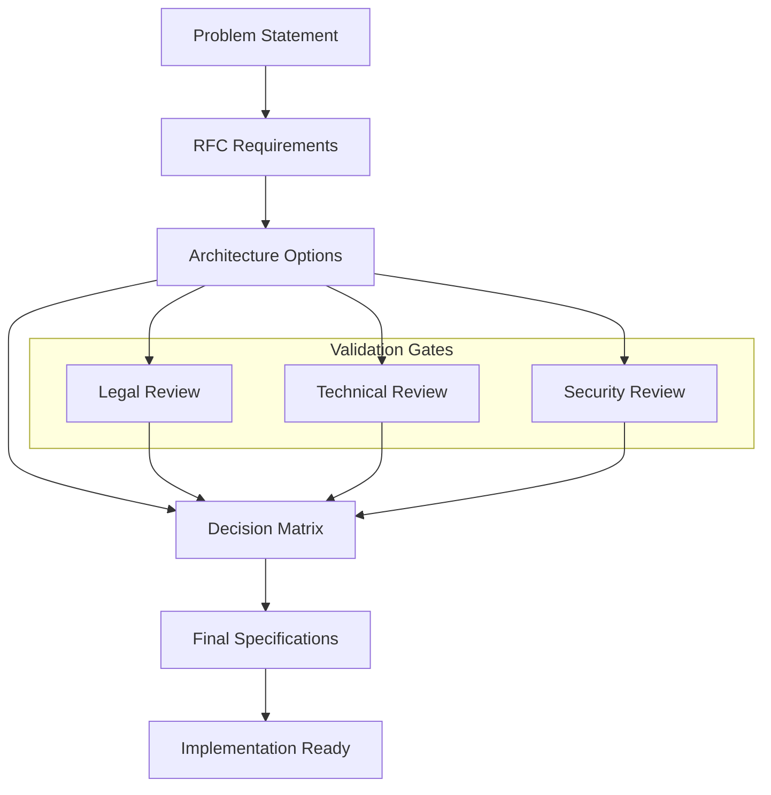
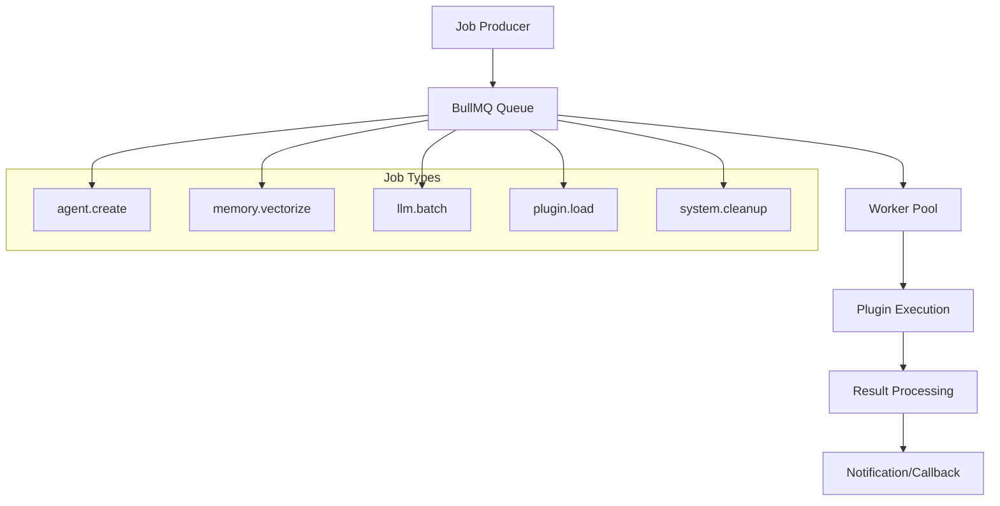
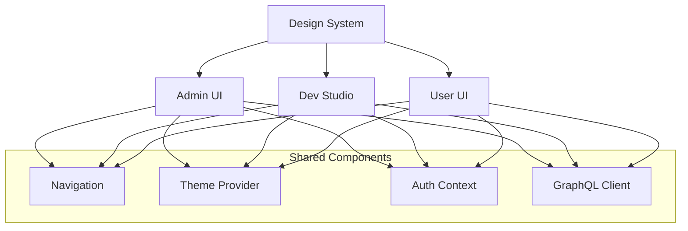

# AutoWeave Sprint Templates

## Table of Contents

- [Sprint 0: RFC & Validation OSS](#sprint-0-rfc--validation-oss)
- [Sprint 1: Daemon USB & Plugin Loader](#sprint-1-daemon-usb--plugin-loader)
- [Sprint 2: Queue & Workers BullMQ](#sprint-2-queue--workers-bullmq)
- [Sprint 3: GraphQL Gateway & Auth RBAC](#sprint-3-graphql-gateway--auth-rbac)
- [Sprint 4: Observabilité Tempo/Loki](#sprint-4-observabilité-tempoloki)
- [Sprint 5: 3 Front-ends Next.js 15](#sprint-5-3-front-ends-nextjs-15)
- [Sprint 6: Qualité + Release + Docs](#sprint-6-qualité--release--docs)

## Sprint 0: RFC & Validation OSS

### 📋 Sprint Planning Template

**Duration:** 1 semaine maximum  
**Objectif:** Gel des exigences techniques et validation juridique OSS

#### 🎯 Sprint Goal

Finaliser toutes les spécifications techniques et valider la compatibilité OSS
pour démarrer l'implémentation sans blocage.

#### 📊 Capacity Planning

- **Product Owner:** 40% (validation business requirements)
- **Tech Lead:** 80% (architecture decisions)
- **Legal/Compliance:** 20% (OSS audit)
- **Team:** 10% (review et feedback)

#### 🔄 Sprint Backlog

| User Story                  | Story Points | Priority | Acceptance Criteria            |
| --------------------------- | ------------ | -------- | ------------------------------ |
| **RFC-001 Plugin Manifest** | 8            | MUST     | Schema JSON validé avec AJV    |
| **OSS Dependencies Audit**  | 5            | MUST     | Aucune licence bloquante       |
| **USB Daemon Architecture** | 5            | MUST     | Choix Node.js vs Go documenté  |
| **Plugin Isolation Design** | 3            | MUST     | Worker Thread specs finalisées |
| **Security Model**          | 3            | MUST     | Permissions system défini      |

#### 📝 Daily Standup Template

**Questions:**

1. Avez-vous terminé votre analyse/validation hier ?
2. Quels blocages juridiques/techniques avez-vous identifiés ?
3. Avez-vous besoin d'aide pour finaliser vos spécifications ?

**Métriques:**

- RFC sections completed: X/Y
- Dependencies reviewed: X/Y
- Architecture decisions made: X/Y

#### ✅ Sprint Review Template

**Démonstration:**

- Présentation RFC-001 finalisé
- Rapport d'audit OSS complet
- Décisions architecturales documentées

**Métriques de succès:**

- [ ] RFC-001 approuvé par équipe technique
- [ ] Aucune dépendance OSS bloquante identifiée
- [ ] Architecture USB daemon finalisée
- [ ] Schema plugin manifest validé avec AJV
- [ ] Process de signature SHA-256 défini

#### 🔄 Sprint Retrospective Template

**What went well:**

- Processus de validation RFC efficace
- Collaboration équipe technique/juridique

**What could be improved:**

- Délais de validation plus courts
- Documentation des décisions plus détaillée

**Action items:**

- Améliorer templates RFC pour futurs sprints
- Automatiser audit OSS avec outils

### 🎨 Design Sprint Canvas



---

## Sprint 1: Daemon USB & Plugin Loader

### 📋 Sprint Planning Template

**Duration:** 2 semaines  
**Objectif:** Infrastructure hot-plug et gestionnaire de plugins

#### 🎯 Sprint Goal

Implémenter un système de détection USB hot-plug fiable et un gestionnaire de
plugins sécurisé avec isolation Worker Thread.

#### 📊 Capacity Planning

- **Backend Team:** 90% (USB daemon + plugin loader)
- **DevOps:** 30% (infrastructure Redis)
- **QA:** 50% (tests de charge et sécurité)
- **Product Owner:** 20% (validation fonctionnelle)

#### 🔄 Sprint Backlog

| User Story                       | Story Points | Priority | Assignee     | Acceptance Criteria                      |
| -------------------------------- | ------------ | -------- | ------------ | ---------------------------------------- |
| **USB Daemon Implementation**    | 13           | MUST     | Backend Lead | Détection attach/detach via node-usb     |
| **Plugin Loader Core**           | 13           | MUST     | Backend Dev  | Surveillance `plugins/` + validation AJV |
| **Worker Thread Isolation**      | 8            | MUST     | Backend Dev  | Plugins isolés avec limits mémoire/CPU   |
| **Redis Streams Integration**    | 5            | MUST     | DevOps       | Events publiés sur `aw:hotplug`          |
| **SHA-256 Signature Validation** | 5            | MUST     | Security     | Validation crypto avant import           |
| **Performance Testing**          | 8            | MUST     | QA           | <250ms load time, <1MB memory leak       |
| **Error Handling**               | 3            | SHOULD   | Backend Dev  | Fallback gracieux en cas d'erreur        |
| **Monitoring Hooks**             | 3            | SHOULD   | DevOps       | Métriques OTEL basiques                  |

#### 📝 Daily Standup Template

**Questions:**

1. Avez-vous progressé sur votre composant USB/Plugin hier ?
2. Quels blocages techniques rencontrez-vous ?
3. Avez-vous besoin d'aide pour les tests de performance ?

**Métriques quotidiennes:**

- Plugins loaded successfully: X
- USB detection events: X
- Performance tests passed: X/Y
- Memory leaks detected: X

#### ✅ Sprint Review Template

**Démonstration:**

- Live demo: USB device plug/unplug detection
- Plugin loading avec validation AJV
- Worker Thread isolation en action
- Dashboard métriques temps réel

**Métriques de succès:**

- [ ] USB daemon détecte attach/detach events via node-usb
- [ ] Events publiés sur Redis Streams channel `aw:hotplug`
- [ ] Plugin loader surveille `plugins/` directory via Chokidar
- [ ] Validation AJV + SHA-256 signature fonctionne
- [ ] Worker Thread isolation effective (mémoire + CPU)
- [ ] Plugin load time <250ms mesuré
- [ ] 1000 cycles plug/unplug sans fuite mémoire >1MB
- [ ] Fallback udev rules documenté pour permissions kernel

#### 🔄 Sprint Retrospective Template

**What went well:**

- Collaboration équipe backend efficace
- Tests de performance intégrés dès le début

**What could be improved:**

- Configuration udev plus complexe que prévu
- Documentation technique insuffisante

**Action items:**

- Améliorer docs configuration système
- Automatiser tests de performance dans CI

### 🛠️ Technical Implementation Template

```typescript
// Implementation checklist template
interface ImplementationChecklist {
  usbDaemon: {
    nodeUsbIntegration: boolean;
    hotplugCallbacks: boolean;
    redisStreamPublishing: boolean;
    errorHandling: boolean;
  };
  pluginLoader: {
    chokidarWatcher: boolean;
    ajvValidation: boolean;
    sha256Verification: boolean;
    workerThreadIsolation: boolean;
    dynamicImport: boolean;
  };
  testing: {
    unitTests: boolean;
    integrationTests: boolean;
    performanceTests: boolean;
    securityTests: boolean;
  };
}
```

---

## Sprint 2: Queue & Workers BullMQ

### 📋 Sprint Planning Template

**Duration:** 2 semaines  
**Objectif:** Système de queue asynchrone et workers distribuée

#### 🎯 Sprint Goal

Implémenter un système de queue robuste avec BullMQ pour traiter les jobs
asynchrones et orchestrer les workers de plugins.

#### 📊 Capacity Planning

- **Backend Team:** 80% (BullMQ integration)
- **Frontend Team:** 40% (Dashboard UI)
- **DevOps:** 60% (Redis configuration)
- **QA:** 40% (load testing)

#### 🔄 Sprint Backlog

| User Story                  | Story Points | Priority | Assignee     | Acceptance Criteria                 |
| --------------------------- | ------------ | -------- | ------------ | ----------------------------------- |
| **BullMQ Core Integration** | 13           | MUST     | Backend Lead | Queues configurées pour 5 job types |
| **Generic Plugin Worker**   | 8            | MUST     | Backend Dev  | Worker générique avec OTEL traces   |
| **Job Flow Management**     | 8            | MUST     | Backend Dev  | Flow multi-étapes fonctionnel       |
| **Dashboard Integration**   | 5            | MUST     | Frontend Dev | Dashboard BullMQ dans Admin UI      |
| **Redis Streams Setup**     | 5            | MUST     | DevOps       | Redis streams optimisé              |
| **Error Handling & Retry**  | 5            | MUST     | Backend Dev  | Backoff exponential configuré       |
| **Performance Testing**     | 8            | MUST     | QA           | >100 jobs/minute sustained          |
| **Monitoring & Alerting**   | 3            | SHOULD   | DevOps       | Métriques queue health              |

#### 📝 Daily Standup Template

**Questions:**

1. Avez-vous progressé sur votre composant queue/worker hier ?
2. Quels problèmes de performance avez-vous identifiés ?
3. L'intégration dashboard avance-t-elle bien ?

**Métriques quotidiennes:**

- Jobs processed: X
- Queue throughput: X jobs/min
- Failed jobs: X
- Worker uptime: X%

#### ✅ Sprint Review Template

**Démonstration:**

- Live demo: Job processing pipeline
- Dashboard BullMQ temps réel
- Error handling et retry logic
- Performance sous charge

**Métriques de succès:**

- [ ] BullMQ queues configurées pour 5 job types
- [ ] Worker générique avec OpenTelemetry traces
- [ ] Dashboard BullMQ intégré dans Admin UI
- [ ] Flow multi-étapes fonctionnel pour agents
- [ ] Retry/error handling avec backoff exponential
- [ ] Performance >100 jobs/minute sustained
- [ ] Graceful shutdown workers <5 secondes

### 🎨 Queue Architecture Template



---

## Sprint 3: GraphQL Gateway & Auth RBAC

### 📋 Sprint Planning Template

**Duration:** 2 semaines  
**Objectif:** Super-graph unifié avec authentification enterprise

#### 🎯 Sprint Goal

Créer un gateway GraphQL fédéré avec authentification JWT et autorisation RBAC
pour unifier toutes les APIs.

#### 📊 Capacity Planning

- **Backend Team:** 90% (GraphQL federation)
- **Security Team:** 60% (Auth implementation)
- **Frontend Team:** 30% (Client integration)
- **DevOps:** 40% (rate limiting setup)

#### 🔄 Sprint Backlog

| User Story                  | Story Points | Priority | Assignee     | Acceptance Criteria                  |
| --------------------------- | ------------ | -------- | ------------ | ------------------------------------ |
| **Apollo Gateway Setup**    | 13           | MUST     | Backend Lead | Super-graph fédère 5 subgraphs       |
| **JWT Authentication**      | 8            | MUST     | Security     | JWT validation + context propagation |
| **RBAC Authorization**      | 8            | MUST     | Security     | Role-based access control            |
| **Rate Limiting**           | 5            | MUST     | DevOps       | 100 req/min/tenant effectif          |
| **Subgraph Implementation** | 13           | MUST     | Backend Team | 5 subgraphs opérationnels            |
| **Subscription Support**    | 5            | MUST     | Backend Dev  | Real-time subscriptions              |
| **Schema Introspection**    | 3            | MUST     | Backend Dev  | Playground GraphQL actif             |
| **Client Integration**      | 5            | SHOULD   | Frontend Dev | React hooks générés                  |

#### 📝 Daily Standup Template

**Questions:**

1. Avez-vous progressé sur votre subgraph/gateway hier ?
2. Quels problèmes d'authentification rencontrez-vous ?
3. Les performances du gateway sont-elles satisfaisantes ?

**Métriques quotidiennes:**

- Subgraphs online: X/5
- Auth success rate: X%
- Rate limit violations: X
- GraphQL query latency: Xms

#### ✅ Sprint Review Template

**Démonstration:**

- GraphQL playground avec tous les subgraphs
- Authentification JWT en action
- Rate limiting par tenant
- Subscriptions temps réel

**Métriques de succès:**

- [ ] Apollo Gateway fédère 5 subgraphs
- [ ] JWT authentication + RBAC fonctionnel
- [ ] Rate limiting 100 req/min/tenant effectif
- [ ] Context propagation sécurisé vers resolvers
- [ ] Subscriptions temps réel fonctionnelles
- [ ] Performance <200ms P95 latency
- [ ] Schema introspection et playground actifs

### 🔐 Security Implementation Template

```typescript
// Security checklist template
interface SecurityChecklist {
  authentication: {
    jwtValidation: boolean;
    tokenExpiration: boolean;
    refreshTokens: boolean;
    multiTenant: boolean;
  };
  authorization: {
    roleBasedAccess: boolean;
    resourcePermissions: boolean;
    contextPropagation: boolean;
    auditLogging: boolean;
  };
  rateLimiting: {
    perTenantLimits: boolean;
    burstProtection: boolean;
    alerting: boolean;
  };
}
```

---

## Sprint 4: Observabilité Tempo/Loki

### 📋 Sprint Planning Template

**Duration:** 2 semaines  
**Objectif:** Instrumentation complète et stack de monitoring

#### 🎯 Sprint Goal

Déployer une stack d'observabilité complète avec OpenTelemetry, Grafana Tempo et
Loki pour monitoring production.

#### 📊 Capacity Planning

- **DevOps Team:** 80% (stack deployment)
- **Backend Team:** 60% (instrumentation)
- **Frontend Team:** 40% (dashboard integration)
- **SRE:** 30% (monitoring setup)

#### 🔄 Sprint Backlog

| User Story                 | Story Points | Priority | Assignee     | Acceptance Criteria               |
| -------------------------- | ------------ | -------- | ------------ | --------------------------------- |
| **OpenTelemetry Setup**    | 8            | MUST     | Backend Lead | SDK instrumenté sur tous services |
| **Tempo Deployment**       | 8            | MUST     | DevOps       | Traces OTLP/HTTP vers Tempo       |
| **Loki Integration**       | 8            | MUST     | DevOps       | Logs structurés vers Loki         |
| **Grafana Dashboards**     | 5            | MUST     | SRE          | Dashboard temps réel opérationnel |
| **Custom Instrumentation** | 8            | MUST     | Backend Team | Labels tenant/plugin/jobId        |
| **Helm Chart**             | 5            | MUST     | DevOps       | Stack déployable via Helm         |
| **Admin UI Integration**   | 5            | MUST     | Frontend Dev | Drill-down iframe Grafana         |
| **Alerting Rules**         | 3            | SHOULD   | SRE          | Alertes sur erreurs/latence       |

#### 📝 Daily Standup Template

**Questions:**

1. Avez-vous progressé sur votre instrumentation hier ?
2. Quels problèmes de déploiement stack rencontrez-vous ?
3. Les métriques collectées sont-elles pertinentes ?

**Métriques quotidiennes:**

- Services instrumented: X/Y
- Traces collected: X
- Logs indexed: X
- Dashboard uptime: X%

#### ✅ Sprint Review Template

**Démonstration:**

- Stack Tempo/Loki/Grafana opérationnelle
- Traces end-to-end avec labels
- Logs structurés par tenant/plugin
- Dashboard Admin UI avec drill-down

**Métriques de succès:**

- [ ] OpenTelemetry SDK instrumenté sur tous services
- [ ] Traces OTLP/HTTP exportées vers Tempo
- [ ] Logs structurés envoyés vers Loki
- [ ] Labels tenant/plugin/jobId appliqués partout
- [ ] Helm chart deploie stack Tempo+Loki+Grafana
- [ ] Admin UI dashboard temps réel fonctionnel
- [ ] Drill-down iframe Grafana intégré
- [ ] Performance bottlenecks visibles dans traces

### 📊 Monitoring Template

```yaml
# Monitoring configuration template
monitoring:
  metrics:
    - name: 'request_duration'
      labels: ['tenant', 'plugin', 'endpoint']
      target: 'p95 < 200ms'
    - name: 'error_rate'
      labels: ['tenant', 'service']
      target: '< 0.1%'
    - name: 'throughput'
      labels: ['queue', 'job_type']
      target: '> 100 jobs/min'

  alerts:
    - name: 'high_error_rate'
      condition: 'error_rate > 1%'
      severity: 'warning'
    - name: 'high_latency'
      condition: 'p95_latency > 500ms'
      severity: 'critical'
```

---

## Sprint 5: 3 Front-ends Next.js 15

### 📋 Sprint Planning Template

**Duration:** 2 semaines  
**Objectif:** Applications utilisateur avec design system unifié

#### 🎯 Sprint Goal

Développer trois applications Next.js 15 avec App Router et design system
cohérent pour différents cas d'usage.

#### 📊 Capacity Planning

- **Frontend Team:** 90% (3 applications)
- **UX/UI Designer:** 70% (design system)
- **Backend Team:** 20% (API integration)
- **QA:** 60% (testing applications)

#### 🔄 Sprint Backlog

| User Story                   | Story Points | Priority | Assignee      | Acceptance Criteria                 |
| ---------------------------- | ------------ | -------- | ------------- | ----------------------------------- |
| **Admin UI Application**     | 13           | MUST     | Frontend Lead | Pages health/plugins/logs complètes |
| **Dev Studio Application**   | 13           | MUST     | Frontend Dev  | React Flow builder opérationnel     |
| **User UI Application**      | 8            | MUST     | Frontend Dev  | Chat interface fonctionnelle        |
| **Design System Package**    | 8            | MUST     | UX/UI         | shadcn/ui components partagés       |
| **Navigation & Auth**        | 5            | MUST     | Frontend Dev  | OIDC navigation unifiée             |
| **Theme System**             | 5            | MUST     | UX/UI         | Dark/light themes                   |
| **Performance Optimization** | 8            | MUST     | Frontend Team | Lighthouse >90 score                |
| **A11Y Compliance**          | 5            | MUST     | UX/UI         | WCAG 2.1 conformité                 |

#### 📝 Daily Standup Template

**Questions:**

1. Sur quelle application avez-vous travaillé hier ?
2. Quels problèmes de performance/UX avez-vous identifiés ?
3. L'intégration design system avance-t-elle bien ?

**Métriques quotidiennes:**

- Components implemented: X/Y
- Lighthouse score: X
- A11Y issues: X
- Bundle size: X KB

#### ✅ Sprint Review Template

**Démonstration:**

- Live demo des 3 applications
- Design system consistency
- Performance mobile/desktop
- Accessibilité features

**Métriques de succès:**

- [ ] 3 applications Next.js 15 déployées (Admin, Studio, User)
- [ ] Design system @autoweave/ui partagé fonctionnel
- [ ] React Flow agent builder opérationnel
- [ ] Navigation OIDC partagée entre apps
- [ ] Themes dark/light fonctionnels
- [ ] Composants A11Y Radix conformes WCAG 2.1
- [ ] Lighthouse score >90 performance mobile
- [ ] WebSocket logs stream Loki intégré

### 🎨 Frontend Architecture Template



---

## Sprint 6: Qualité + Release + Docs

### 📋 Sprint Planning Template

**Duration:** 3 semaines  
**Objectif:** Production readiness et gouvernance

#### 🎯 Sprint Goal

Atteindre la production readiness avec quality gates, pipeline CI/CD automatisé
et documentation complète.

#### 📊 Capacity Planning

- **DevOps Team:** 80% (CI/CD pipeline)
- **QA Team:** 90% (quality gates)
- **Tech Writer:** 80% (documentation)
- **All Teams:** 30% (final polish)

#### 🔄 Sprint Backlog

| User Story                 | Story Points | Priority | Assignee      | Acceptance Criteria            |
| -------------------------- | ------------ | -------- | ------------- | ------------------------------ |
| **SonarCloud Integration** | 8            | MUST     | DevOps        | Quality Gate ≥80% coverage     |
| **Semantic Release**       | 8            | MUST     | DevOps        | Automated versioning           |
| **Docker Multi-arch**      | 5            | MUST     | DevOps        | Images signed with cosign      |
| **SBOM Generation**        | 5            | MUST     | Security      | Syft SBOM attached to releases |
| **Documentation Site**     | 13           | MUST     | Tech Writer   | Docusaurus site complet        |
| **Governance Setup**       | 5            | MUST     | Product Owner | RFC process public             |
| **Performance Testing**    | 8            | MUST     | QA            | Load testing all services      |
| **Security Audit**         | 8            | MUST     | Security      | Vulnerability scan             |

#### 📝 Daily Standup Template

**Questions:**

1. Avez-vous progressé sur votre quality gate hier ?
2. Quels problèmes de CI/CD rencontrez-vous ?
3. La documentation est-elle à jour ?

**Métriques quotidiennes:**

- Tests passing: X/Y
- Coverage: X%
- Vulnerabilities: X
- Docs pages: X

#### ✅ Sprint Review Template

**Démonstration:**

- Pipeline CI/CD complet
- Quality gates en action
- Documentation site
- Release process automated

**Métriques de succès:**

- [ ] SonarCloud Quality Gate à 80% coverage, 0 vulnérabilités
- [ ] Semantic-release automatique fonctionnel
- [ ] Docker images multi-arch signées avec cosign
- [ ] SBOM généré et attaché aux releases GitHub
- [ ] Documentation Docusaurus déployée sur docs.autoweave.dev
- [ ] Tutoriels Quick-Start, Dev Studio, Admin complets
- [ ] RFC process public opérationnel
- [ ] Blog post Vercel sur RSC architecture publié

### 🚀 Release Template

```yaml
# Release checklist template
release:
  pre_release:
    - code_freeze: true
    - security_scan: true
    - performance_test: true
    - documentation_review: true

  release:
    - version_bump: true
    - changelog_generated: true
    - docker_build: true
    - helm_chart_updated: true
    - docs_deployed: true

  post_release:
    - release_notes: true
    - blog_post: true
    - community_notification: true
    - monitoring_alert: true
```

## 📊 Cross-Sprint Metrics Template

### Velocity Tracking

```typescript
interface SprintMetrics {
  planned_points: number;
  completed_points: number;
  velocity: number;
  burndown: number[];
  quality_metrics: {
    bugs_found: number;
    bugs_fixed: number;
    test_coverage: number;
    performance_score: number;
  };
}
```

### Quality Gates

```yaml
quality_gates:
  sprint_0:
    - rfc_approved: true
    - dependencies_validated: true
  sprint_1:
    - performance_target: '<250ms plugin load'
    - memory_leak_test: '<1MB after 1000 cycles'
  sprint_2:
    - throughput_target: '>100 jobs/min'
    - error_rate: '<1%'
  sprint_3:
    - latency_target: '<200ms p95'
    - rate_limit_working: true
  sprint_4:
    - instrumentation_complete: true
    - dashboards_operational: true
  sprint_5:
    - lighthouse_score: '>90'
    - a11y_compliance: 'WCAG 2.1'
  sprint_6:
    - coverage_target: '≥80%'
    - vulnerabilities: '0 critical/high'
```

Ces templates fournissent une structure cohérente et reproductible pour chaque
sprint, avec des métriques claires et des critères d'acceptation bien définis.
