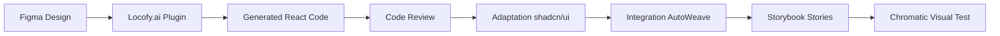

# AutoWeave UI Toolchain Guide

## Table of Contents

- [Overview](#overview)
- [Design System Tools](#design-system-tools)
- [Low-code/Visual Builders](#low-codevisual-builders)
- [Development Tools](#development-tools)
- [Code Generation & Documentation](#code-generation--documentation)
- [Integration with Turborepo](#integration-with-turborepo)
- [Quality Gates](#quality-gates)
- [Sprint Integration](#sprint-integration)

## Overview

Ce guide décrit l'intégration complète des outils UI/Frontend dans AutoWeave, en
s'appuyant sur la stack Node.js + Next.js 15 + Turborepo pour créer un
écosystème d'outils qui automatise et accélère la création d'interfaces
utilisateur.

## Design System Tools

### shadcn/ui CLI + Radix UI

**Installation et Configuration**

```bash
# Installation dans le workspace @autoweave/ui
cd packages/ui
pnpm dlx shadcn@latest init

# Configuration automatique
? Would you like to use TypeScript? › Yes
? Which style would you like to use? › Default
? Which color would you like to use as base color? › Slate
? Where is your global CSS file? › src/styles/globals.css
? Would you like to use CSS variables for colors? › Yes
? Where is your tailwind.config.js located? › tailwind.config.js
? Configure the import alias for components? › @/components
? Configure the import alias for utils? › @/lib/utils
```

**Structure du Package UI**

```
packages/ui/
├── src/
│   ├── components/
│   │   ├── ui/           # Composants shadcn/ui
│   │   │   ├── button.tsx
│   │   │   ├── card.tsx
│   │   │   ├── dialog.tsx
│   │   │   └── input.tsx
│   │   ├── layout/       # Composants de mise en page
│   │   │   ├── sidebar.tsx
│   │   │   ├── header.tsx
│   │   │   └── footer.tsx
│   │   └── business/     # Composants métier
│   │       ├── agent-card.tsx
│   │       ├── plugin-table.tsx
│   │       └── metrics-card.tsx
│   ├── lib/
│   │   ├── utils.ts      # Utilitaires (cn, etc.)
│   │   └── types.ts      # Types partagés
│   ├── hooks/
│   │   ├── use-theme.ts
│   │   └── use-toast.ts
│   └── styles/
│       └── globals.css
├── tailwind.config.js
├── tsconfig.json
└── package.json
```

**Ajout de Composants**

```bash
# Ajouter des composants shadcn/ui
pnpm dlx shadcn@latest add button
pnpm dlx shadcn@latest add card
pnpm dlx shadcn@latest add dialog
pnpm dlx shadcn@latest add input
pnpm dlx shadcn@latest add table
pnpm dlx shadcn@latest add badge
pnpm dlx shadcn@latest add toast
pnpm dlx shadcn@latest add dropdown-menu
```

**Configuration des Tokens de Design**

```typescript
// packages/ui/lib/tokens.ts
export const tokens = {
  colors: {
    primary: {
      50: '#f0f9ff',
      500: '#3b82f6',
      900: '#1e3a8a',
    },
    gray: {
      50: '#f9fafb',
      500: '#6b7280',
      900: '#111827',
    },
    autoweave: {
      brand: '#7c3aed',
      success: '#10b981',
      warning: '#f59e0b',
      error: '#ef4444',
    },
  },
  spacing: {
    xs: '0.25rem',
    sm: '0.5rem',
    md: '1rem',
    lg: '1.5rem',
    xl: '2rem',
  },
  typography: {
    fontFamily: {
      sans: ['Inter', 'system-ui', 'sans-serif'],
      mono: ['Fira Code', 'monospace'],
    },
    fontSize: {
      xs: '0.75rem',
      sm: '0.875rem',
      base: '1rem',
      lg: '1.125rem',
      xl: '1.25rem',
      '2xl': '1.5rem',
      '3xl': '1.875rem',
    },
  },
};
```

### v0 - Generative UI by Vercel

**Intégration dans le Workflow**

```bash
# Utilisation de v0 pour prototypage rapide
# 1. Créer un composant sur v0.dev
# 2. Copier le code généré
# 3. Adapter aux composants shadcn/ui existants
# 4. Intégrer dans le design system
```

**Exemple de Workflow v0**

```typescript
// Composant généré par v0 (exemple)
// Adapté pour AutoWeave
'use client';

import { Card, CardContent, CardHeader, CardTitle } from '@/components/ui/card';
import { Badge } from '@/components/ui/badge';
import { Button } from '@/components/ui/button';
import { Play, Pause, Square } from 'lucide-react';

export function AgentCard({ agent }) {
  return (
    <Card className="w-full max-w-md">
      <CardHeader>
        <div className="flex items-center justify-between">
          <CardTitle className="text-lg">{agent.name}</CardTitle>
          <Badge variant={agent.status === 'running' ? 'default' : 'secondary'}>
            {agent.status}
          </Badge>
        </div>
      </CardHeader>
      <CardContent>
        <p className="text-sm text-muted-foreground mb-4">
          {agent.description}
        </p>
        <div className="flex gap-2">
          <Button size="sm" variant="outline">
            <Play className="h-4 w-4 mr-2" />
            Start
          </Button>
          <Button size="sm" variant="outline">
            <Pause className="h-4 w-4 mr-2" />
            Pause
          </Button>
          <Button size="sm" variant="outline">
            <Square className="h-4 w-4 mr-2" />
            Stop
          </Button>
        </div>
      </CardContent>
    </Card>
  );
}
```

## Low-code/Visual Builders

### Plasmic - Interfaces Externes

**Installation et Configuration**

```bash
# Dans apps/marketing (interfaces externes)
cd apps/marketing
pnpm install @plasmicapp/react-web @plasmicapp/loader-nextjs

# Configuration Next.js
# next.config.js
const { withPlasmic } = require('@plasmicapp/loader-nextjs');

module.exports = withPlasmic({
  // Configuration Next.js
  experimental: {
    appDir: true,
  },
})({
  // Configuration Plasmic
  projects: [
    {
      id: 'YOUR_PROJECT_ID',
      token: process.env.PLASMIC_PROJECT_TOKEN,
    },
  ],
});
```

**Utilisation dans les Pages**

```typescript
// apps/marketing/src/app/page.tsx
import { PlasmicComponent } from '@plasmicapp/loader-nextjs';
import { PLASMIC } from '@/plasmic-init';

export default async function HomePage() {
  const plasmicData = await PLASMIC.fetchComponentData('HomePage');

  return (
    <PlasmicComponent
      component="HomePage"
      plasmicData={plasmicData}
    />
  );
}
```

### Builder.io - Marketing + A/B Testing

**Configuration**

```bash
# Installation
pnpm install @builder.io/react @builder.io/sdk

# Configuration
# apps/marketing/src/lib/builder.ts
import { builder } from '@builder.io/react';

builder.init(process.env.NEXT_PUBLIC_BUILDER_API_KEY!);

// Enregistrement des composants personnalisés
builder.registerComponent(AgentCard, {
  name: 'AgentCard',
  inputs: [
    {
      name: 'agent',
      type: 'object',
      subFields: [
        { name: 'name', type: 'string' },
        { name: 'description', type: 'string' },
        { name: 'status', type: 'string' },
      ],
    },
  ],
});
```

### Appsmith - Admin Panels

**Configuration Docker**

```yaml
# docker-compose.yml pour développement
version: '3.7'
services:
  appsmith:
    image: appsmith/appsmith-ce:latest
    ports:
      - '80:80'
      - '443:443'
    volumes:
      - ./stacks:/appsmith-stacks
    environment:
      - APPSMITH_ENCRYPTION_PASSWORD=your-password
      - APPSMITH_ENCRYPTION_SALT=your-salt
    depends_on:
      - mongo
      - redis

  mongo:
    image: mongo:5.0
    ports:
      - '27017:27017'
    volumes:
      - ./data/mongo:/data/db

  redis:
    image: redis:6.2-alpine
    ports:
      - '6379:6379'
```

**Intégration avec AutoWeave API**

```javascript
// Configuration API dans Appsmith
// Datasource: AutoWeave GraphQL API
{
  "url": "http://localhost:4000/graphql",
  "headers": {
    "Authorization": "Bearer {{appsmith.store.authToken}}",
    "Content-Type": "application/json"
  },
  "body": {
    "query": "query GetAgents { agents { id name status description } }"
  }
}
```

### Budibase - Outils Internes

**Configuration Self-hosted**

```bash
# Installation Budibase
curl -H "Accept: application/vnd.github.v3.raw" \
  -s https://api.github.com/repos/Budibase/budibase/contents/hosting/docker-compose.yaml | \
  docker-compose -f - up -d
```

**Configuration Kubernetes**

```yaml
# budibase-values.yaml
apiVersion: v1
kind: ConfigMap
metadata:
  name: budibase-config
data:
  BUDIBASE_ENVIRONMENT: production
  COUCH_DB_URL: http://couchdb:5984
  REDIS_URL: redis://redis:6379
  MINIO_URL: http://minio:9000
---
apiVersion: apps/v1
kind: Deployment
metadata:
  name: budibase
spec:
  replicas: 2
  selector:
    matchLabels:
      app: budibase
  template:
    metadata:
      labels:
        app: budibase
    spec:
      containers:
        - name: budibase
          image: budibase/budibase:latest
          ports:
            - containerPort: 4001
          envFrom:
            - configMapRef:
                name: budibase-config
```

## Development Tools

### React Flow - Dev Studio

**Installation et Configuration**

```bash
# Dans apps/studio
cd apps/studio
pnpm install reactflow @reactflow/node-toolbar @reactflow/background @reactflow/controls @reactflow/minimap
```

**Configuration des Types de Nœuds**

```typescript
// apps/studio/src/components/nodes/index.ts
import { NodeTypes } from 'reactflow';
import { LLMNode } from './llm-node';
import { MemoryNode } from './memory-node';
import { ToolNode } from './tool-node';
import { ConditionNode } from './condition-node';
import { OutputNode } from './output-node';

export const nodeTypes: NodeTypes = {
  llm: LLMNode,
  memory: MemoryNode,
  tool: ToolNode,
  condition: ConditionNode,
  output: OutputNode,
};
```

**Nœud LLM Personnalisé**

```typescript
// apps/studio/src/components/nodes/llm-node.tsx
import { memo } from 'react';
import { Handle, Position, NodeProps } from 'reactflow';
import { Card, CardContent, CardHeader, CardTitle } from '@/components/ui/card';
import { Badge } from '@/components/ui/badge';
import { Brain } from 'lucide-react';

interface LLMNodeData {
  model: string;
  temperature: number;
  maxTokens: number;
  prompt: string;
}

function LLMNode({ data, selected }: NodeProps<LLMNodeData>) {
  return (
    <Card className={`w-64 ${selected ? 'ring-2 ring-blue-500' : ''}`}>
      <CardHeader className="pb-2">
        <CardTitle className="text-sm flex items-center gap-2">
          <Brain className="h-4 w-4" />
          LLM Node
        </CardTitle>
        <Badge variant="secondary">{data.model}</Badge>
      </CardHeader>
      <CardContent className="text-xs space-y-1">
        <div>Temperature: {data.temperature}</div>
        <div>Max Tokens: {data.maxTokens}</div>
        <div className="truncate" title={data.prompt}>
          Prompt: {data.prompt}
        </div>
      </CardContent>

      <Handle type="target" position={Position.Left} />
      <Handle type="source" position={Position.Right} />
    </Card>
  );
}

export default memo(LLMNode);
```

**Sérialisation des Graphiques**

```typescript
// apps/studio/src/lib/graph-serializer.ts
import { Node, Edge } from 'reactflow';

export interface SerializedGraph {
  id: string;
  name: string;
  description?: string;
  nodes: Node[];
  edges: Edge[];
  metadata: {
    createdAt: string;
    updatedAt: string;
    version: string;
  };
}

export function serializeGraph(
  nodes: Node[],
  edges: Edge[],
  metadata: Partial<SerializedGraph['metadata']> = {},
): SerializedGraph {
  return {
    id: crypto.randomUUID(),
    name: metadata.name || 'Untitled Graph',
    description: metadata.description,
    nodes,
    edges,
    metadata: {
      createdAt: new Date().toISOString(),
      updatedAt: new Date().toISOString(),
      version: '1.0.0',
      ...metadata,
    },
  };
}

export function deserializeGraph(serialized: SerializedGraph): {
  nodes: Node[];
  edges: Edge[];
  metadata: SerializedGraph['metadata'];
} {
  return {
    nodes: serialized.nodes,
    edges: serialized.edges,
    metadata: serialized.metadata,
  };
}
```

### Locofy.ai - Figma to React

**Workflow d'Intégration**



**Configuration Locofy**

```json
{
  "framework": "next",
  "typescript": true,
  "tailwind": true,
  "componentLibrary": "shadcn/ui",
  "outputPath": "./src/components/generated",
  "figmaFileId": "YOUR_FIGMA_FILE_ID",
  "figmaToken": "YOUR_FIGMA_TOKEN"
}
```

## Code Generation & Documentation

### GraphQL Codegen

**Configuration**

```yaml
# codegen.yml
schema:
  - 'http://localhost:4000/graphql'
  - './src/schema/**/*.graphql'
documents:
  - './src/**/*.graphql'
  - './src/**/*.tsx'
generates:
  ./src/generated/graphql.ts:
    plugins:
      - typescript
      - typescript-operations
      - typescript-react-apollo
    config:
      withHooks: true
      withComponent: false
      withHOC: false
      scalars:
        DateTime: string
        JSON: any
  ./src/generated/introspection.json:
    plugins:
      - introspection
```

**Hooks Générés**

```typescript
// Exemple d'utilisation des hooks générés
import { useGetAgentsQuery, useCreateAgentMutation } from '@/generated/graphql';

export function AgentsList() {
  const { data, loading, error } = useGetAgentsQuery();
  const [createAgent] = useCreateAgentMutation();

  if (loading) return <div>Loading...</div>;
  if (error) return <div>Error: {error.message}</div>;

  return (
    <div>
      {data?.agents.map(agent => (
        <AgentCard key={agent.id} agent={agent} />
      ))}
    </div>
  );
}
```

### Storybook 7 Autodocs

**Configuration**

```typescript
// .storybook/main.ts
import type { StorybookConfig } from '@storybook/nextjs';

const config: StorybookConfig = {
  stories: ['../src/**/*.stories.@(js|jsx|ts|tsx|mdx)'],
  addons: [
    '@storybook/addon-essentials',
    '@storybook/addon-interactions',
    '@storybook/addon-a11y',
    '@storybook/addon-docs',
  ],
  framework: {
    name: '@storybook/nextjs',
    options: {},
  },
  docs: {
    autodocs: 'tag',
  },
  typescript: {
    check: false,
    reactDocgen: 'react-docgen-typescript',
    reactDocgenTypescriptOptions: {
      shouldExtractLiteralValuesFromEnum: true,
      propFilter: (prop) =>
        prop.parent ? !/node_modules/.test(prop.parent.fileName) : true,
    },
  },
};

export default config;
```

**Story Exemple avec Auto-documentation**

```typescript
// src/components/ui/button.stories.tsx
import type { Meta, StoryObj } from '@storybook/react';
import { Button } from './button';

const meta: Meta<typeof Button> = {
  title: 'UI/Button',
  component: Button,
  parameters: {
    layout: 'centered',
    docs: {
      description: {
        component: 'Composant bouton basé sur Radix UI avec support des variants et tailles.',
      },
    },
  },
  tags: ['autodocs'],
  argTypes: {
    variant: {
      control: 'select',
      options: ['default', 'destructive', 'outline', 'secondary', 'ghost', 'link'],
    },
    size: {
      control: 'select',
      options: ['default', 'sm', 'lg', 'icon'],
    },
  },
};

export default meta;
type Story = StoryObj<typeof meta>;

export const Default: Story = {
  args: {
    children: 'Button',
  },
};

export const Variants: Story = {
  render: () => (
    <div className="flex gap-2">
      <Button variant="default">Default</Button>
      <Button variant="destructive">Destructive</Button>
      <Button variant="outline">Outline</Button>
      <Button variant="secondary">Secondary</Button>
      <Button variant="ghost">Ghost</Button>
      <Button variant="link">Link</Button>
    </div>
  ),
};
```

## Integration with Turborepo

### Configuration Turborepo

```json
{
  "pipeline": {
    "build": {
      "dependsOn": ["^build"],
      "outputs": ["dist/**", ".next/**", "build/**"]
    },
    "ui:build": {
      "dependsOn": ["^ui:build"],
      "outputs": ["dist/**"]
    },
    "ui:storybook": {
      "dependsOn": ["ui:build"],
      "outputs": ["storybook-static/**"]
    },
    "ui:chromatic": {
      "dependsOn": ["ui:storybook"],
      "env": ["CHROMATIC_PROJECT_TOKEN"]
    },
    "dev": {
      "cache": false,
      "persistent": true
    },
    "lint": {
      "dependsOn": ["^lint"],
      "outputs": []
    },
    "test": {
      "dependsOn": ["^test"],
      "outputs": ["coverage/**"]
    }
  }
}
```

### Scripts Package.json

```json
{
  "scripts": {
    "dev": "turbo run dev --parallel",
    "build": "turbo run build",
    "ui:dev": "turbo run dev --filter=@autoweave/ui",
    "ui:build": "turbo run ui:build",
    "ui:storybook": "turbo run ui:storybook",
    "ui:chromatic": "turbo run ui:chromatic",
    "studio:dev": "turbo run dev --filter=studio",
    "admin:dev": "turbo run dev --filter=admin",
    "user:dev": "turbo run dev --filter=user",
    "plasmic:sync": "turbo run plasmic:sync --filter=marketing",
    "codegen": "turbo run codegen"
  }
}
```

## Quality Gates

### Chromatic Visual Testing

**Configuration**

```bash
# Installation
pnpm install -D chromatic

# Configuration
# .github/workflows/chromatic.yml
name: Chromatic
on: push
jobs:
  chromatic:
    runs-on: ubuntu-latest
    steps:
      - uses: actions/checkout@v3
      - uses: actions/setup-node@v3
        with:
          node-version: '20'
      - name: Install dependencies
        run: pnpm install
      - name: Build Storybook
        run: pnpm run ui:storybook
      - name: Publish to Chromatic
        uses: chromaui/action@v1
        with:
          projectToken: ${{ secrets.CHROMATIC_PROJECT_TOKEN }}
          token: ${{ secrets.GITHUB_TOKEN }}
          storybookBuildDir: packages/ui/storybook-static
```

### Lighthouse CI

**Configuration**

```json
{
  "ci": {
    "collect": {
      "url": [
        "http://localhost:3000",
        "http://localhost:3001",
        "http://localhost:3002"
      ],
      "startServerCommand": "pnpm run dev",
      "numberOfRuns": 3
    },
    "assert": {
      "preset": "lighthouse:recommended",
      "assertions": {
        "categories:performance": ["warn", { "minScore": 0.9 }],
        "categories:accessibility": ["error", { "minScore": 0.9 }],
        "categories:best-practices": ["warn", { "minScore": 0.9 }],
        "categories:seo": ["warn", { "minScore": 0.9 }],
        "first-contentful-paint": ["warn", { "maxNumericValue": 2000 }],
        "largest-contentful-paint": ["warn", { "maxNumericValue": 2500 }],
        "cumulative-layout-shift": ["warn", { "maxNumericValue": 0.1 }]
      }
    }
  }
}
```

## Sprint Integration

### Sprint 1-2: Installation shadcn + Storybook

```bash
# Sprint 1: Setup design system
pnpm run ui:init
pnpm run ui:add-components
pnpm run ui:storybook:init

# Sprint 2: Documentation
pnpm run ui:storybook:build
pnpm run ui:chromatic:setup
```

### Sprint 3-4: React Flow + Builder.io

```bash
# Sprint 3: Dev Studio
pnpm run studio:setup-reactflow
pnpm run studio:create-nodes

# Sprint 4: Marketing tools
pnpm run marketing:setup-builder
pnpm run marketing:setup-plasmic
```

### Sprint 5: GraphQL Codegen + Appsmith

```bash
# Sprint 5: Code generation
pnpm run codegen:setup
pnpm run codegen:generate

# Admin tools
pnpm run admin:setup-appsmith
pnpm run admin:setup-budibase
```

### Sprint 6: Final Polish + Chromatic

```bash
# Sprint 6: Quality gates
pnpm run ui:chromatic:run
pnpm run lighthouse:ci
pnpm run ui:test:visual
```

## Métriques et Monitoring

### Performance Targets

- **Lighthouse Score**: >90 pour toutes les applications
- **Storybook Build Time**: <2 minutes
- **Chromatic Diff Detection**: <5 secondes
- **React Flow Render Time**: <100ms pour 50 nœuds

### Monitoring Dashboard

```typescript
// apps/admin/src/components/ui-metrics.tsx
export function UIMetrics() {
  return (
    <div className="grid gap-4 md:grid-cols-4">
      <MetricCard
        title="Lighthouse Score"
        value="94"
        target="90+"
        status="success"
      />
      <MetricCard
        title="Storybook Stories"
        value="127"
        target="100+"
        status="success"
      />
      <MetricCard
        title="Chromatic Snapshots"
        value="1,234"
        target="<5K"
        status="success"
      />
      <MetricCard
        title="Bundle Size"
        value="142KB"
        target="<200KB"
        status="success"
      />
    </div>
  );
}
```

Cette configuration complète permet une intégration fluide de tous les outils UI
dans l'écosystème AutoWeave, avec des quality gates robustes et une
documentation automatique.
