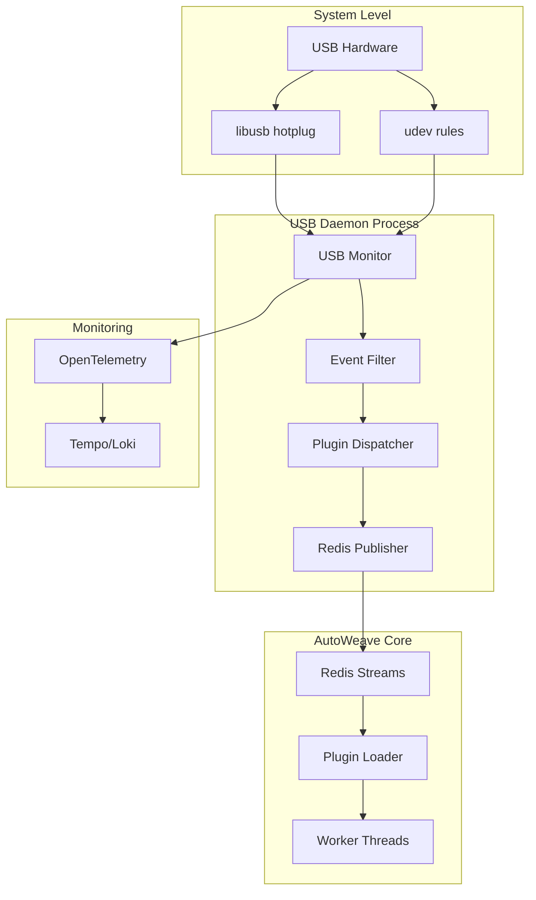

# USB Daemon Specification

**Version:** 1.0.0  
**Sprint:** 1 (Daemon USB & Plugin Loader)  
**Priority:** Critique  
**Date:** 2025-07-14

## 1. Vue d'Ensemble

Le daemon USB d'AutoWeave assure la détection hot-plug fiable des périphériques
USB et leur intégration transparente avec le système de plugins. Il s'appuie sur
**node-usb** + **libusb** avec fallback **udev** sur Linux.

## 2. Architecture Générale



## 3. Spécification Technique

### 3.1 Dépendances Core

```json
{
  "dependencies": {
    "usb": "^2.11.0",
    "redis": "^4.6.0",
    "ioredis": "^5.3.0",
    "@opentelemetry/api": "^1.6.0",
    "@opentelemetry/sdk-node": "^0.45.0",
    "ajv": "^8.12.0",
    "chokidar": "^3.5.3"
  },
  "devDependencies": {
    "@types/usb": "^2.0.0",
    "clinic": "^12.1.0"
  }
}
```

### 3.2 Node-USB Implementation

```typescript
import * as usb from 'usb';
import { EventEmitter } from 'events';
import { createHash } from 'crypto';

export interface USBDeviceInfo {
  vendorId: number;
  productId: number;
  deviceDescriptor: usb.DeviceDescriptor;
  serialNumber?: string;
  manufacturer?: string;
  product?: string;
  location: {
    busNumber: number;
    deviceAddress: number;
    portPath: string;
  };
  timestamp: number;
  signature: string;
}

export class USBDaemon extends EventEmitter {
  private isRunning = false;
  private connectedDevices = new Map<string, USBDeviceInfo>();
  private monitoringConfig: USBMonitoringConfig;

  constructor(config: USBMonitoringConfig) {
    super();
    this.monitoringConfig = config;
    this.setupUSBEventHandlers();
  }

  private setupUSBEventHandlers(): void {
    // Primary: node-usb events
    usb.on('attach', this.handleDeviceAttach.bind(this));
    usb.on('detach', this.handleDeviceDetach.bind(this));

    // Error handling
    usb.on('error', this.handleUSBError.bind(this));
  }

  private async handleDeviceAttach(device: usb.Device): Promise<void> {
    try {
      const deviceInfo = await this.extractDeviceInfo(device);
      const signature = this.generateDeviceSignature(deviceInfo);

      // Prevent duplicate events
      if (this.connectedDevices.has(signature)) {
        return;
      }

      deviceInfo.signature = signature;
      this.connectedDevices.set(signature, deviceInfo);

      // Emit to Redis + internal handlers
      await this.publishUSBEvent('attach', deviceInfo);
      this.emit('device:attach', deviceInfo);

      console.log(
        `USB Device attached: ${deviceInfo.manufacturer} ${deviceInfo.product} (${deviceInfo.vendorId}:${deviceInfo.productId})`,
      );
    } catch (error) {
      this.handleUSBError(error as Error, 'attach');
    }
  }

  private async handleDeviceDetach(device: usb.Device): Promise<void> {
    try {
      const tempInfo = await this.extractDeviceInfo(device);
      const signature = this.generateDeviceSignature(tempInfo);

      const deviceInfo = this.connectedDevices.get(signature);
      if (!deviceInfo) {
        return; // Device was not tracked
      }

      this.connectedDevices.delete(signature);

      // Emit to Redis + internal handlers
      await this.publishUSBEvent('detach', deviceInfo);
      this.emit('device:detach', deviceInfo);

      console.log(
        `USB Device detached: ${deviceInfo.manufacturer} ${deviceInfo.product}`,
      );
    } catch (error) {
      this.handleUSBError(error as Error, 'detach');
    }
  }

  private async extractDeviceInfo(device: usb.Device): Promise<USBDeviceInfo> {
    return new Promise((resolve, reject) => {
      try {
        device.open();

        const deviceInfo: USBDeviceInfo = {
          vendorId: device.deviceDescriptor.idVendor,
          productId: device.deviceDescriptor.idProduct,
          deviceDescriptor: device.deviceDescriptor,
          location: {
            busNumber: device.busNumber,
            deviceAddress: device.deviceAddress,
            portPath: device.portNumbers ? device.portNumbers.join('.') : '0',
          },
          timestamp: Date.now(),
          signature: '',
        };

        // Async string descriptors
        let pending = 0;

        if (device.deviceDescriptor.iManufacturer) {
          pending++;
          device.getStringDescriptor(
            device.deviceDescriptor.iManufacturer,
            (error, data) => {
              if (!error && data) deviceInfo.manufacturer = data.toString();
              if (--pending === 0) finalize();
            },
          );
        }

        if (device.deviceDescriptor.iProduct) {
          pending++;
          device.getStringDescriptor(
            device.deviceDescriptor.iProduct,
            (error, data) => {
              if (!error && data) deviceInfo.product = data.toString();
              if (--pending === 0) finalize();
            },
          );
        }

        if (device.deviceDescriptor.iSerialNumber) {
          pending++;
          device.getStringDescriptor(
            device.deviceDescriptor.iSerialNumber,
            (error, data) => {
              if (!error && data) deviceInfo.serialNumber = data.toString();
              if (--pending === 0) finalize();
            },
          );
        }

        if (pending === 0) {
          finalize();
        }

        function finalize() {
          try {
            device.close();
            resolve(deviceInfo);
          } catch (closeError) {
            // Device might be detached already
            resolve(deviceInfo);
          }
        }
      } catch (error) {
        reject(error);
      }
    });
  }

  private generateDeviceSignature(deviceInfo: USBDeviceInfo): string {
    const data = `${deviceInfo.vendorId}:${deviceInfo.productId}:${deviceInfo.location.busNumber}:${deviceInfo.location.deviceAddress}`;
    return createHash('sha256').update(data).digest('hex').substring(0, 16);
  }

  async start(): Promise<void> {
    if (this.isRunning) return;

    try {
      // Initialize libusb
      usb.useUsbDkBackend(); // Windows compatibility

      // Scan existing devices
      await this.scanExistingDevices();

      this.isRunning = true;
      console.log('USB Daemon started successfully');
    } catch (error) {
      console.error('Failed to start USB daemon:', error);
      throw error;
    }
  }

  async stop(): Promise<void> {
    if (!this.isRunning) return;

    this.isRunning = false;
    this.connectedDevices.clear();

    // Cleanup node-usb
    usb.removeAllListeners();

    console.log('USB Daemon stopped');
  }

  private async scanExistingDevices(): Promise<void> {
    const devices = usb.getDeviceList();

    for (const device of devices) {
      try {
        await this.handleDeviceAttach(device);
      } catch (error) {
        console.warn('Failed to process existing device:', error);
      }
    }
  }
}
```

### 3.3 LibUSB Hotplug Callbacks (Native Extension)

Pour les cas où node-usb ne suffit pas, extension native C++ :

```cpp
// src/native/usb_hotplug.cc
#include <node.h>
#include <libusb-1.0/libusb.h>
#include <uv.h>

class USBHotplugWatcher {
private:
    libusb_context* ctx;
    libusb_hotplug_callback_handle callback_handle;
    uv_async_t async_handle;

public:
    static int hotplug_callback(libusb_context* ctx, libusb_device* device,
                               libusb_hotplug_event event, void* user_data) {
        USBHotplugWatcher* watcher = static_cast<USBHotplugWatcher*>(user_data);

        // Get device descriptor
        libusb_device_descriptor desc;
        int result = libusb_get_device_descriptor(device, &desc);

        if (result == LIBUSB_SUCCESS) {
            HotplugEvent* hotplug_event = new HotplugEvent{
                .event_type = event,
                .vendor_id = desc.idVendor,
                .product_id = desc.idProduct,
                .bus_number = libusb_get_bus_number(device),
                .device_address = libusb_get_device_address(device)
            };

            watcher->async_handle.data = hotplug_event;
            uv_async_send(&watcher->async_handle);
        }

        return 0; // Continue monitoring
    }

    int start_monitoring() {
        int result = libusb_init(&ctx);
        if (result != LIBUSB_SUCCESS) return result;

        // Register hotplug callback
        result = libusb_hotplug_register_callback(
            ctx,
            static_cast<libusb_hotplug_event>(
                LIBUSB_HOTPLUG_EVENT_DEVICE_ARRIVED |
                LIBUSB_HOTPLUG_EVENT_DEVICE_LEFT
            ),
            LIBUSB_HOTPLUG_ENUMERATE,
            LIBUSB_HOTPLUG_MATCH_ANY,  // vendor_id
            LIBUSB_HOTPLUG_MATCH_ANY,  // product_id
            LIBUSB_HOTPLUG_MATCH_ANY,  // dev_class
            hotplug_callback,
            this,
            &callback_handle
        );

        if (result == LIBUSB_SUCCESS) {
            // Start event loop in separate thread
            uv_thread_create(&event_thread, event_loop_worker, ctx);
        }

        return result;
    }
};
```

### 3.4 Fallback udev Rules (Linux)

```bash
# /etc/udev/rules.d/99-autoweave-usb.rules
# AutoWeave USB Hot-plug Detection

# All USB devices - notify AutoWeave daemon
SUBSYSTEM=="usb", ACTION=="add", RUN+="/usr/local/bin/autoweave-udev-notify add %k %s{idVendor} %s{idProduct}"
SUBSYSTEM=="usb", ACTION=="remove", RUN+="/usr/local/bin/autoweave-udev-notify remove %k %s{idVendor} %s{idProduct}"

# Specific device classes of interest
SUBSYSTEM=="usb", ATTR{bDeviceClass}=="09", ACTION=="add", TAG+="autoweave_hub"
SUBSYSTEM=="usb", ATTR{bDeviceClass}=="03", ACTION=="add", TAG+="autoweave_hid"
SUBSYSTEM=="usb", ATTR{bDeviceClass}=="08", ACTION=="add", TAG+="autoweave_storage"
SUBSYSTEM=="usb", ATTR{bDeviceClass}=="0a", ACTION=="add", TAG+="autoweave_cdc"

# Grant permissions for AutoWeave daemon
SUBSYSTEM=="usb", GROUP="autoweave", MODE="0664"
```

### 3.5 udev Helper Script

```bash
#!/bin/bash
# /usr/local/bin/autoweave-udev-notify

ACTION=$1
DEVICE=$2
VENDOR_ID=$3
PRODUCT_ID=$4

REDIS_HOST=${AUTOWEAVE_REDIS_HOST:-localhost}
REDIS_PORT=${AUTOWEAVE_REDIS_PORT:-6379}

# Notify via Redis
redis-cli -h "$REDIS_HOST" -p "$REDIS_PORT" XADD "aw:hotplug" "*" \
  "source" "udev" \
  "action" "$ACTION" \
  "device" "$DEVICE" \
  "vendor_id" "$VENDOR_ID" \
  "product_id" "$PRODUCT_ID" \
  "timestamp" "$(date +%s%3N)"
```

## 4. Redis Streams Integration

### 4.1 Event Publishing

```typescript
import Redis from 'ioredis';

export class USBEventPublisher {
  private redis: Redis;
  private streamName = 'aw:hotplug';

  constructor(redisConfig: Redis.RedisOptions) {
    this.redis = new Redis(redisConfig);
  }

  async publishUSBEvent(
    action: 'attach' | 'detach',
    deviceInfo: USBDeviceInfo,
  ): Promise<string> {
    const eventData = {
      source: 'node-usb',
      action,
      vendor_id: deviceInfo.vendorId.toString(16),
      product_id: deviceInfo.productId.toString(16),
      device_signature: deviceInfo.signature,
      manufacturer: deviceInfo.manufacturer || '',
      product: deviceInfo.product || '',
      serial_number: deviceInfo.serialNumber || '',
      bus_number: deviceInfo.location.busNumber.toString(),
      device_address: deviceInfo.location.deviceAddress.toString(),
      port_path: deviceInfo.location.portPath,
      timestamp: deviceInfo.timestamp.toString(),
      device_descriptor: JSON.stringify(deviceInfo.deviceDescriptor),
    };

    try {
      const messageId = await this.redis.xadd(
        this.streamName,
        '*',
        ...Object.entries(eventData).flat(),
      );

      console.log(
        `Published USB event ${action} to Redis stream: ${messageId}`,
      );
      return messageId;
    } catch (error) {
      console.error('Failed to publish USB event to Redis:', error);
      throw error;
    }
  }

  async getRecentEvents(count = 10): Promise<any[]> {
    return this.redis.xrevrange(this.streamName, '+', '-', 'COUNT', count);
  }

  async createConsumerGroup(groupName: string): Promise<void> {
    try {
      await this.redis.xgroup(
        'CREATE',
        this.streamName,
        groupName,
        '$',
        'MKSTREAM',
      );
    } catch (error) {
      // Group might already exist
      if (!error.message.includes('BUSYGROUP')) {
        throw error;
      }
    }
  }
}
```

### 4.2 Event Consumer (Plugin Loader)

```typescript
export class USBEventConsumer {
  private redis: Redis;
  private streamName = 'aw:hotplug';
  private groupName: string;
  private consumerName: string;
  private isRunning = false;

  constructor(
    redisConfig: Redis.RedisOptions,
    groupName = 'plugin-loader',
    consumerName = 'main',
  ) {
    this.redis = new Redis(redisConfig);
    this.groupName = groupName;
    this.consumerName = consumerName;
  }

  async startConsuming(
    eventHandler: (event: USBEvent) => Promise<void>,
  ): Promise<void> {
    this.isRunning = true;

    // Ensure consumer group exists
    await this.createConsumerGroup();

    while (this.isRunning) {
      try {
        const results = await this.redis.xreadgroup(
          'GROUP',
          this.groupName,
          this.consumerName,
          'COUNT',
          1,
          'BLOCK',
          1000,
          'STREAMS',
          this.streamName,
          '>',
        );

        if (results && results.length > 0) {
          const [streamName, messages] = results[0];

          for (const [messageId, fields] of messages) {
            const event = this.parseUSBEvent(messageId, fields);
            await eventHandler(event);

            // Acknowledge message
            await this.redis.xack(this.streamName, this.groupName, messageId);
          }
        }
      } catch (error) {
        if (this.isRunning) {
          console.error('Error consuming USB events:', error);
          await new Promise((resolve) => setTimeout(resolve, 1000));
        }
      }
    }
  }

  private parseUSBEvent(messageId: string, fields: string[]): USBEvent {
    const fieldObj: Record<string, string> = {};
    for (let i = 0; i < fields.length; i += 2) {
      fieldObj[fields[i]] = fields[i + 1];
    }

    return {
      messageId,
      source: fieldObj.source as 'node-usb' | 'udev',
      action: fieldObj.action as 'attach' | 'detach',
      vendorId: parseInt(fieldObj.vendor_id, 16),
      productId: parseInt(fieldObj.product_id, 16),
      deviceSignature: fieldObj.device_signature,
      manufacturer: fieldObj.manufacturer,
      product: fieldObj.product,
      serialNumber: fieldObj.serial_number,
      timestamp: parseInt(fieldObj.timestamp),
      deviceDescriptor: fieldObj.device_descriptor
        ? JSON.parse(fieldObj.device_descriptor)
        : null,
    };
  }
}
```

## 5. Tests de Performance

### 5.1 Test de Charge 1000 Cycles

```typescript
import { USBDaemon } from './usb-daemon';
import * as clinic from 'clinic';

describe('USB Daemon Performance Tests', () => {
  let daemon: USBDaemon;
  let memoryBaseline: number;

  beforeAll(() => {
    memoryBaseline = process.memoryUsage().heapUsed;
  });

  test('1000 plug/unplug cycles without memory leak', async () => {
    daemon = new USBDaemon(testConfig);
    await daemon.start();

    const mockDevice = createMockUSBDevice();

    for (let i = 0; i < 1000; i++) {
      // Simulate attach
      await daemon['handleDeviceAttach'](mockDevice);

      // Simulate detach
      await daemon['handleDeviceDetach'](mockDevice);

      // Memory check every 100 cycles
      if (i % 100 === 0) {
        const currentMemory = process.memoryUsage().heapUsed;
        const memoryGrowth = currentMemory - memoryBaseline;

        expect(memoryGrowth).toBeLessThan(1024 * 1024); // < 1MB growth

        // Force garbage collection
        if (global.gc) global.gc();
      }
    }

    await daemon.stop();
  }, 60000);

  test('Event publishing latency < 10ms', async () => {
    const publisher = new USBEventPublisher(redisConfig);
    const mockDevice = createMockDeviceInfo();

    const start = process.hrtime.bigint();
    await publisher.publishUSBEvent('attach', mockDevice);
    const end = process.hrtime.bigint();

    const latencyMs = Number(end - start) / 1_000_000;
    expect(latencyMs).toBeLessThan(10);
  });

  test('Concurrent device handling', async () => {
    daemon = new USBDaemon(testConfig);
    await daemon.start();

    const devices = Array.from({ length: 50 }, createMockUSBDevice);

    // Attach all devices concurrently
    const attachPromises = devices.map((device) =>
      daemon['handleDeviceAttach'](device),
    );

    await Promise.all(attachPromises);

    expect(daemon['connectedDevices'].size).toBe(50);

    await daemon.stop();
  });
});
```

### 5.2 Clinic.js Memory Profiling

```bash
# Memory profiling
clinic doctor --on-port 'autocannon localhost:$PORT' -- node dist/usb-daemon.js

# CPU profiling
clinic flame -- node dist/usb-daemon.js

# Heap profiling
clinic heapprofiler -- node dist/usb-daemon.js
```

## 6. Configuration & Déploiement

### 6.1 Configuration Daemon

```typescript
export interface USBDaemonConfig {
  redis: {
    host: string;
    port: number;
    password?: string;
    db: number;
  };
  monitoring: {
    enabled: boolean;
    interval: number;
    healthcheck_port: number;
  };
  filters: {
    vendor_whitelist?: number[];
    vendor_blacklist?: number[];
    device_class_filter?: number[];
  };
  performance: {
    max_events_per_second: number;
    debounce_ms: number;
    batch_size: number;
  };
  fallback: {
    enable_udev: boolean;
    udev_script_path: string;
  };
}

const defaultConfig: USBDaemonConfig = {
  redis: {
    host: process.env.REDIS_HOST || 'localhost',
    port: parseInt(process.env.REDIS_PORT || '6379'),
    db: parseInt(process.env.REDIS_DB || '0'),
  },
  monitoring: {
    enabled: true,
    interval: 5000,
    healthcheck_port: 8080,
  },
  filters: {
    // No filters by default - capture all devices
  },
  performance: {
    max_events_per_second: 100,
    debounce_ms: 50,
    batch_size: 10,
  },
  fallback: {
    enable_udev: process.platform === 'linux',
    udev_script_path: '/usr/local/bin/autoweave-udev-notify',
  },
};
```

### 6.2 Docker Container

```dockerfile
FROM node:20-alpine

# Install libusb
RUN apk add --no-cache libusb-dev eudev-dev

WORKDIR /app

COPY package*.json ./
RUN npm ci --only=production

COPY dist/ ./dist/
COPY udev/ ./udev/

# Setup udev rules (for privileged containers)
COPY udev/99-autoweave-usb.rules /etc/udev/rules.d/
COPY udev/autoweave-udev-notify /usr/local/bin/
RUN chmod +x /usr/local/bin/autoweave-udev-notify

EXPOSE 8080

# Health check
HEALTHCHECK --interval=30s --timeout=10s --start-period=5s --retries=3 \
  CMD curl -f http://localhost:8080/health || exit 1

CMD ["node", "dist/usb-daemon.js"]
```

### 6.3 Docker Compose

```yaml
version: '3.8'

services:
  usb-daemon:
    build: .
    privileged: true # Required for USB access
    devices:
      - '/dev/bus/usb:/dev/bus/usb'
    volumes:
      - '/run/udev:/run/udev:ro'
    environment:
      - REDIS_HOST=redis
      - LOG_LEVEL=info
    depends_on:
      - redis
    restart: unless-stopped

  redis:
    image: redis:7-alpine
    volumes:
      - redis_data:/data
    restart: unless-stopped

volumes:
  redis_data:
```

### 6.4 Helm Chart Values

```yaml
# values.yaml
usbDaemon:
  image:
    repository: autoweave/usb-daemon
    tag: '1.0.0'
    pullPolicy: IfNotPresent

  replicaCount: 1 # Single instance for USB access

  resources:
    requests:
      memory: '64Mi'
      cpu: '50m'
    limits:
      memory: '256Mi'
      cpu: '200m'

  securityContext:
    privileged: true # Required for USB device access

  nodeSelector:
    # Run on nodes with USB ports
    node-role.kubernetes.io/worker: 'true'

  tolerations:
    - key: 'hardware/usb'
      operator: 'Exists'
      effect: 'NoSchedule'

redis:
  enabled: true
  auth:
    enabled: false
  persistence:
    enabled: true
    size: 1Gi

monitoring:
  enabled: true
  serviceMonitor:
    enabled: true
    interval: 30s
```

## 7. Observabilité

### 7.1 OpenTelemetry Instrumentation

```typescript
import { NodeSDK } from '@opentelemetry/sdk-node';
import { getNodeAutoInstrumentations } from '@opentelemetry/auto-instrumentations-node';
import { Resource } from '@opentelemetry/resources';
import { SemanticResourceAttributes } from '@opentelemetry/semantic-conventions';

export function initializeTracing(): void {
  const sdk = new NodeSDK({
    resource: new Resource({
      [SemanticResourceAttributes.SERVICE_NAME]: 'autoweave-usb-daemon',
      [SemanticResourceAttributes.SERVICE_VERSION]: '1.0.0',
    }),
    instrumentations: [
      getNodeAutoInstrumentations({
        '@opentelemetry/instrumentation-redis': {
          enabled: true,
        },
      }),
    ],
  });

  sdk.start();
}

// Custom USB metrics
import { metrics } from '@opentelemetry/api';

const meter = metrics.getMeter('autoweave-usb-daemon');

const usbEventsCounter = meter.createCounter('usb_events_total', {
  description: 'Total number of USB events processed',
});

const connectedDevicesGauge = meter.createUpDownCounter(
  'usb_devices_connected',
  {
    description: 'Number of currently connected USB devices',
  },
);

const eventProcessingDuration = meter.createHistogram(
  'usb_event_processing_duration_ms',
  {
    description: 'Time taken to process USB events',
  },
);
```

### 7.2 Grafana Dashboard

```json
{
  "dashboard": {
    "title": "AutoWeave USB Daemon",
    "panels": [
      {
        "title": "USB Events Rate",
        "type": "graph",
        "targets": [
          {
            "expr": "rate(usb_events_total[5m])",
            "legendFormat": "{{action}} events/sec"
          }
        ]
      },
      {
        "title": "Connected Devices",
        "type": "stat",
        "targets": [
          {
            "expr": "usb_devices_connected",
            "legendFormat": "Connected USB devices"
          }
        ]
      },
      {
        "title": "Memory Usage",
        "type": "graph",
        "targets": [
          {
            "expr": "process_resident_memory_bytes{job=\"usb-daemon\"}",
            "legendFormat": "Memory Usage"
          }
        ]
      },
      {
        "title": "Event Processing Latency",
        "type": "graph",
        "targets": [
          {
            "expr": "histogram_quantile(0.95, usb_event_processing_duration_ms_bucket)",
            "legendFormat": "95th percentile"
          }
        ]
      }
    ]
  }
}
```

## 8. Tests d'Acceptation

### 8.1 Critères de Validation

- [ ] **Hot-plug détection** : 100% événements USB attach/detach capturés
- [ ] **Performance mémoire** : < 1MB croissance après 1000 cycles
- [ ] **Latence événement** : < 10ms publication Redis
- [ ] **Fiabilité** : 0 événement perdu sur 24h de test
- [ ] **Fallback udev** : Activation automatique si node-usb échoue
- [ ] **Monitoring** : Métriques OpenTelemetry exportées
- [ ] **Sécurité** : Permissions USB strictement contrôlées

### 8.2 Environnements de Test

- **Ubuntu 20.04/22.04** + node-usb + udev
- **Windows 10/11** + WinUSB/libusb
- **macOS 12+** + IOKit/libusb
- **Docker containers** + privileged mode
- **Kubernetes** + device plugins

## 9. Roadmap

### 9.1 Version 1.0 (Sprint 1)

- [x] Spécification complète
- [ ] Implémentation node-usb core
- [ ] Redis Streams integration
- [ ] Tests performance 1000 cycles
- [ ] Docker packaging

### 9.2 Version 1.1 (Sprint 2)

- [ ] LibUSB native extension
- [ ] Advanced device filtering
- [ ] Batch event processing
- [ ] Health monitoring dashboard

### 9.3 Version 1.2 (Sprint 3+)

- [ ] Multi-platform native binaries
- [ ] Device capability detection
- [ ] Automatic driver installation
- [ ] Cloud device registry sync

---

**Status:** 🚧 IN DEVELOPMENT  
**Next Review:** Sprint 1 Demo  
**Owner:** USB Team Lead
