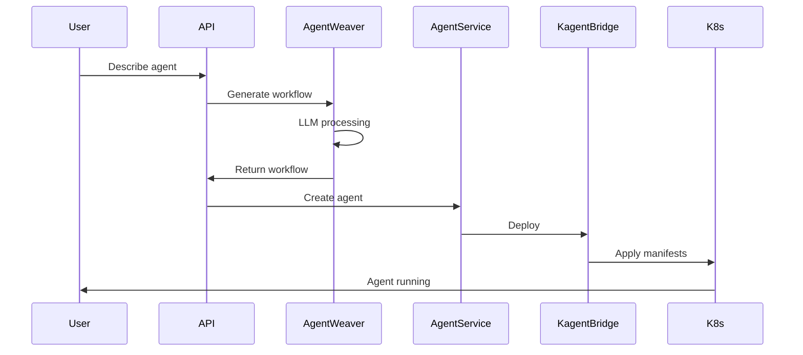
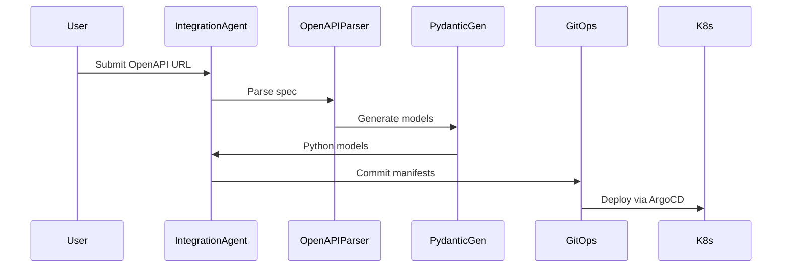

# AutoWeave Architecture

## 📋 Table of Contents

1. [Overview](#overview)
2. [Core Components](#core-components)
3. [Data Flow](#data-flow)
4. [Integration Patterns](#integration-patterns)
5. [Deployment Architecture](#deployment-architecture)
6. [Security Model](#security-model)
7. [Scalability Design](#scalability-design)

## Overview

AutoWeave follows a microservices architecture pattern with clear separation of concerns. The system is designed to be cloud-native, scalable, and extensible.

```
┌─────────────────────────────────────────────────────────────────────┐
│                         AutoWeave Platform                           │
├─────────────────────────────────────────────────────────────────────┤
│                                                                     │
│  ┌─────────────┐    ┌─────────────┐    ┌─────────────┐            │
│  │   Input      │    │   Process   │    │   Deploy    │            │
│  │   Layer      │───▶│   Layer     │───▶│   Layer     │            │
│  └─────────────┘    └─────────────┘    └─────────────┘            │
│                                                                     │
│  ┌─────────────────────────────────────────────────────────────┐   │
│  │                     Infrastructure Layer                     │   │
│  │  (Kubernetes, kagent, Memory Systems, Monitoring)           │   │
│  └─────────────────────────────────────────────────────────────┘   │
└─────────────────────────────────────────────────────────────────────┘
```

## Core Components

### 1. AutoWeave Core Engine (`src/core/autoweave.js`)

The orchestration hub that coordinates all system components.

**Responsibilities:**
- Service initialization and lifecycle management
- Request routing and coordination
- Health monitoring and metrics collection
- WebSocket management for AG-UI

**Key Features:**
- Event-driven architecture
- Graceful degradation when services unavailable
- Comprehensive error handling

### 2. Agent Weaver (`src/core/agent-weaver.js`)

AI-powered workflow generation engine.

**Capabilities:**
- Natural language processing via OpenAI
- Workflow structure generation
- OpenAPI 3.1 specification creation
- ANP compliance validation

**Workflow Generation Process:**
```
Natural Language → LLM Processing → Workflow JSON → Validation → Enhancement
```

### 3. MCP Discovery (`src/mcp/discovery.js`)

Protocol discovery and ANP server implementation.

**Dual Functionality:**
1. **MCP Client**: Discovers and integrates Model Context Protocol servers
2. **ANP Server**: Implements Agent Network Protocol for interoperability

**ANP Endpoints:**
- `GET /agent` - Agent capability declaration
- `POST /agent/tasks` - Task submission
- `GET /agent/openapi/validate` - OpenAPI validation

### 4. Integration Agent Module (`src/agents/integration-agent/`)

Transforms OpenAPI specifications into Kubernetes-ready agents.

**Components:**
- `integration-agent.js` - Core transformation logic
- `openapi-parser.js` - OpenAPI parsing and validation
- `pydantic-generator.js` - Python model generation
- `gitops-manager.js` - Git operations and ArgoCD integration
- `langchain-orchestrator.js` - AI-powered orchestration

**Pipeline:**
```
OpenAPI Spec → Parse → Generate Models → Create K8s Manifests → Deploy
```

### 5. kagent Bridge (`src/kagent/bridge.js`)

Interface between AutoWeave and kagent runtime.

**Functions:**
- Agent deployment to Kubernetes
- Status monitoring
- Resource management
- Tool discovery

### 6. Hybrid Memory Manager (`src/memory/hybrid-memory.js`)

Dual-memory system for agent intelligence.

**Architecture:**
```
┌─────────────────────────────────────┐
│      Hybrid Memory Manager          │
├─────────────────┬───────────────────┤
│ Contextual      │ Structural        │
│ Memory (mem0)   │ Memory (Memgraph) │
├─────────────────┼───────────────────┤
│ • Conversations │ • Relationships    │
│ • History       │ • Knowledge Graph  │
│ • User Context  │ • Ontologies       │
└─────────────────┴───────────────────┘
```

### 7. UI Agent (`src/agui/ui-agent.js`)

Dynamic UI generation for AG-UI protocol.

**Capabilities:**
- Template-based UI generation
- Real-time event streaming
- Interactive form generation
- Progress visualization

## Data Flow

### Agent Creation Flow



### Integration Agent Flow



## Integration Patterns

### 1. Protocol Integration

**MCP (Model Context Protocol)**
- Tool discovery
- Capability negotiation
- Dynamic integration

**ANP (Agent Network Protocol)**
- Standardized agent communication
- Task delegation
- Capability sharing

### 2. Service Integration

**External Services**
- OpenAPI specification parsing
- Automatic client generation
- Error handling and retries

**Internal Services**
- Event-driven communication
- Service mesh compatibility
- Circuit breaker patterns

### 3. UI Integration

**Multiple Interfaces**
- REST API for programmatic access
- WebSocket for real-time updates
- OpenAI-compatible endpoints
- AG-UI dynamic generation

## Deployment Architecture

### Kubernetes Deployment

```yaml
autoweave-namespace/
├── autoweave-core (Deployment)
│   ├── API Server
│   ├── ANP Server
│   └── WebSocket Server
├── memory-system (StatefulSet)
│   ├── Qdrant (Vector DB)
│   └── Memgraph (Graph DB)
├── support-services (Deployments)
│   ├── SillyTavern
│   └── Appsmith
└── agents (Dynamic)
    ├── Generated Agents
    └── Integration Agents
```

### High Availability Setup

```
┌─────────────┐     ┌─────────────┐     ┌─────────────┐
│  AutoWeave  │     │  AutoWeave  │     │  AutoWeave  │
│  Instance 1 │     │  Instance 2 │     │  Instance 3 │
└─────────────┘     └─────────────┘     └─────────────┘
       │                   │                   │
       └───────────────────┼───────────────────┘
                           │
                    ┌──────────────┐
                    │ Load Balancer │
                    └──────────────┘
```

## Security Model

### Authentication & Authorization

1. **API Key Authentication**
   - OpenAI API key for agent generation
   - Service-specific API keys

2. **Kubernetes RBAC**
   - Service accounts for agents
   - Role-based permissions
   - Network policies

3. **Secret Management**
   - Kubernetes secrets
   - Environment variable injection
   - Encrypted storage

### Network Security

```yaml
NetworkPolicy:
  - Ingress: Controlled access to services
  - Egress: Limited external communication
  - Inter-service: mTLS where supported
```

## Scalability Design

### Horizontal Scaling

**AutoWeave Core**
- Stateless design
- Load balancer distribution
- Session affinity for WebSockets

**Agent Scaling**
- Independent agent scaling
- Resource-based autoscaling
- Priority-based scheduling

### Vertical Scaling

**Memory Systems**
- Qdrant clustering
- Memgraph replication
- Cache layers

### Performance Optimization

1. **Caching Strategy**
   - LLM response caching
   - Workflow template caching
   - Tool discovery caching

2. **Async Processing**
   - Background agent creation
   - Async deployment pipeline
   - Event-driven updates

3. **Resource Management**
   - CPU/Memory limits
   - Request quotas
   - Priority classes

## Monitoring & Observability

### Metrics Collection

```
Prometheus Metrics
├── System Metrics
│   ├── CPU/Memory usage
│   ├── Request latency
│   └── Error rates
├── Business Metrics
│   ├── Agents created
│   ├── Workflows generated
│   └── Integration success rate
└── Custom Metrics
    ├── LLM token usage
    ├── Memory queries
    └── Protocol negotiations
```

### Logging Architecture

```
Application Logs → Fluentd → Elasticsearch → Kibana
                     ↓
                Structured JSON
                     ↓
              Log Aggregation
```

### Distributed Tracing

```
Request → Trace ID → Span Creation → Context Propagation → Trace Collection
```

## Extension Points

### 1. Custom Tool Integration

```javascript
// Implement ToolProvider interface
class CustomToolProvider {
  async discoverTools() { }
  async executeTool(toolId, params) { }
}
```

### 2. Memory Backends

```javascript
// Implement MemoryBackend interface
class CustomMemoryBackend {
  async store(key, value) { }
  async retrieve(key) { }
  async search(query) { }
}
```

### 3. Protocol Handlers

```javascript
// Implement ProtocolHandler interface
class CustomProtocolHandler {
  async handleRequest(request) { }
  async generateResponse(data) { }
}
```

## Best Practices

### 1. Error Handling
- Graceful degradation
- Comprehensive logging
- User-friendly error messages

### 2. Testing Strategy
- Unit tests for components
- Integration tests for workflows
- E2E tests for user journeys

### 3. Documentation
- API documentation
- Code comments
- Architecture decisions

### 4. Performance
- Efficient resource usage
- Optimized queries
- Caching strategies

---

This architecture is designed to be modular, scalable, and maintainable, supporting AutoWeave's vision of democratizing AI agent creation and deployment.