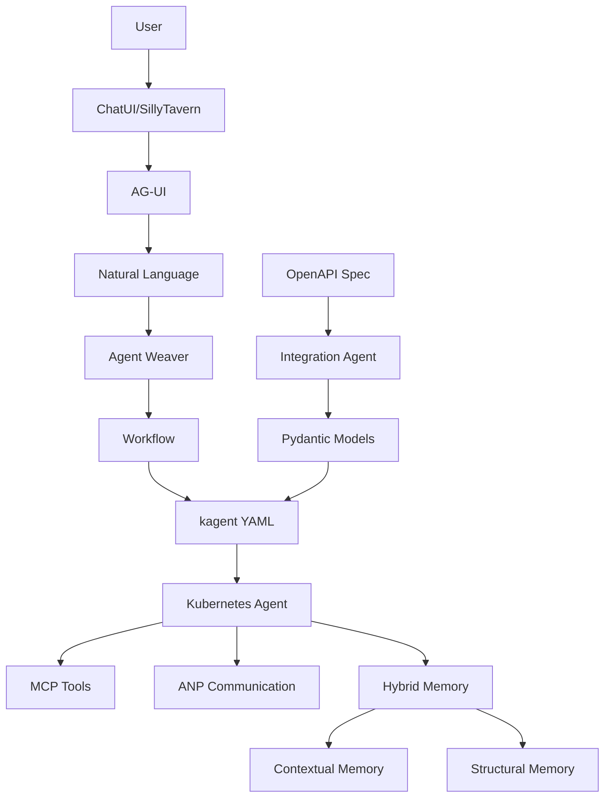

# AutoWeave Concepts Guide

## 🎯 Core Concepts

### 1. Self-Weaving

The fundamental philosophy of AutoWeave. It represents the ability of the system to:
- **Auto-configure** based on natural language descriptions
- **Self-organize** agent capabilities and connections
- **Auto-evolve** through continuous learning

**Example**: When you say "create an agent to monitor logs", AutoWeave "weaves" together log reading capabilities, pattern matching, and alerting—all automatically.

### 2. Agent

An autonomous software entity that:
- Executes specific tasks
- Has defined capabilities (tools)
- Runs in Kubernetes pods
- Can communicate with other agents

**Types of Agents:**
- **Natural Language Agents**: Created from descriptions
- **Integration Agents**: Created from OpenAPI specifications
- **System Agents**: Internal AutoWeave agents

### 3. Workflow

A structured representation of an agent's behavior:
```javascript
{
  "name": "log-monitor",
  "description": "Monitors system logs",
  "requiredModules": ["file-reader", "pattern-matcher"],
  "steps": [
    { "action": "read-logs", "description": "Read log files" },
    { "action": "analyze", "description": "Find patterns" }
  ]
}
```

## 🔧 Technical Concepts

### 4. MCP (Model Context Protocol)

A protocol for discovering and integrating AI model tools:
- **Purpose**: Standardize tool discovery
- **Use in AutoWeave**: Automatic tool integration
- **Benefits**: Plug-and-play capabilities

### 5. ANP (Agent Network Protocol)

A protocol for agent-to-agent communication:
- **Purpose**: Enable agent interoperability
- **Implementation**: REST API with OpenAPI 3.1
- **Key Endpoints**: `/agent`, `/agent/tasks`

### 6. kagent

The Kubernetes-native runtime for agents:
- **Role**: Deploy and manage agents in Kubernetes
- **CRDs**: Agent, Tool, ModelConfig
- **Integration**: AutoWeave generates kagent-compatible YAML

### 7. Hybrid Memory

A dual-memory system combining:

**Contextual Memory (mem0)**
- Short-term memory
- Conversation history
- User preferences
- Vector-based search

**Structural Memory (Memgraph)**
- Long-term memory
- Knowledge graphs
- Relationships
- Graph-based queries

### 8. AG-UI (Agent GUI)

Dynamic user interface generation system:
- **Protocol**: WebSocket-based
- **Events**: Chat, display, input, status
- **Templates**: Form, table, chart, progress

## 🏗️ Architectural Concepts

### 9. Agent Weaver

The AI engine that transforms natural language into workflows:
- **Input**: "Create an agent that..."
- **Process**: LLM-powered analysis
- **Output**: Structured workflow + deployment specs

### 10. Integration Agent Module

Specialized module for API integration:
- **Input**: OpenAPI specification
- **Process**: Parse → Generate models → Create manifests
- **Output**: Deployable Kubernetes agent

### 11. Service Mesh

The interconnected network of AutoWeave services:
```
AutoWeave Core ←→ MCP Discovery ←→ ANP Server
     ↓              ↓                ↓
Agent Service ←→ Memory Manager ←→ UI Agent
     ↓              ↓                ↓
kagent Bridge ←→ Kubernetes    ←→ Agents
```

## 📊 Operational Concepts

### 12. Deployment Pipeline

The journey from idea to running agent:
```
Describe → Generate → Validate → Deploy → Monitor → Evolve
```

### 13. GitOps Integration

Infrastructure as Code approach:
- **Git Repository**: Source of truth
- **ArgoCD**: Continuous deployment
- **Automation**: Commit triggers deployment

### 14. Observability Stack

Comprehensive monitoring:
- **Metrics**: Prometheus
- **Logs**: Fluentd → Elasticsearch
- **Traces**: OpenTelemetry
- **Dashboards**: Grafana/Appsmith

## 🔄 Lifecycle Concepts

### 15. Agent States

```
Created → Deploying → Running → Updating → Terminating
            ↓           ↓         ↓
          Failed    Suspended  Scaling
```

### 16. Memory Lifecycle

```
Experience → Store → Index → Query → Retrieve → Apply
     ↑                                            ↓
     └────────────── Learn ──────────────────────┘
```

### 17. Protocol Negotiation

How agents discover and use capabilities:
1. **Discovery**: Find available tools/agents
2. **Capability Matching**: Match needs to capabilities
3. **Protocol Selection**: Choose communication method
4. **Integration**: Establish connection

## 🎨 User Experience Concepts

### 18. Natural Language Interface

The primary way users interact with AutoWeave:
- **Simple**: "Create an agent to process invoices"
- **Complex**: "Build a multi-stage data pipeline that extracts data from multiple APIs, transforms it according to business rules, and loads it into our data warehouse"

### 19. Multi-Modal Interfaces

Different ways to interact with AutoWeave:
- **ChatUI**: Web-based chat interface
- **SillyTavern**: Immersive chat experience
- **API**: Programmatic access
- **AG-UI**: Dynamic generated interfaces

### 20. Feedback Loops

Continuous improvement mechanisms:
- **User Feedback**: Ratings and corrections
- **Performance Metrics**: Automatic optimization
- **Error Learning**: Failure pattern recognition

## 🔐 Security Concepts

### 21. Zero Trust Architecture

Security model where nothing is trusted by default:
- **Authentication**: Every request authenticated
- **Authorization**: Fine-grained permissions
- **Encryption**: Data in transit and at rest

### 22. Isolation Boundaries

```
Namespace Isolation → Network Policies → RBAC → Secrets Management
```

## 📈 Scaling Concepts

### 23. Horizontal Scaling

Adding more instances:
- **Agents**: Multiple replicas
- **Services**: Load-balanced instances
- **Databases**: Clustered deployments

### 24. Vertical Scaling

Adding more resources:
- **CPU/Memory**: Resource limits
- **Storage**: Persistent volumes
- **Network**: Bandwidth allocation

### 25. Auto-Scaling

Dynamic resource adjustment:
- **Metrics-based**: CPU, memory, custom metrics
- **Schedule-based**: Time-of-day scaling
- **Event-based**: Workload triggers

## 🌐 Integration Concepts

### 26. Protocol Adapters

Bridges between different communication protocols:
```
REST ←→ GraphQL ←→ gRPC ←→ WebSocket
```

### 27. Schema Evolution

How APIs and data structures change over time:
- **Versioning**: API version management
- **Migration**: Data transformation
- **Compatibility**: Backward compatibility

### 28. Federation

Connecting multiple AutoWeave instances:
- **Agent Sharing**: Cross-instance agents
- **Memory Sync**: Distributed memory
- **Protocol Bridge**: Inter-instance communication

## 🚀 Advanced Concepts

### 29. Emergent Behavior

Unexpected beneficial behaviors that arise from agent interactions:
- **Collaboration**: Agents working together
- **Optimization**: Self-improving workflows
- **Innovation**: Novel solution discovery

### 30. Cognitive Architecture

The overall structure of agent intelligence:
```
Perception → Reasoning → Planning → Execution → Learning
     ↑                                            ↓
     └──────────────── Reflection ────────────────┘
```

---

## 📚 Concept Relationships



This conceptual framework provides the foundation for understanding how AutoWeave transforms ideas into intelligent, autonomous agents.