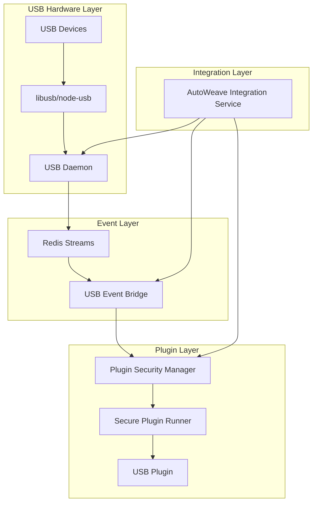

# USB Integration Guide

This guide explains how to use the AutoWeave USB daemon and plugin loader integration to create USB-aware plugins.

## Architecture Overview

The integration consists of several key components:



## Components

### 1. USB Daemon
- Monitors USB device attach/detach events using node-usb
- Publishes events to Redis Streams
- Handles device information extraction and filtering
- Located at: `src/usb/usb-daemon.js`

### 2. USB Event Bridge
- Consumes USB events from Redis Streams
- Routes events to authorized plugins based on permissions
- Handles event filtering and transformation
- Located at: `src/integration/usb-event-bridge.js`

### 3. Plugin USB Capability
- Validates USB permissions in plugin manifests
- Creates device filters for permission checking
- Extends manifest schema with USB support
- Located at: `src/integration/plugin-usb-capability.js`

### 4. AutoWeave Integration Service
- Main orchestrator connecting all components
- Manages component lifecycle
- Provides health monitoring and reporting
- Located at: `src/integration/autoweave-integration-service.js`

## Plugin Manifest Configuration

To create a USB-aware plugin, configure the manifest with USB permissions:

```json
{
  "name": "my-usb-plugin",
  "version": "1.0.0",
  "entry": "src/index.js",
  "permissions": {
    "usb": {
      "vendor_ids": ["0x04A9", "0x03F0"],
      "product_ids": ["0x220E", "0x0C17"],
      "device_classes": [6, 8],
      "exclusive": false,
      "detach_kernel_driver": false
    },
    "filesystem": [
      {
        "path": "/tmp/device-data",
        "mode": "readwrite"
      }
    ],
    "queue": ["device-processing"]
  },
  "hooks": {
    "onLoad": "initialize",
    "onUnload": "cleanup",
    "onUSBAttach": "handleDeviceAttach",
    "onUSBDetach": "handleDeviceDetach",
    "onUSBError": "handleUSBError"
  }
}
```

### USB Permission Fields

- **vendor_ids**: Array of allowed USB vendor IDs in hex format
- **product_ids**: Array of allowed USB product IDs in hex format  
- **device_classes**: Array of allowed USB device classes (numeric)
- **exclusive**: Request exclusive access to matching devices
- **detach_kernel_driver**: Allow detaching kernel drivers (requires elevated permissions)

### USB Hook Functions

- **onUSBAttach**: Called when a matching USB device is attached
- **onUSBDetach**: Called when a matching USB device is detached
- **onUSBError**: Called when USB errors occur

## Plugin Implementation

### Basic USB Plugin Structure

```javascript
// Plugin state
const pluginState = {
  initialized: false,
  connectedDevices: new Map(),
  statistics: {
    devicesDetected: 0,
    errors: 0
  }
};

/**
 * Initialize the plugin
 */
async function initialize() {
  try {
    console.log('Initializing USB plugin...');
    
    // Setup plugin state
    pluginState.initialized = true;
    
    // Subscribe to processing queues
    autoweave.queue.subscribe('device-processing', processDeviceJob);
    
    console.log('USB plugin initialized successfully');
    
  } catch (error) {
    console.error('Failed to initialize plugin:', error);
    throw error;
  }
}

/**
 * Handle USB device attachment
 */
async function handleDeviceAttach(event) {
  try {
    const { device } = event;
    
    console.log(`Device attached: ${device.manufacturer} ${device.product}`);
    
    // Create device record
    const deviceRecord = {
      id: device.signature,
      vendorId: device.vendorId,
      productId: device.productId,
      manufacturer: device.manufacturer,
      product: device.product,
      serialNumber: device.serialNumber,
      location: device.location,
      attachedAt: Date.now(),
      status: 'ready'
    };
    
    // Store device
    pluginState.connectedDevices.set(deviceRecord.id, deviceRecord);
    pluginState.statistics.devicesDetected++;
    
    // Notify about new device
    autoweave.emit('device-connected', {
      deviceId: deviceRecord.id,
      manufacturer: deviceRecord.manufacturer,
      product: deviceRecord.product
    });
    
    // Store device info for other services
    await autoweave.storage.set(`device:${deviceRecord.id}`, deviceRecord);
    
  } catch (error) {
    console.error('Error handling device attach:', error);
    pluginState.statistics.errors++;
  }
}

/**
 * Handle USB device detachment
 */
async function handleDeviceDetach(event) {
  try {
    const { device } = event;
    
    // Find device by signature or location
    let deviceId = null;
    for (const [id, deviceRecord] of pluginState.connectedDevices) {
      if (deviceRecord.serialNumber === device.serialNumber ||
          deviceRecord.location.portPath === device.location.portPath) {
        deviceId = id;
        break;
      }
    }
    
    if (!deviceId) {
      console.warn('Unknown device detached');
      return;
    }
    
    const deviceRecord = pluginState.connectedDevices.get(deviceId);
    console.log(`Device detached: ${deviceRecord.manufacturer} ${deviceRecord.product}`);
    
    // Remove device
    pluginState.connectedDevices.delete(deviceId);
    
    // Notify about device removal
    autoweave.emit('device-disconnected', {
      deviceId,
      manufacturer: deviceRecord.manufacturer,
      product: deviceRecord.product
    });
    
    // Remove from storage
    await autoweave.storage.delete(`device:${deviceId}`);
    
  } catch (error) {
    console.error('Error handling device detach:', error);
    pluginState.statistics.errors++;
  }
}

/**
 * Handle USB errors
 */
async function handleUSBError(error) {
  console.error('USB error:', error);
  pluginState.statistics.errors++;
  
  autoweave.emit('device-error', {
    error: error.message || 'Unknown USB error'
  });
}

/**
 * Cleanup function
 */
async function cleanup() {
  try {
    console.log('Cleaning up USB plugin...');
    
    // Clear storage
    for (const [deviceId] of pluginState.connectedDevices) {
      await autoweave.storage.delete(`device:${deviceId}`);
    }
    
    // Clear state
    pluginState.connectedDevices.clear();
    
    console.log('USB plugin cleaned up');
    
  } catch (error) {
    console.error('Error during cleanup:', error);
  }
}

// Export plugin functions
module.exports = {
  initialize,
  handleDeviceAttach,
  handleDeviceDetach,
  handleUSBError,
  cleanup
};
```

## Usage Example

### 1. Setup Integration Service

```javascript
const { AutoWeaveIntegrationService } = require('./src/integration');

// Create service
const service = new AutoWeaveIntegrationService({
  redis: {
    host: 'localhost',
    port: 6379
  }
});

// Initialize and start
await service.initialize();
await service.start();
```

### 2. Load USB Plugin

```javascript
// Load plugin
const pluginId = await service.loadPlugin('/path/to/usb-plugin');

// Start plugin
await service.startPlugin(pluginId);
```

### 3. Monitor Events

```javascript
service.on('plugin-loaded', (data) => {
  console.log('Plugin loaded:', data.pluginId);
});

service.on('health-check', (health) => {
  console.log('System health:', health.status);
});

service.on('component-error', (error) => {
  console.error('Component error:', error);
});
```

## Testing

### Run Integration Tests

```bash
# Run the integration test script
node src/integration/test-integration.js
```

### Manual Testing

1. **Start Redis**: Ensure Redis is running on localhost:6379
2. **Connect USB Device**: Attach a USB device to trigger events
3. **Check Logs**: Monitor console output for event processing
4. **Verify Storage**: Check plugin storage for device records

## USB Device Classes

Common USB device classes for filtering:

- **0x01**: Audio devices
- **0x03**: HID (Human Interface Devices)
- **0x06**: Imaging devices (scanners, cameras)
- **0x07**: Printer devices
- **0x08**: Mass storage devices
- **0x09**: USB hubs
- **0x0A**: CDC-Data devices

## Security Considerations

### Permission Validation
- USB permissions are validated against the plugin manifest
- Only authorized devices can trigger plugin events
- Device access is restricted by vendor/product ID filters

### Sandboxing
- Plugins run in secure VM2 sandboxes
- File system access is restricted to allowed paths
- Network access is rate-limited and filtered

### Resource Limits
- Memory usage is monitored and limited
- CPU usage is tracked for anomaly detection
- Event rate limiting prevents DoS attacks

## Troubleshooting

### Common Issues

1. **USB Events Not Received**
   - Check if USB daemon is running
   - Verify Redis connection
   - Check plugin USB permissions

2. **Plugin Not Loading**
   - Validate plugin manifest syntax
   - Check file permissions
   - Review security logs

3. **Device Not Recognized**
   - Verify vendor/product ID in permissions
   - Check device class filters
   - Review USB daemon logs

### Debug Commands

```javascript
// Get service status
const status = service.getStatus();
console.log(status);

// Generate detailed report
const report = await service.generateReport();
console.log(report);

// Check plugin health
const health = await service.checkHealth();
console.log(health);
```

## Performance Considerations

### Event Processing
- Events are processed in batches for efficiency
- Rate limiting prevents event flooding
- Debouncing reduces duplicate events

### Memory Management
- Plugin memory usage is monitored
- Storage has configurable limits
- Cleanup is automatic on plugin unload

### Scalability
- Redis Streams support multiple consumers
- Plugin isolation enables parallel processing
- Resource limits prevent system overload

## Best Practices

1. **Permission Design**
   - Use specific vendor/product IDs when possible
   - Avoid broad device class filters
   - Request minimal required permissions

2. **Error Handling**
   - Always implement USB error handlers
   - Log errors for debugging
   - Gracefully handle device disconnection

3. **Resource Management**
   - Clean up resources in the cleanup handler
   - Monitor memory usage in long-running operations
   - Use appropriate timeouts for device operations

4. **Testing**
   - Test with multiple USB devices
   - Verify plugin behavior on device disconnection
   - Test error scenarios and recovery